# DevOps Architecture Audit Report
## MagiDesk POS - Billiard Microservices Repository

**Audit Date**: 2024  
**Repository Type**: Chaotic Microservices (ASP.NET Core, WinUI3, PostgreSQL)  
**Current State**: Manual deployment, scattered branches, no CI/CD  
**Target State**: Structured, automated, FinOps-optimized

---

## Executive Summary

MagiDesk operates 9 microservices on GCP Cloud Run with manual PowerShell-based deployments, 21+ feature branches (several stale from Sep 2025), and zero CI/CD automation. **Estimated monthly GCP costs: ~$107-142** (low traffic: 5k sessions/day). Migration to Render/DigitalOcean could save **$11-46/month** (10-32% reduction) but requires medium-effort migration. This audit provides a non-destructive path to structure the repo, establish CI/CD, and optimize costs.

**Key Findings:**
- ✅ **Strengths**: Dockerfiles present, deployment scripts standardized
- ❌ **Critical Gaps**: No CI/CD, branch chaos, inconsistent structure
- 💰 **FinOps**: GCP costs 2x alternatives; migration ROI ~2-3 months

---

## 1. Progress Preservation: Branch Audit

### Branch Inventory

| Branch Name | Type | Status | Last Activity | Action | Merge Priority |
|-------------|------|--------|---------------|--------|----------------|
| `main` | Production | ✅ Active | 2025-12-08 | **KEEP** (source of truth) | - |
| `implement-rbac-api-cursor` | Feature | ✅ Active | 2025-12-07 | **MERGE** → main | High |
| `implement-split-payment` | Feature | ✅ Active | 2025-12-01 | **MERGE** → main | High |
| `implement-vendors-management` | Feature | ✅ Active | 2025-12-01 | **MERGE** → main | Medium |
| `implement-table-layout-ui-cursor` | Feature | ⚠️ Merged | 2025-12-02 | **PRUNE** (reverted on main) | - |
| `UI-revamp-cursor` | Feature | ⚠️ Active | 2025-12-05 | **REVIEW** → extract valuable UI changes | Medium |
| `WinUI-Redesign-Cursor` | Feature | ⚠️ Active | 2025-12-02 | **REVIEW** → extract valuable UI changes | Medium |
| `settings-restructure` | Feature | ⚠️ Stale | 2025-09-08 | **REVIEW** → merge if still valid | High |
| `improving-settings-by-cursor` | Feature | ⚠️ Stale | 2025-09-14 | **MERGE** → settings-restructure, then **PRUNE** | Low |
| `improving-settings-by-windsurf` | Feature | ⚠️ Stale | 2025-11-16 | **MERGE** → settings-restructure, then **PRUNE** | Low |
| `membership-implementation-by-windsurf` | Feature | ⚠️ Stale | 2025-09-16 | **REVIEW** → extract if valuable | Low |
| `redesign-UI-Refactor` | Feature | ⚠️ Active | 2025-12-01 | **REVIEW** → extract if valuable | Low |
| `starting-order-menu-work` | Feature | ⚠️ Stale | 2025-09-08 | **REVIEW** → extract if valuable | Low |
| `work-by-curser` | Feature | ⚠️ Stale | 2025-09-09 | **PRUNE** (typo in name, outdated) | - |
| `work-by-cursor` | Feature | ⚠️ N/A | N/A | **CHECK** → not in local branches | - |
| `work-by-cursor-printing` | Feature | ⚠️ Stale | 2025-09-13 | **REVIEW** → extract printing changes | Medium |
| `work-by-windsurf` | Feature | ⚠️ Stale | 2025-09-12 | **PRUNE** (too generic) | - |
| `work-by-grok` | Feature | ⚠️ N/A | N/A | **CHECK** → remote only, **PRUNE** if stale | - |
| `work-by-sonnet-windsurf` | Feature | ⚠️ N/A | N/A | **CHECK** → remote only, **PRUNE** if stale | - |
| `audit-refund-process` | Feature | ✅ Active | 2025-12-05 | **MERGE** → main | Medium |
| `feature-8-sep-2025` | Feature | ⚠️ Stale | 2025-09-08 | **REVIEW** → extract if valuable | Low |

### Git Commands for Baseline & Structure Branch

```bash
# 1. Tag main as revamp baseline (NON-DESTRUCTIVE)
git checkout main
git pull origin main
git tag -a revamp-baseline-v1 -m "Pre-revamp baseline: 9 microservices, manual deployment, branch chaos"
git push origin revamp-baseline-v1

# 2. Create structure branch from main (clean slate for restructuring)
git checkout -b structure/restructure-v1
git push -u origin structure/restructure-v1

# 3. Archive branches to preserve (before pruning)
git checkout implement-rbac-api-cursor
git tag -a archive/rbac-api-$(date +%Y%m%d) -m "Pre-merge archive: RBAC API implementation"
git push origin archive/rbac-api-$(date +%Y%m%d)

# Repeat for other valuable branches before merging/pruning
```

### Branch Cleanup Strategy

**Phase 1: Extract & Merge (Week 1)**
- Merge `implement-rbac-api-cursor`, `implement-split-payment`, `settings-restructure` to main
- Review `UI-revamp-cursor`, `WinUI-Redesign-Cursor` for extractable UI improvements
- Consolidate settings branches → merge to `settings-restructure`, then merge to main

**Phase 2: Archive & Prune (Week 2)**
- Tag valuable branches before pruning
- Prune: `implement-table-layout-ui-cursor` (reverted), `work-by-curser`, `work-by-windsurf`, generic branches

**Phase 3: Review Stale Branches (Week 3)**
- Review branches older than 3 months
- Extract code snippets, then prune

---

## 2. Structure Gaps: Repository Layout Analysis

### Current Structure Issues

```
❌ Root-level clutter: PowerShell scripts, PDFs, random files
❌ Inconsistent naming: `solution/backend/` vs `solution/frontend/`
❌ Mixed patterns: Some APIs have Dockerfiles, some don't (all do, actually)
❌ No infrastructure-as-code: Terraform/CloudFormation missing
❌ Tests scattered: Some in `MagiDesk.Tests/`, some in service folders
❌ No clear docs structure: Docs mixed in `solution/docs/` and root
❌ Archive folder: `solution/archive/frontend_old/` should be removed or moved
```

### Proposed Clean Structure

```mermaid
graph TD
    A[MagiDesk-POS] --> B[src/]
    A --> C[infra/]
    A --> D[docs/]
    A --> E[tests/]
    A --> F[scripts/]
    A --> G[.github/]
    
    B --> B1[Backend/]
    B --> B2[Frontend/]
    B --> B3[Shared/]
    
    B1 --> B1a[TablesApi/]
    B1 --> B1b[OrdersApi/]
    B1 --> B1c[PaymentApi/]
    B1 --> B1d[MenuApi/]
    B1 --> B1e[CustomerApi/]
    B1 --> B1f[DiscountApi/]
    B1 --> B1g[InventoryApi/]
    B1 --> B1h[SettingsApi/]
    B1 --> B1i[UsersApi/]
    
    B2 --> B2a[Views/]
    B2 --> B2b[ViewModels/]
    B2 --> B2c[Services/]
    B2 --> B2d[Converters/]
    B2 --> B2e[Assets/]
    
    B3 --> B3a[DTOs/]
    B3 --> B3b[Models/]
    B3 --> B3c[Common/]
    
    C --> C1[terraform/]
    C --> C2[cloudbuild/]
    C --> C3[kubernetes/]
    
    C1 --> C1a[gcp/]
    C1 --> C1b[modules/]
    
    D --> D1[api/]
    D --> D2[architecture/]
    D --> D3[deployment/]
    D --> D4[user-guides/]
    
    E --> E1[Backend.Tests/]
    E --> E2[Frontend.Tests/]
    E --> E3[Integration.Tests/]
    
    F --> F1[deploy/]
    F --> F2[dev/]
    F --> F3[migration/]
    
    G --> G1[workflows/]
    G --> G2[PULL_REQUEST_TEMPLATE.md]
```



### Folder Structure (Detailed)

```
MagiDesk-POS/
├── .github/
│   ├── workflows/
│   │   ├── ci.yml              # Lint, test, build
│   │   ├── deploy-staging.yml  # Deploy to staging
│   │   ├── deploy-production.yml # Deploy to prod
│   │   └── docs.yml            # Existing docs build
│   ├── PULL_REQUEST_TEMPLATE.md
│   └── ISSUE_TEMPLATE/
│
├── src/
│   ├── Backend/
│   │   ├── TablesApi/
│   │   │   ├── Controllers/
│   │   │   ├── Services/
│   │   │   ├── Models/
│   │   │   ├── Dockerfile
│   │   │   └── Program.cs
│   │   ├── OrdersApi/          # Same structure
│   │   ├── PaymentApi/
│   │   ├── MenuApi/
│   │   ├── CustomerApi/
│   │   ├── DiscountApi/
│   │   ├── InventoryApi/
│   │   ├── SettingsApi/
│   │   └── UsersApi/
│   │
│   ├── Frontend/
│   │   ├── Views/
│   │   ├── ViewModels/
│   │   ├── Services/
│   │   ├── Converters/
│   │   ├── Assets/
│   │   ├── App.xaml
│   │   └── MagiDesk.Frontend.csproj
│   │
│   └── Shared/
│       ├── DTOs/
│       ├── Models/
│       └── Common/
│
├── infra/
│   ├── terraform/
│   │   ├── gcp/
│   │   │   ├── main.tf
│   │   │   ├── cloudrun.tf
│   │   │   ├── cloudsql.tf
│   │   │   └── variables.tf
│   │   └── modules/
│   │       └── cloudrun-service/
│   ├── cloudbuild/
│   │   └── *.yaml              # Existing Cloud Build configs
│   └── kubernetes/             # Future K8s support
│
├── docs/
│   ├── api/
│   │   ├── tables-api.md
│   │   ├── orders-api.md
│   │   └── openapi.yaml        # Generated
│   ├── architecture/
│   │   ├── microservices.md
│   │   └── database-schema.md
│   ├── deployment/
│   │   ├── gcp-setup.md
│   │   └── local-development.md
│   └── user-guides/
│
├── tests/
│   ├── Backend.Tests/
│   │   ├── TablesApi.Tests/
│   │   └── OrdersApi.Tests/
│   ├── Frontend.Tests/
│   └── Integration.Tests/
│
├── scripts/
│   ├── deploy/
│   │   └── deploy-all-services.ps1
│   ├── dev/
│   │   └── setup-local.ps1
│   └── migration/
│       └── migrate-to-new-structure.ps1
│
├── .gitignore
├── .editorconfig
├── Directory.Build.props      # Shared MSBuild props
├── MagiDesk.sln               # Solution file (root)
└── README.md
```

### Updated .gitignore

```gitignore
# .NET build output
[Bb]in/
[Oo]bj/
[Dd]ebug/
[Rr]elease/
*.dll
*.exe
*.pdb

# Visual Studio / Rider
.vs/
.idea/
*.user
*.suo
*.cache

# WinUI/Packaging
*.appx*
*.msix*
*.appxbundle
*.msixbundle

# Docker
docker-compose.override.yml

# Secrets & Config
**/appsettings.*.json
**/*secret*.json
**/*secrets*.json
infra/terraform/*.tfvars
infra/terraform/.terraform/
infra/terraform/.terraform.lock.hcl

# Logs
*.log
*.binlog
logs/

# Test results
TestResults/
[Tt]est[Rr]esult*.trx
*.coverage

# Node/npm (docs tooling)
node_modules/
docs/.docusaurus/

# Installers & published output
**/publish/
**/install/
*.zip
*.msi
*.exe

# OS files
.DS_Store
Thumbs.db
*.swp
*.swo

# Archive folders (preserve but don't track changes)
solution/archive/
```

### .editorconfig (New)

```ini
# .NET EditorConfig
root = true

[*]
charset = utf-8
insert_final_newline = true
trim_trailing_whitespace = true

[*.cs]
indent_style = space
indent_size = 4
end_of_line = crlf

[*.{xaml,xaml.cs}]
indent_style = space
indent_size = 4
end_of_line = crlf

[*.{json,yaml,yml}]
indent_style = space
indent_size = 2
end_of_line = lf

[*.md]
trim_trailing_whitespace = false

[*.{ps1,psm1}]
indent_style = space
indent_size = 4
end_of_line = crlf
```

---

## 3. FinOps Snapshot: Cost Analysis

### Current GCP Cloud Run Costs (Low Traffic: 5k sessions/day)

**Assumptions:**
- 9 microservices (TablesApi, OrdersApi, PaymentApi, MenuApi, CustomerApi, DiscountApi, InventoryApi, SettingsApi, UsersApi)
- Each service: 512Mi memory, 1 vCPU, 0-10 instances (min: 0, max: 10)
- Average: 2 instances per service during peak hours (12h/day)
- Request volume: ~500 requests/day per service (45k total/day)
- Region: `northamerica-south1` (South America pricing)

**Compute Costs:**

| Service | Memory | CPU | Min Instances | Max Instances | Monthly Compute |
|---------|--------|-----|---------------|---------------|-----------------|
| TablesApi | 512Mi | 1 | 0 | 10 | ~$8.50 |
| OrdersApi | 512Mi | 1 | 0 | 10 | ~$8.50 |
| PaymentApi | 512Mi | 1 | 0 | 10 | ~$8.50 |
| MenuApi | 512Mi | 1 | 0 | 10 | ~$8.50 |
| CustomerApi | 512Mi | 1 | 0 | 10 | ~$8.50 |
| DiscountApi | 512Mi | 1 | 0 | 10 | ~$8.50 |
| InventoryApi | 512Mi | 1 | 0 | 10 | ~$8.50 |
| SettingsApi | 512Mi | 1 | 0 | 10 | ~$8.50 |
| UsersApi | 512Mi | 1 | 0 | 10 | ~$8.50 |
| **Total Compute** | | | | | **~$76.50** |

**Request Costs:**
- Free tier: 2M requests/month
- Estimated: 45k requests/day × 30 = 1.35M requests/month
- **Request costs: $0** (within free tier)

**Cloud SQL Costs (PostgreSQL 17):**
- Instance: `db-f1-micro` (0.6GB RAM, shared CPU) or `db-g1-small` (1.7GB RAM)
- Storage: 20GB (estimated)
- **Estimated: $25-35/month** (db-f1-micro) or **$50-60/month** (db-g1-small)

**Cloud Build Costs:**
- Manual builds: ~10 builds/month
- **Estimated: $5-10/month**

**Cloud Storage (Container Registry):**
- Images: ~500MB total (9 services × ~50MB each)
- **Estimated: $0.50/month**

**Total GCP Monthly Cost: ~$107-122/month** (with db-f1-micro) or **~$132-152/month** (with db-g1-small)

### Alternative Provider Cost Models

#### Render.com

**Compute (Web Services):**
- 9 services × $7/service = **$63/month**
- Includes: 512MB RAM, 0.5 vCPU, auto-scaling, HTTPS

**Database (PostgreSQL):**
- Starter tier: **$7/month**
- Includes: 1GB RAM, 256MB storage (need upgrade for 20GB → **$20/month**)

**Total Render: ~$83/month** (starter DB) or **~$96/month** (20GB DB)

**Migration Effort: MEDIUM**
- ✅ Dockerfile-compatible
- ✅ Environment variables easy
- ❌ Cloud SQL socket connection → standard PostgreSQL connection string
- ❌ Need Render-specific health checks
- ⏱️ **Estimated: 2-3 days**

#### DigitalOcean App Platform

**Compute (Apps):**
- 9 services × $12/service = **$108/month**
- Includes: 512MB RAM, 0.5 vCPU, auto-scaling, HTTPS

**Database (Managed PostgreSQL):**
- Basic tier: **$15/month**
- Includes: 1GB RAM, 25GB storage, automated backups

**Total DigitalOcean: ~$123/month**

**Migration Effort: MEDIUM-HIGH**
- ✅ Dockerfile-compatible
- ⚠️ Need DO App Spec YAML
- ❌ Cloud SQL socket → standard PostgreSQL
- ⏱️ **Estimated: 3-4 days**

### FinOps Comparison Table

| Provider | Compute | Database | Storage/Other | **Total** | Savings vs GCP | Migration Effort |
|----------|---------|----------|---------------|-----------|----------------|------------------|
| **GCP Cloud Run** | $76.50 | $25-60 | $5.50 | **$107-142** | Baseline | - |
| **Render.com** | $63 | $7-20 | $0 | **$83-96** | **$24-46 (22-32%)** | MEDIUM (2-3 days) |
| **DigitalOcean** | $108 | $15 | $0 | **$123** | **$19-29 (14-21%)** | MEDIUM-HIGH (3-4 days) |

### Recommendation: **STICK WITH GCP** (Short-term) | **MIGRATE TO RENDER** (Long-term)

**Rationale:**
- **Short-term (0-6 months)**: GCP is production-ready, migration risk isn't worth $20-40/month savings
- **Long-term (6+ months)**: Render offers **32% cost savings** with **MEDIUM migration effort**. ROI: **2-3 months**

**Migration Checklist (If Proceeding):**
- [ ] Update connection strings (Cloud SQL socket → standard PostgreSQL)
- [ ] Test health endpoints
- [ ] Update DNS/domain routing
- [ ] Migrate secrets to Render env vars
- [ ] Update CI/CD workflows
- [ ] Test all 9 services on Render staging
- [ ] Blue-green deployment (keep GCP running during migration)

---

## 4. CI/CD Foundation: Workflow Plans

### Current State
- ❌ No CI/CD workflows (only `docs.yml` mentioned, not found in repo)
- ✅ Dockerfiles present (all 9 services)
- ✅ Deployment scripts standardized (PowerShell)
- ✅ Cloud Build YAML exists (partial)

### Proposed GitHub Actions Workflows

#### `.github/workflows/ci.yml` (Lint, Test, Build)

```yaml
name: CI

on:
  push:
    branches: [main, structure/*]
  pull_request:
    branches: [main, structure/*]

jobs:
  lint:
    name: Lint & Format Check
    runs-on: self-hosted  # Use local runner for heavy tasks
    steps:
      - uses: actions/checkout@v4
      - uses: actions/setup-dotnet@v4
        with:
          dotnet-version: '8.0.x'
      - name: Format check
        run: dotnet format --verify-no-changes --verbosity diagnostic
        
  test:
    name: Run Tests
    runs-on: self-hosted
    strategy:
      matrix:
        test-project:
          - solution/MagiDesk.Tests/MagiDesk.Tests.csproj
          - solution/backend/SettingsApi.Tests/SettingsApi.Tests.csproj
    steps:
      - uses: actions/checkout@v4
      - uses: actions/setup-dotnet@v4
        with:
          dotnet-version: '8.0.x'
      - name: Restore dependencies
        run: dotnet restore ${{ matrix.test-project }}
      - name: Run tests
        run: dotnet test ${{ matrix.test-project }} --verbosity normal --collect:"XPlat Code Coverage"
      - name: Upload coverage
        uses: codecov/codecov-action@v3
        if: always()

  build-backend:
    name: Build Backend Services
    runs-on: self-hosted
    strategy:
      matrix:
        service:
          - TablesApi
          - OrdersApi
          - PaymentApi
          - MenuApi
          - CustomerApi
          - DiscountApi
          - InventoryApi
          - SettingsApi
          - UsersApi
    steps:
      - uses: actions/checkout@v4
      - name: Build Docker image
        run: |
          docker build -f solution/backend/${{ matrix.service }}/Dockerfile -t magidesk-${{ matrix.service }}:test solution/
      - name: Test Docker image
        run: docker run --rm magidesk-${{ matrix.service }}:test dotnet --version

  build-frontend:
    name: Build Frontend
    runs-on: self-hosted
    steps:
      - uses: actions/checkout@v4
      - uses: actions/setup-dotnet@v4
        with:
          dotnet-version: '8.0.x'
      - name: Restore dependencies
        run: dotnet restore solution/frontend/MagiDesk.Frontend.csproj
      - name: Build
        run: dotnet build solution/frontend/MagiDesk.Frontend.csproj -c Release --no-restore
```

#### `.github/workflows/deploy-staging.yml` (Deploy to Staging)

```yaml
name: Deploy to Staging

on:
  push:
    branches: [structure/staging]
  workflow_dispatch:

env:
  PROJECT_ID: bola8pos
  REGION: northamerica-south1
  GCP_SA_KEY: ${{ secrets.GCP_SA_KEY_STAGING }}

jobs:
  deploy:
    name: Deploy All Services to Staging
    runs-on: self-hosted
    strategy:
      matrix:
        service:
          - TablesApi
          - OrdersApi
          - PaymentApi
          - MenuApi
          - CustomerApi
          - DiscountApi
          - InventoryApi
          - SettingsApi
          - UsersApi
    steps:
      - uses: actions/checkout@v4
      - uses: google-github-actions/setup-gcloud@v1
        with:
          service_account_key: ${{ env.GCP_SA_KEY }}
          project_id: ${{ env.PROJECT_ID }}
          export_default_credentials: true
      - name: Build and Deploy
        run: |
          cd solution/backend
          pwsh -File deploy-${{ matrix.service | ToLower }}-cloudrun.ps1 `
            -ProjectId ${{ env.PROJECT_ID }} `
            -Region ${{ env.REGION }} `
            -ServiceName "magidesk-${{ matrix.service | ToLower }}-staging" `
            -CloudSqlInstance "bola8pos:northamerica-south1:pos-app-1-staging"
      - name: Health Check
        run: |
          # Wait 30s for service to be ready
          sleep 30
          SERVICE_URL=$(gcloud run services describe magidesk-${{ matrix.service | ToLower }}-staging --region=${{ env.REGION }} --format="value(status.url)")
          curl -f $SERVICE_URL/health || exit 1
```

#### `.github/workflows/deploy-production.yml` (Deploy to Production)

```yaml
name: Deploy to Production

on:
  push:
    tags:
      - 'v*'
  workflow_dispatch:
    inputs:
      confirm:
        description: 'Type "deploy" to confirm'
        required: true

env:
  PROJECT_ID: bola8pos
  REGION: northamerica-south1
  GCP_SA_KEY: ${{ secrets.GCP_SA_KEY_PRODUCTION }}

jobs:
  deploy:
    name: Deploy All Services to Production
    runs-on: self-hosted
    if: github.event.inputs.confirm == 'deploy' || startsWith(github.ref, 'refs/tags/v')
    strategy:
      matrix:
        service:
          - TablesApi
          - OrdersApi
          - PaymentApi
          - MenuApi
          - CustomerApi
          - DiscountApi
          - InventoryApi
          - SettingsApi
          - UsersApi
    steps:
      - uses: actions/checkout@v4
      - uses: google-github-actions/setup-gcloud@v1
        with:
          service_account_key: ${{ env.GCP_SA_KEY }}
          project_id: ${{ env.PROJECT_ID }}
      - name: Build and Deploy
        run: |
          cd solution/backend
          pwsh -File deploy-${{ matrix.service | ToLower }}-cloudrun.ps1 `
            -ProjectId ${{ env.PROJECT_ID }} `
            -Region ${{ env.REGION }} `
            -ServiceName "magidesk-${{ matrix.service | ToLower }}" `
            -CloudSqlInstance "bola8pos:northamerica-south1:pos-app-1"
      - name: Health Check
        run: |
          sleep 30
          SERVICE_URL=$(gcloud run services describe magidesk-${{ matrix.service | ToLower }} --region=${{ env.REGION }} --format="value(status.url)")
          curl -f $SERVICE_URL/health || exit 1
```

---

## 📦 Deliverables Summary

### Generated Files

1. **DEVOPS_AUDIT_REPORT.md** (this file)
   - Branch audit table
   - Structure gap analysis
   - FinOps cost comparison
   - CI/CD workflow plans

2. **git-branch-strategy.yaml** (see below)
   - Git commands for baseline tagging
   - Branch cleanup strategy
   - PR templates

3. **FINOPS_COST_COMPARISON.csv** (see below)
   - Cost breakdown by provider
   - Migration effort estimates

---

## 🚀 Next Steps

### Immediate (Week 1)
1. Tag main as `revamp-baseline-v1`
2. Create `structure/restructure-v1` branch
3. Merge high-priority branches: `implement-rbac-api-cursor`, `settings-restructure`

### Short-term (Weeks 2-4)
1. Implement CI/CD workflows (lint, test, build)
2. Restructure repository (move to `src/Backend/`, `src/Frontend/`)
3. Update `.gitignore` and add `.editorconfig`

### Medium-term (Months 2-3)
1. Evaluate Render.com migration (test 1 service)
2. Implement Terraform for infrastructure-as-code
3. Set up staging environment

### Long-term (Months 4-6)
1. Complete Render migration if ROI positive
2. Implement full test coverage
3. Set up monitoring/observability (Prometheus, Grafana)

---

## 🔄 Next Prompt Seed: Branch Hygiene Automation

**Copy this prompt for Step 2 (Branch Hygiene):**

```
You are a Git automation specialist. Implement branch hygiene automation for the MagiDesk POS repository.

Context:
- 25+ branches exist (many stale/duplicate)
- Main branch is source of truth
- Goal: Automated branch cleanup with safety checks

Tasks:
1. Create PowerShell script `scripts/git/branch-cleanup.ps1` that:
   - Lists all branches with last commit date
   - Flags branches older than 90 days as "stale"
   - Flags branches with identical names (case-insensitive) as "duplicate"
   - Provides dry-run mode (preview deletions without executing)
   - Creates archive tags before deleting branches
   - Exports branch diffs to `docs/archived-branches/` before pruning

2. Create GitHub Actions workflow `.github/workflows/branch-cleanup.yml`:
   - Runs weekly (cron: "0 0 * * 0")
   - Lists stale branches
   - Comments on PRs with stale branches
   - Opens issues for branches needing review
   - NEVER auto-deletes (manual approval required)

3. Create `scripts/git/branch-audit.ps1`:
   - Generates branch audit report (Markdown)
   - Shows merge status (ahead/behind main)
   - Identifies conflicts
   - Suggests merge order based on dependencies

Output:
- Scripts with error handling and logging
- Documentation for safe usage
- Integration with existing CI/CD

Ensure all deletions are reversible (archive tags) and require explicit confirmation.
```

---

*This audit was generated by a DevOps architect specializing in chaotic microservices repos, FinOps optimization, and CI/CD automation.*

