# Caja System - Architecture Documentation

**Date:** 2025-01-27  
**Branch:** `implement-caja-system`  
**Status:** Architecture Design

## System Architecture Overview

The Caja System is integrated into the existing MagiDesk POS architecture, following the same patterns and conventions.

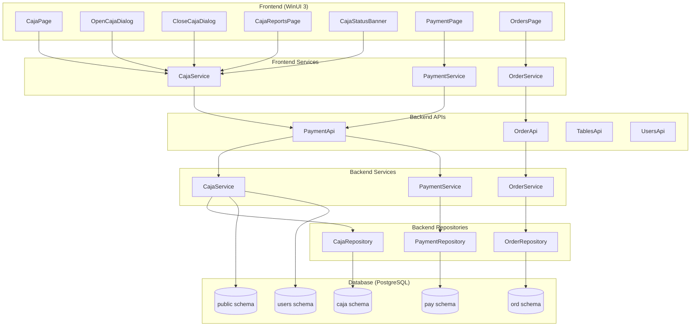

---

## Database Schema Architecture

### Schema: `caja`

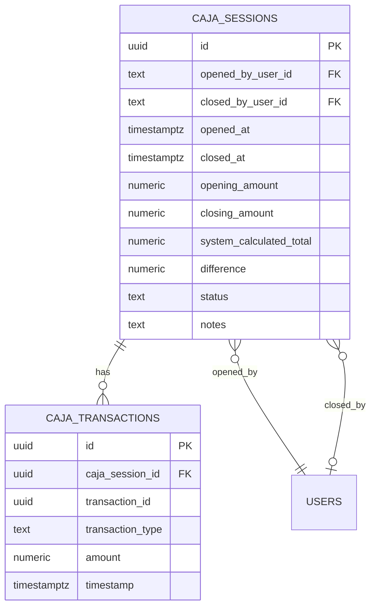

### Schema Relationships

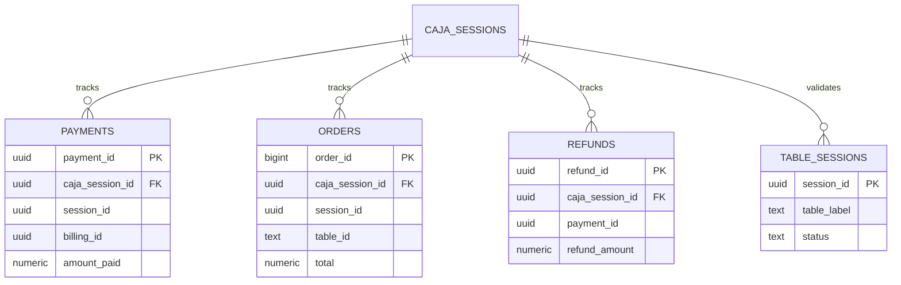

---

## Backend Architecture

### Service Layer

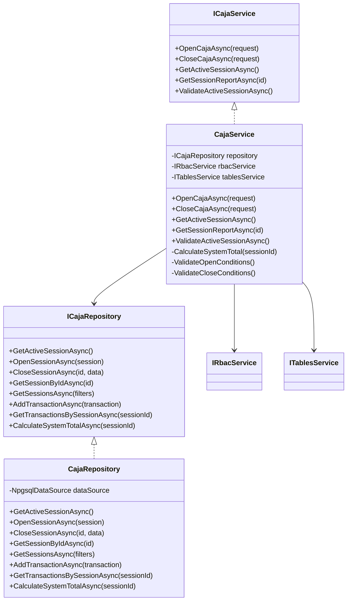

### Controller Layer

```mermaid
classDiagram
    class CajaController {
        -ICajaService cajaService
        +OpenCaja(request) POST /api/caja/open
        +CloseCaja(request) POST /api/caja/close
        +GetActiveSession() GET /api/caja/active
        +GetSession(id) GET /api/caja/{id}
        +GetHistory(filters) GET /api/caja/history
        +GetReport(id) GET /api/caja/{id}/report
    }
    
    class PaymentController {
        -IPaymentService paymentService
        +RegisterPayment(request) POST /api/payments
        +ProcessRefund(id, request) POST /api/payments/{id}/refund
    }
    
    class OrderController {
        -IOrderService orderService
        +CreateOrder(request) POST /api/orders
        +UpdateOrder(id, request) PUT /api/orders/{id}
    }
    
    CajaController --> ICajaService
    PaymentController --> IPaymentService
    OrderController --> IOrderService
```

---

## Frontend Architecture

### ViewModel Layer

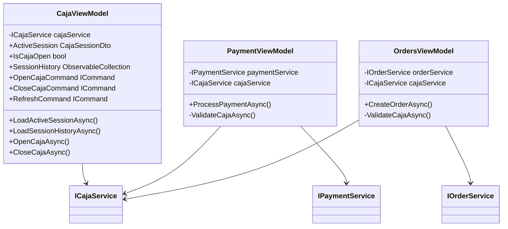

### Service Layer

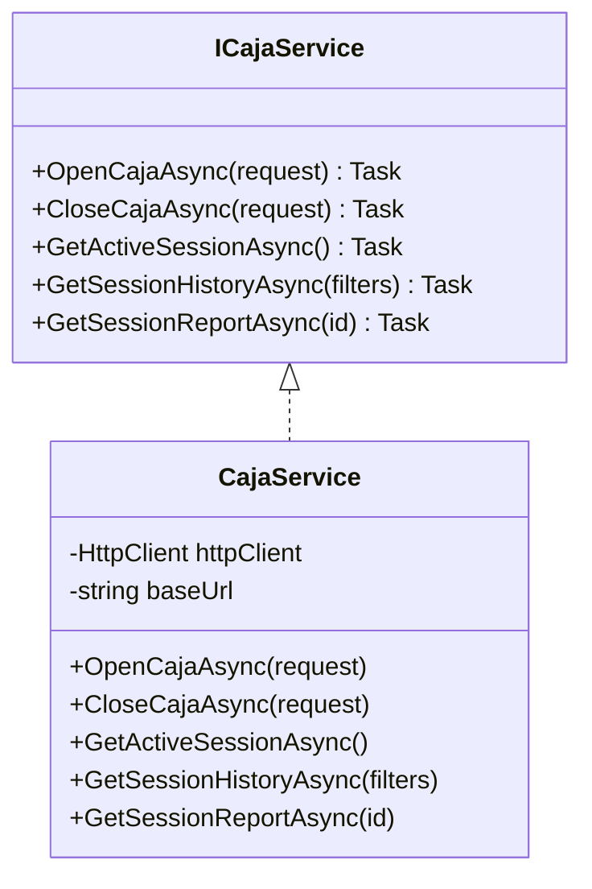

---

## Data Flow Diagrams

### Open Caja Flow

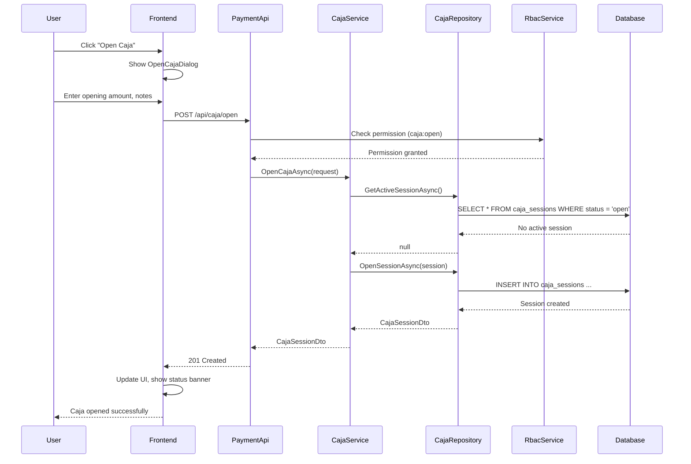

### Process Payment with Caja Validation

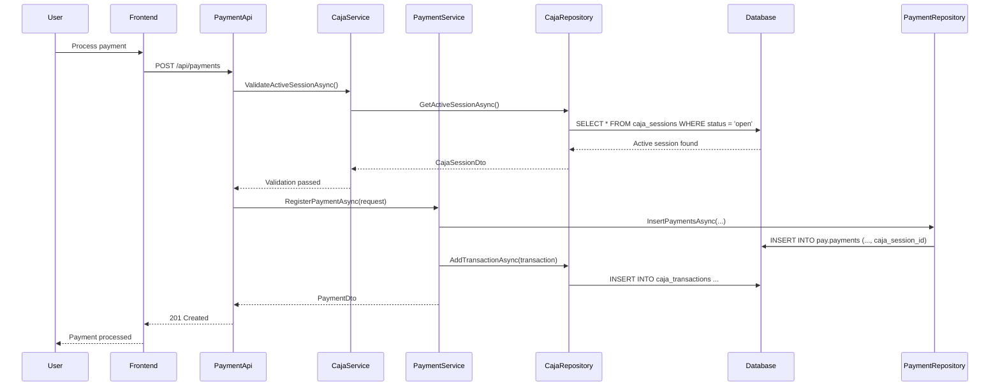

### Close Caja Flow

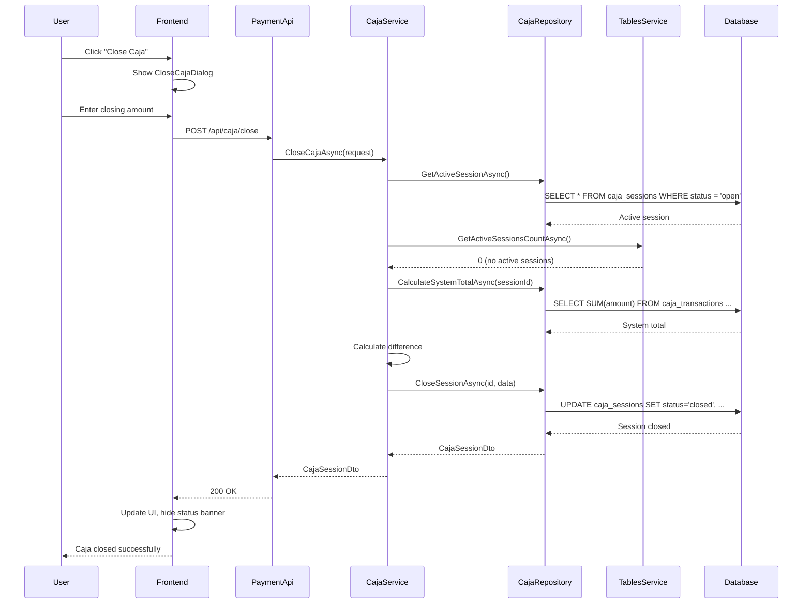

---

## Middleware Architecture

### Request Pipeline

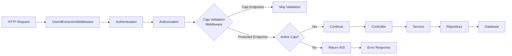

### Caja Validation Middleware

```csharp
public class CajaSessionValidationMiddleware
{
    private readonly RequestDelegate _next;
    private readonly ICajaService _cajaService;
    private readonly HashSet<string> _excludedPaths;

    public async Task InvokeAsync(HttpContext context)
    {
        // Skip validation for caja endpoints
        if (_excludedPaths.Contains(context.Request.Path))
        {
            await _next(context);
            return;
        }

        // Check for active caja session
        var hasActiveSession = await _cajaService.ValidateActiveSessionAsync();
        
        if (!hasActiveSession)
        {
            context.Response.StatusCode = 403;
            await context.Response.WriteAsJsonAsync(new
            {
                error = "Caja cerrada",
                message = "Debe abrir la caja antes de continuar."
            });
            return;
        }

        await _next(context);
    }
}
```

---

## Security Architecture

### RBAC Integration

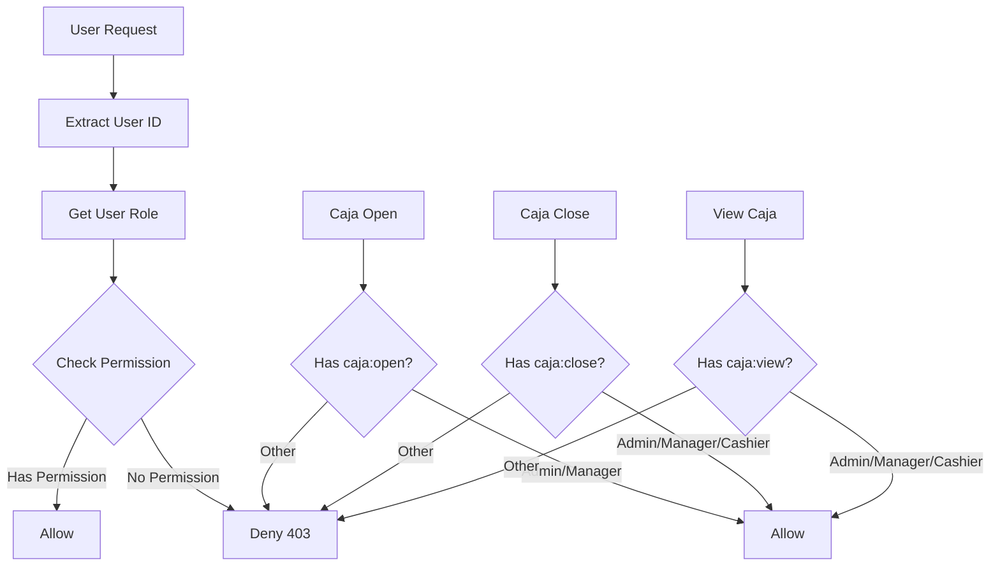

### Permission Matrix

| Role | caja:open | caja:close | caja:view | caja:view_history |
|------|-----------|------------|-----------|-------------------|
| Owner | ✅ | ✅ | ✅ | ✅ |
| Admin | ✅ | ✅ | ✅ | ✅ |
| Manager | ✅ | ✅ | ✅ | ✅ |
| Cashier | ❌ | ✅ | ✅ | ❌ |
| Server | ❌ | ❌ | ❌ | ❌ |
| Host | ❌ | ❌ | ❌ | ❌ |

---

## Error Handling Architecture

### Error Response Format

```json
{
  "error": "Caja cerrada",
  "message": "Debe abrir la caja antes de continuar.",
  "code": "CAJA_CLOSED",
  "details": {
    "requiredAction": "open_caja",
    "lastClosedAt": "2025-01-27T10:30:00Z"
  }
}
```

### Error Codes

| Code | HTTP Status | Description |
|------|-------------|-------------|
| `CAJA_CLOSED` | 403 | No active caja session |
| `CAJA_ALREADY_OPEN` | 409 | Caja already open |
| `CAJA_CANNOT_CLOSE` | 400 | Cannot close (open tables/payments) |
| `CAJA_PERMISSION_DENIED` | 403 | Insufficient permissions |
| `CAJA_NOT_FOUND` | 404 | Caja session not found |

---

## Performance Considerations

### Caching Strategy

- **Active Session Cache**: Cache active caja session in memory (5-minute TTL)
- **Session History Cache**: Cache recent sessions (10-minute TTL)
- **Invalidation**: Invalidate on open/close operations

### Database Optimization

- **Indexes**: 
  - `idx_caja_sessions_status` on `status`
  - `idx_caja_sessions_active` unique on `status` where `status = 'open'`
  - `idx_caja_transactions_session` on `caja_session_id`

- **Query Optimization**:
  - Use `SELECT FOR UPDATE` for active session checks
  - Aggregate queries for totals calculation

---

## Deployment Architecture

### Cloud Run Services

```
PaymentApi (Cloud Run)
├── CajaController
├── CajaService
├── CajaRepository
└── Database (Cloud SQL)
    └── caja schema
```

### Environment Variables

```bash
# Caja Configuration
CAJA_VALIDATION_ENABLED=true
CAJA_SESSION_TIMEOUT_MINUTES=480  # 8 hours
CAJA_CACHE_TTL_SECONDS=300
```

---

## Monitoring & Logging

### Key Metrics

- Caja open/close frequency
- Average session duration
- Transaction count per session
- Difference amounts (variance)
- Validation failures

### Logging Events

- `CajaOpened` - Session opened
- `CajaClosed` - Session closed
- `CajaValidationFailed` - Validation blocked operation
- `CajaCalculationError` - Total calculation error

---

**Next Document:** [04-integration-guide.md](./04-integration-guide.md)
