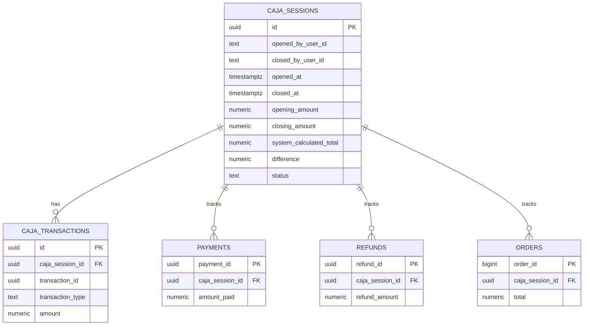

# Caja System - Database Schema

**Date:** 2025-01-27  
**Branch:** `implement-caja-system`  
**Status:** Schema Design

## Overview

The Caja System uses a new `caja` schema in PostgreSQL to isolate caja-related tables from other system schemas. This follows the existing pattern of schema-per-domain.

---

## Schema: `caja`

### Table: `caja.caja_sessions`

Stores caja session records (open/close cycles).

```sql
CREATE SCHEMA IF NOT EXISTS caja;

CREATE TABLE caja.caja_sessions (
    id UUID PRIMARY KEY DEFAULT gen_random_uuid(),
    opened_by_user_id TEXT NOT NULL,
    closed_by_user_id TEXT NULL,
    opened_at TIMESTAMPTZ NOT NULL DEFAULT now(),
    closed_at TIMESTAMPTZ NULL,
    opening_amount NUMERIC(10,2) NOT NULL,
    closing_amount NUMERIC(10,2) NULL,
    system_calculated_total NUMERIC(10,2) NULL,
    difference NUMERIC(10,2) NULL,
    status TEXT NOT NULL CHECK (status IN ('open', 'closed')) DEFAULT 'open',
    notes TEXT NULL,
    created_at TIMESTAMPTZ NOT NULL DEFAULT now(),
    updated_at TIMESTAMPTZ NOT NULL DEFAULT now()
);
```

#### Column Descriptions

| Column | Type | Nullable | Description |
|--------|------|----------|-------------|
| `id` | UUID | NO | Primary key, auto-generated |
| `opened_by_user_id` | TEXT | NO | User ID who opened the caja (FK to users.users) |
| `closed_by_user_id` | TEXT | YES | User ID who closed the caja (FK to users.users) |
| `opened_at` | TIMESTAMPTZ | NO | Timestamp when caja was opened |
| `closed_at` | TIMESTAMPTZ | YES | Timestamp when caja was closed |
| `opening_amount` | NUMERIC(10,2) | NO | Cash amount counted at opening |
| `closing_amount` | NUMERIC(10,2) | YES | Cash amount counted at closing |
| `system_calculated_total` | NUMERIC(10,2) | YES | System-calculated total from transactions |
| `difference` | NUMERIC(10,2) | YES | Difference: closing_amount - system_calculated_total |
| `status` | TEXT | NO | Session status: 'open' or 'closed' |
| `notes` | TEXT | YES | Optional notes for the session |
| `created_at` | TIMESTAMPTZ | NO | Record creation timestamp |
| `updated_at` | TIMESTAMPTZ | NO | Record last update timestamp |

#### Constraints

- **Primary Key**: `id`
- **Check Constraint**: `status IN ('open', 'closed')`
- **Unique Constraint**: Only one session with `status = 'open'` (enforced by unique index)

#### Indexes

```sql
-- Index for status queries (most common)
CREATE INDEX idx_caja_sessions_status ON caja.caja_sessions(status);

-- Index for date range queries
CREATE INDEX idx_caja_sessions_opened_at ON caja.caja_sessions(opened_at DESC);

-- Unique index to enforce only one active session
CREATE UNIQUE INDEX idx_caja_sessions_active 
ON caja.caja_sessions(status) 
WHERE status = 'open';

-- Index for user queries
CREATE INDEX idx_caja_sessions_opened_by ON caja.caja_sessions(opened_by_user_id);
CREATE INDEX idx_caja_sessions_closed_by ON caja.caja_sessions(closed_by_user_id);
```

---

### Table: `caja.caja_transactions`

Stores all transactions linked to a caja session.

```sql
CREATE TABLE caja.caja_transactions (
    id UUID PRIMARY KEY DEFAULT gen_random_uuid(),
    caja_session_id UUID NOT NULL REFERENCES caja.caja_sessions(id) ON DELETE CASCADE,
    transaction_id UUID NOT NULL,
    transaction_type TEXT NOT NULL CHECK (transaction_type IN ('sale', 'refund', 'tip', 'deposit', 'withdrawal')),
    amount NUMERIC(10,2) NOT NULL,
    timestamp TIMESTAMPTZ NOT NULL DEFAULT now(),
    created_at TIMESTAMPTZ NOT NULL DEFAULT now()
);
```

#### Column Descriptions

| Column | Type | Nullable | Description |
|--------|------|----------|-------------|
| `id` | UUID | NO | Primary key, auto-generated |
| `caja_session_id` | UUID | NO | Foreign key to caja_sessions |
| `transaction_id` | UUID | NO | Reference to payment_id, order_id, or refund_id |
| `transaction_type` | TEXT | NO | Type: 'sale', 'refund', 'tip', 'deposit', 'withdrawal' |
| `amount` | NUMERIC(10,2) | NO | Transaction amount (positive for sales/tips/deposits, negative for refunds/withdrawals) |
| `timestamp` | TIMESTAMPTZ | NO | When transaction occurred |
| `created_at` | TIMESTAMPTZ | NO | Record creation timestamp |

#### Constraints

- **Primary Key**: `id`
- **Foreign Key**: `caja_session_id` → `caja.caja_sessions(id)` ON DELETE CASCADE
- **Check Constraint**: `transaction_type IN ('sale', 'refund', 'tip', 'deposit', 'withdrawal')`

#### Indexes

```sql
-- Index for session queries (most common)
CREATE INDEX idx_caja_transactions_session ON caja.caja_transactions(caja_session_id);

-- Index for transaction type queries
CREATE INDEX idx_caja_transactions_type ON caja.caja_transactions(transaction_type);

-- Index for timestamp queries
CREATE INDEX idx_caja_transactions_timestamp ON caja.caja_transactions(timestamp DESC);

-- Composite index for session + type queries
CREATE INDEX idx_caja_transactions_session_type ON caja.caja_transactions(caja_session_id, transaction_type);
```

---

## Schema Modifications

### Modify `pay.payments` Table

Add `caja_session_id` column to link payments to caja sessions.

```sql
-- Add column
ALTER TABLE pay.payments 
ADD COLUMN IF NOT EXISTS caja_session_id UUID NULL;

-- Add foreign key constraint
ALTER TABLE pay.payments
ADD CONSTRAINT fk_payments_caja_session 
FOREIGN KEY (caja_session_id) 
REFERENCES caja.caja_sessions(id) 
ON DELETE SET NULL;

-- Add index
CREATE INDEX IF NOT EXISTS idx_payments_caja_session 
ON pay.payments(caja_session_id);

-- Add comment
COMMENT ON COLUMN pay.payments.caja_session_id IS 'Links payment to caja session';
```

### Modify `pay.refunds` Table

Add `caja_session_id` column to link refunds to caja sessions.

```sql
-- Add column
ALTER TABLE pay.refunds 
ADD COLUMN IF NOT EXISTS caja_session_id UUID NULL;

-- Add foreign key constraint
ALTER TABLE pay.refunds
ADD CONSTRAINT fk_refunds_caja_session 
FOREIGN KEY (caja_session_id) 
REFERENCES caja.caja_sessions(id) 
ON DELETE SET NULL;

-- Add index
CREATE INDEX IF NOT EXISTS idx_refunds_caja_session 
ON pay.refunds(caja_session_id);

-- Add comment
COMMENT ON COLUMN pay.refunds.caja_session_id IS 'Links refund to caja session';
```

### Modify `ord.orders` Table (Optional)

Add `caja_session_id` column for direct linking (alternative to indirect via session_id).

```sql
-- Add column
ALTER TABLE ord.orders 
ADD COLUMN IF NOT EXISTS caja_session_id UUID NULL;

-- Add foreign key constraint
ALTER TABLE ord.orders
ADD CONSTRAINT fk_orders_caja_session 
FOREIGN KEY (caja_session_id) 
REFERENCES caja.caja_sessions(id) 
ON DELETE SET NULL;

-- Add index
CREATE INDEX IF NOT EXISTS idx_orders_caja_session 
ON ord.orders(caja_session_id);

-- Add comment
COMMENT ON COLUMN ord.orders.caja_session_id IS 'Links order to caja session';
```

**Note**: Orders can also be linked indirectly via `session_id` → `table_sessions` → `caja_session_id`. Direct linking is optional but recommended for performance.

---

## Migration Script

### Complete Migration Script

```sql
-- ============================================
-- Caja System Database Migration
-- ============================================

-- Create caja schema
CREATE SCHEMA IF NOT EXISTS caja;

-- Create caja_sessions table
CREATE TABLE IF NOT EXISTS caja.caja_sessions (
    id UUID PRIMARY KEY DEFAULT gen_random_uuid(),
    opened_by_user_id TEXT NOT NULL,
    closed_by_user_id TEXT NULL,
    opened_at TIMESTAMPTZ NOT NULL DEFAULT now(),
    closed_at TIMESTAMPTZ NULL,
    opening_amount NUMERIC(10,2) NOT NULL,
    closing_amount NUMERIC(10,2) NULL,
    system_calculated_total NUMERIC(10,2) NULL,
    difference NUMERIC(10,2) NULL,
    status TEXT NOT NULL CHECK (status IN ('open', 'closed')) DEFAULT 'open',
    notes TEXT NULL,
    created_at TIMESTAMPTZ NOT NULL DEFAULT now(),
    updated_at TIMESTAMPTZ NOT NULL DEFAULT now()
);

-- Create caja_transactions table
CREATE TABLE IF NOT EXISTS caja.caja_transactions (
    id UUID PRIMARY KEY DEFAULT gen_random_uuid(),
    caja_session_id UUID NOT NULL REFERENCES caja.caja_sessions(id) ON DELETE CASCADE,
    transaction_id UUID NOT NULL,
    transaction_type TEXT NOT NULL CHECK (transaction_type IN ('sale', 'refund', 'tip', 'deposit', 'withdrawal')),
    amount NUMERIC(10,2) NOT NULL,
    timestamp TIMESTAMPTZ NOT NULL DEFAULT now(),
    created_at TIMESTAMPTZ NOT NULL DEFAULT now()
);

-- Create indexes for caja_sessions
CREATE INDEX IF NOT EXISTS idx_caja_sessions_status ON caja.caja_sessions(status);
CREATE INDEX IF NOT EXISTS idx_caja_sessions_opened_at ON caja.caja_sessions(opened_at DESC);
CREATE UNIQUE INDEX IF NOT EXISTS idx_caja_sessions_active 
ON caja.caja_sessions(status) 
WHERE status = 'open';
CREATE INDEX IF NOT EXISTS idx_caja_sessions_opened_by ON caja.caja_sessions(opened_by_user_id);
CREATE INDEX IF NOT EXISTS idx_caja_sessions_closed_by ON caja.caja_sessions(closed_by_user_id);

-- Create indexes for caja_transactions
CREATE INDEX IF NOT EXISTS idx_caja_transactions_session ON caja.caja_transactions(caja_session_id);
CREATE INDEX IF NOT EXISTS idx_caja_transactions_type ON caja.caja_transactions(transaction_type);
CREATE INDEX IF NOT EXISTS idx_caja_transactions_timestamp ON caja.caja_transactions(timestamp DESC);
CREATE INDEX IF NOT EXISTS idx_caja_transactions_session_type ON caja.caja_transactions(caja_session_id, transaction_type);

-- Modify pay.payments table
ALTER TABLE pay.payments 
ADD COLUMN IF NOT EXISTS caja_session_id UUID NULL;

DO $$
BEGIN
    IF NOT EXISTS (
        SELECT 1 FROM pg_constraint 
        WHERE conname = 'fk_payments_caja_session'
    ) THEN
        ALTER TABLE pay.payments
        ADD CONSTRAINT fk_payments_caja_session 
        FOREIGN KEY (caja_session_id) 
        REFERENCES caja.caja_sessions(id) 
        ON DELETE SET NULL;
    END IF;
END $$;

CREATE INDEX IF NOT EXISTS idx_payments_caja_session ON pay.payments(caja_session_id);

-- Modify pay.refunds table
ALTER TABLE pay.refunds 
ADD COLUMN IF NOT EXISTS caja_session_id UUID NULL;

DO $$
BEGIN
    IF NOT EXISTS (
        SELECT 1 FROM pg_constraint 
        WHERE conname = 'fk_refunds_caja_session'
    ) THEN
        ALTER TABLE pay.refunds
        ADD CONSTRAINT fk_refunds_caja_session 
        FOREIGN KEY (caja_session_id) 
        REFERENCES caja.caja_sessions(id) 
        ON DELETE SET NULL;
    END IF;
END $$;

CREATE INDEX IF NOT EXISTS idx_refunds_caja_session ON pay.refunds(caja_session_id);

-- Modify ord.orders table (optional)
ALTER TABLE ord.orders 
ADD COLUMN IF NOT EXISTS caja_session_id UUID NULL;

DO $$
BEGIN
    IF NOT EXISTS (
        SELECT 1 FROM pg_constraint 
        WHERE conname = 'fk_orders_caja_session'
    ) THEN
        ALTER TABLE ord.orders
        ADD CONSTRAINT fk_orders_caja_session 
        FOREIGN KEY (caja_session_id) 
        REFERENCES caja.caja_sessions(id) 
        ON DELETE SET NULL;
    END IF;
END $$;

CREATE INDEX IF NOT EXISTS idx_orders_caja_session ON ord.orders(caja_session_id);

-- Add comments
COMMENT ON SCHEMA caja IS 'Caja (Cash Register) System Schema';
COMMENT ON TABLE caja.caja_sessions IS 'Stores caja session records (open/close cycles)';
COMMENT ON TABLE caja.caja_transactions IS 'Stores all transactions linked to a caja session';
COMMENT ON COLUMN pay.payments.caja_session_id IS 'Links payment to caja session';
COMMENT ON COLUMN pay.refunds.caja_session_id IS 'Links refund to caja session';
COMMENT ON COLUMN ord.orders.caja_session_id IS 'Links order to caja session';
```

---

## Rollback Script

```sql
-- ============================================
-- Caja System Database Rollback
-- ============================================

-- Remove foreign key constraints
ALTER TABLE pay.payments DROP CONSTRAINT IF EXISTS fk_payments_caja_session;
ALTER TABLE pay.refunds DROP CONSTRAINT IF EXISTS fk_refunds_caja_session;
ALTER TABLE ord.orders DROP CONSTRAINT IF EXISTS fk_orders_caja_session;

-- Remove columns
ALTER TABLE pay.payments DROP COLUMN IF EXISTS caja_session_id;
ALTER TABLE pay.refunds DROP COLUMN IF EXISTS caja_session_id;
ALTER TABLE ord.orders DROP COLUMN IF EXISTS caja_session_id;

-- Drop indexes
DROP INDEX IF EXISTS idx_payments_caja_session;
DROP INDEX IF EXISTS idx_refunds_caja_session;
DROP INDEX IF EXISTS idx_orders_caja_session;

-- Drop tables (CASCADE will handle foreign keys)
DROP TABLE IF EXISTS caja.caja_transactions CASCADE;
DROP TABLE IF EXISTS caja.caja_sessions CASCADE;

-- Drop schema (only if empty)
DROP SCHEMA IF EXISTS caja CASCADE;
```

---

## Data Relationships

### Entity Relationship Diagram



---

## Query Examples

### Get Active Caja Session

```sql
SELECT 
    id,
    opened_by_user_id,
    opened_at,
    opening_amount,
    status
FROM caja.caja_sessions
WHERE status = 'open'
LIMIT 1;
```

### Calculate System Total for Session

```sql
SELECT 
    COALESCE(SUM(
        CASE 
            WHEN transaction_type IN ('sale', 'tip', 'deposit') THEN amount
            WHEN transaction_type IN ('refund', 'withdrawal') THEN -amount
            ELSE 0
        END
    ), 0) AS system_total
FROM caja.caja_transactions
WHERE caja_session_id = @session_id;
```

### Get Session Report

```sql
SELECT 
    cs.id,
    cs.opened_at,
    cs.closed_at,
    cs.opening_amount,
    cs.closing_amount,
    cs.system_calculated_total,
    cs.difference,
    COUNT(ct.id) AS transaction_count,
    SUM(CASE WHEN ct.transaction_type = 'sale' THEN ct.amount ELSE 0 END) AS sales_total,
    SUM(CASE WHEN ct.transaction_type = 'refund' THEN ct.amount ELSE 0 END) AS refunds_total,
    SUM(CASE WHEN ct.transaction_type = 'tip' THEN ct.amount ELSE 0 END) AS tips_total
FROM caja.caja_sessions cs
LEFT JOIN caja.caja_transactions ct ON ct.caja_session_id = cs.id
WHERE cs.id = @session_id
GROUP BY cs.id;
```

### Get Payments for Session

```sql
SELECT 
    p.payment_id,
    p.amount_paid,
    p.payment_method,
    p.tip_amount,
    p.created_at
FROM pay.payments p
WHERE p.caja_session_id = @session_id
ORDER BY p.created_at;
```

---

## Performance Considerations

### Index Usage

- **Active Session Queries**: Use `idx_caja_sessions_active` (unique index)
- **Session History**: Use `idx_caja_sessions_opened_at` (date range queries)
- **Transaction Aggregation**: Use `idx_caja_transactions_session` (session grouping)
- **Payment Linking**: Use `idx_payments_caja_session` (join operations)

### Query Optimization

- Use `SELECT FOR UPDATE` when checking/updating active session to prevent race conditions
- Use `COALESCE` for nullable aggregations
- Use `LEFT JOIN` for optional relationships
- Consider materialized views for complex reports

---

## Data Integrity

### Constraints

1. **Only One Active Session**: Enforced by unique index `idx_caja_sessions_active`
2. **Valid Status Values**: Enforced by CHECK constraint
3. **Valid Transaction Types**: Enforced by CHECK constraint
4. **Foreign Key Integrity**: Enforced by foreign key constraints

### Validation Rules

1. **Opening Amount**: Must be >= 0
2. **Closing Amount**: Must be >= 0 (when closed)
3. **Difference**: Calculated as `closing_amount - system_calculated_total`
4. **Transaction Amount**: Can be positive or negative based on type

---

**Next Document:** [05-summary-and-approval.md](./05-summary-and-approval.md)
