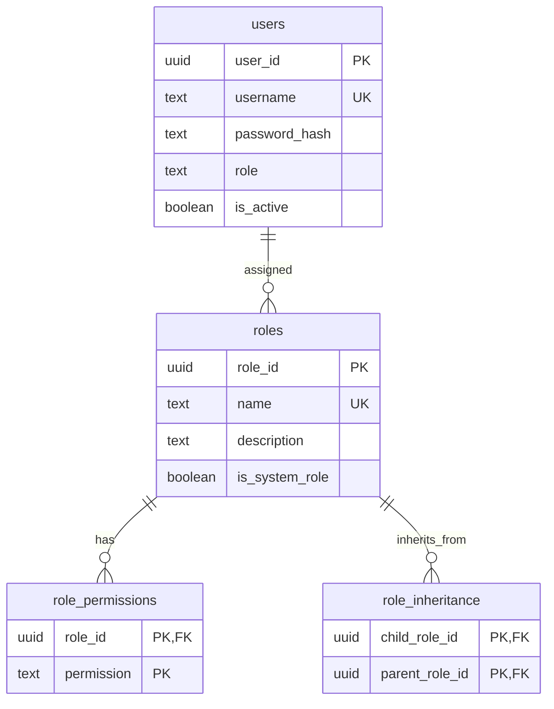
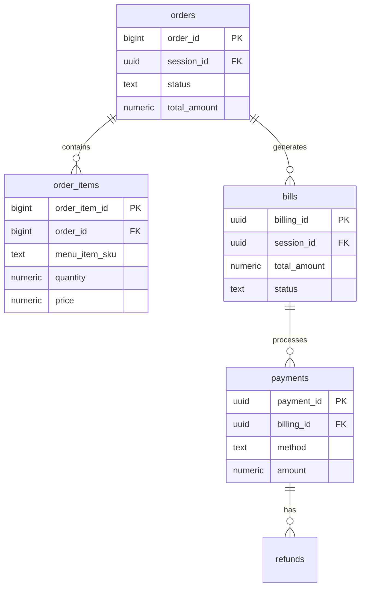

# Database Architecture

This document provides a comprehensive overview of the MagiDesk POS database architecture, including schema design, relationships, and data models.

## Database Overview

**Database System**: PostgreSQL 17  
**Deployment**: Google Cloud SQL  
**Connection**: Cloud SQL Proxy (Unix socket in Cloud Run)  
**Schemas**: 9 schemas (one per service domain)

## Schema Organization

```mermaid
erDiagram
    users ||--o{ users : "has"
    users ||--o{ roles : "assigned"
    roles ||--o{ role_permissions : "has"
    roles ||--o{ role_inheritance : "inherits"
    
    menu ||--o{ menu_items : "contains"
    menu_items ||--o{ modifiers : "has"
    menu_items ||--o{ combos : "includes"
    
    ord ||--o{ orders : "contains"
    orders ||--o{ order_items : "has"
    orders ||--o{ order_logs : "tracks"
    
    payments ||--o{ payments : "processes"
    payments ||--o{ refunds : "has"
    payments ||--o{ payment_logs : "tracks"
    
    inventory ||--o{ inventory_items : "manages"
    inventory_items ||--o{ inventory_stock : "tracks"
    inventory_items ||--o{ inventory_transactions : "records"
    inventory ||--o{ vendors : "has"
    
    customers ||--o{ customers : "manages"
    customers ||--o{ customer_segments : "belongs_to"
    customers ||--o{ loyalty_programs : "enrolled_in"
    customers ||--o{ wallets : "has"
    
    discounts ||--o{ campaigns : "contains"
    discounts ||--o{ vouchers : "has"
    discounts ||--o{ combo_offers : "includes"
    
    settings ||--o{ app_settings : "stores"
    settings ||--o{ setting_categories : "organizes"
    
    public ||--o{ tables : "manages"
    public ||--o{ table_status : "tracks"
    public ||--o{ table_sessions : "records"
    public ||--o{ bills : "generates"
```



## Schema Details

### 1. `users` Schema

**Purpose**: User management, authentication, and RBAC

**Tables**:

#### `users.users`
```sql
CREATE TABLE users.users (
    user_id UUID PRIMARY KEY DEFAULT gen_random_uuid(),
    username TEXT NOT NULL UNIQUE,
    password_hash TEXT NOT NULL,
    role TEXT NOT NULL,
    created_at TIMESTAMPTZ NOT NULL DEFAULT now(),
    updated_at TIMESTAMPTZ NOT NULL DEFAULT now(),
    is_active BOOLEAN NOT NULL DEFAULT true,
    is_deleted BOOLEAN NOT NULL DEFAULT false
);
```

#### `users.roles`
```sql
CREATE TABLE users.roles (
    role_id UUID PRIMARY KEY DEFAULT gen_random_uuid(),
    name TEXT NOT NULL UNIQUE,
    description TEXT,
    is_system_role BOOLEAN NOT NULL DEFAULT false,
    is_active BOOLEAN NOT NULL DEFAULT true,
    created_at TIMESTAMPTZ NOT NULL DEFAULT now(),
    updated_at TIMESTAMPTZ NOT NULL DEFAULT now()
);
```

#### `users.role_permissions`
```sql
CREATE TABLE users.role_permissions (
    role_id UUID NOT NULL REFERENCES users.roles(role_id) ON DELETE CASCADE,
    permission TEXT NOT NULL,
    PRIMARY KEY (role_id, permission)
);
```

#### `users.role_inheritance`
```sql
CREATE TABLE users.role_inheritance (
    child_role_id UUID NOT NULL REFERENCES users.roles(role_id) ON DELETE CASCADE,
    parent_role_id UUID NOT NULL REFERENCES users.roles(role_id) ON DELETE CASCADE,
    PRIMARY KEY (child_role_id, parent_role_id),
    CHECK (child_role_id != parent_role_id)
);
```

**Indexes**:
- `users.users.username` (UNIQUE)
- `users.users.role`
- `users.roles.name` (UNIQUE)
- `users.role_permissions.permission`
- `users.role_inheritance.child_role_id`
- `users.role_inheritance.parent_role_id`

### 2. `menu` Schema

**Purpose**: Menu items, modifiers, combos, and menu versioning

**Key Tables**:
- `menu_items` - Menu items with pricing, availability
- `modifiers` - Item modifiers (size, toppings, etc.)
- `modifier_options` - Options for modifiers
- `combos` - Combo offers
- `menu_history` - Version history

### 3. `ord` Schema

**Purpose**: Order processing and management

**Key Tables**:
- `orders` - Order headers
- `order_items` - Order line items
- `order_logs` - Order change history

### 4. `payments` Schema

**Purpose**: Payment processing, refunds, and payment history

**Key Tables**:
- `payments` - Payment transactions
- `refunds` - Refund records
- `payment_logs` - Payment audit trail

### 5. `inventory` Schema

**Purpose**: Inventory management, vendors, and stock tracking

**Key Tables**:
- `inventory_items` - Inventory items
- `inventory_stock` - Current stock levels
- `inventory_transactions` - Stock movements
- `vendors` - Vendor information
- `vendor_orders` - Purchase orders

### 6. `settings` Schema

**Purpose**: Hierarchical system settings

**Key Tables**:
- `app_settings` - Application settings
- `setting_categories` - Settings organization

### 7. `customers` Schema

**Purpose**: Customer management, loyalty, and campaigns

**Key Tables**:
- `customers` - Customer information
- `customer_segments` - Customer segmentation
- `loyalty_programs` - Loyalty program definitions
- `wallets` - Customer wallet balances

### 8. `discounts` Schema

**Purpose**: Discounts, vouchers, and combo offers

**Key Tables**:
- `campaigns` - Marketing campaigns
- `vouchers` - Discount vouchers
- `combo_offers` - Combo discount offers

### 9. `public` Schema

**Purpose**: Tables, sessions, and bills

**Key Tables**:

#### `public.tables`
```sql
CREATE TABLE public.tables (
    table_id UUID PRIMARY KEY DEFAULT gen_random_uuid(),
    floor_id UUID NOT NULL,
    table_name TEXT NOT NULL,
    table_type TEXT NOT NULL CHECK (table_type IN ('billiard', 'bar')),
    x_position NUMERIC(10,2) NOT NULL,
    y_position NUMERIC(10,2) NOT NULL,
    width NUMERIC(10,2) NOT NULL,
    height NUMERIC(10,2) NOT NULL,
    status TEXT NOT NULL DEFAULT 'available' CHECK (status IN ('available', 'occupied')),
    is_locked BOOLEAN NOT NULL DEFAULT false,
    created_at TIMESTAMPTZ NOT NULL DEFAULT now(),
    updated_at TIMESTAMPTZ NOT NULL DEFAULT now()
);
```

#### `public.table_status`
```sql
CREATE TABLE public.table_status (
    label TEXT PRIMARY KEY,
    type TEXT NOT NULL,
    occupied BOOLEAN NOT NULL,
    order_id TEXT NULL,
    start_time TIMESTAMPTZ NULL,
    server TEXT NULL,
    updated_at TIMESTAMPTZ NOT NULL DEFAULT now()
);
```

#### `public.table_sessions`
```sql
CREATE TABLE public.table_sessions (
    session_id UUID PRIMARY KEY DEFAULT gen_random_uuid(),
    table_label TEXT NOT NULL,
    server_id TEXT NOT NULL,
    server_name TEXT NOT NULL,
    start_time TIMESTAMPTZ NOT NULL,
    end_time TIMESTAMPTZ NULL,
    status TEXT NOT NULL CHECK (status IN ('active', 'closed')) DEFAULT 'active',
    items JSONB NOT NULL DEFAULT '[]',
    billing_id UUID NULL
);
```

#### `public.bills`
```sql
CREATE TABLE public.bills (
    billing_id UUID PRIMARY KEY DEFAULT gen_random_uuid(),
    session_id UUID NOT NULL REFERENCES public.table_sessions(session_id),
    table_label TEXT NOT NULL,
    total_amount NUMERIC(18,2) NOT NULL,
    paid_amount NUMERIC(18,2) NOT NULL DEFAULT 0,
    status TEXT NOT NULL CHECK (status IN ('open', 'paid', 'voided')) DEFAULT 'open',
    created_at TIMESTAMPTZ NOT NULL DEFAULT now(),
    updated_at TIMESTAMPTZ NOT NULL DEFAULT now()
);
```

## Entity Relationships

### User-Role-Permission Relationship



### Order-Item-Payment Relationship



## Data Types and Conventions

### UUID Usage
- **Primary Keys**: All tables use UUID for primary keys
- **Foreign Keys**: UUID references
- **Generation**: `gen_random_uuid()` function

### Timestamps
- **Created At**: `created_at TIMESTAMPTZ NOT NULL DEFAULT now()`
- **Updated At**: `updated_at TIMESTAMPTZ NOT NULL DEFAULT now()`
- **Timezone**: All timestamps use `TIMESTAMPTZ` (timezone-aware)

### Status Fields
- **Text Enums**: Status fields use `CHECK` constraints
- **Examples**: `status TEXT CHECK (status IN ('active', 'inactive'))`

### Numeric Precision
- **Currency**: `NUMERIC(18,2)` for money amounts
- **Quantities**: `NUMERIC(18,3)` for inventory quantities
- **Percentages**: `NUMERIC(5,2)` for rates/percentages

## Indexes and Performance

### Primary Indexes
- All primary keys are automatically indexed
- Foreign keys are indexed for join performance

### Secondary Indexes
- **User Lookups**: `users.users.username` (UNIQUE)
- **Role Lookups**: `users.roles.name` (UNIQUE)
- **Permission Queries**: `users.role_permissions.permission`
- **Table Status**: `public.table_status.label` (PRIMARY KEY)
- **Session Queries**: `public.table_sessions.session_id` (PRIMARY KEY)

### Query Optimization
- **Connection Pooling**: Npgsql DataSource with connection pooling
- **Prepared Statements**: Parameterized queries for security and performance
- **JSONB Indexes**: GIN indexes on JSONB columns for fast queries

## Data Integrity

### Constraints

**Primary Keys**
- All tables have UUID primary keys
- Composite primary keys for junction tables

**Foreign Keys**
- Referential integrity enforced
- `ON DELETE CASCADE` for dependent records
- `ON DELETE SET NULL` for optional references

**Check Constraints**
- Status fields validated
- Numeric ranges validated
- Business rules enforced

**Unique Constraints**
- Usernames, role names, SKUs
- Composite unique constraints where needed

### Transactions
- All multi-table operations use transactions
- ACID compliance guaranteed
- Rollback on errors

## Migration Strategy

### Schema Migrations
- **Version Control**: SQL migration files
- **Idempotent**: Migrations can be run multiple times safely
- **Rollback**: Rollback scripts available

### Data Migrations
- **Backup First**: Always backup before migrations
- **Test Environment**: Test migrations in dev first
- **Gradual Rollout**: Migrate data in batches if large

## Backup and Recovery

### Backup Strategy
- **Automated Backups**: Cloud SQL automated daily backups
- **Point-in-Time Recovery**: Available for last 7 days
- **Manual Backups**: On-demand backups before major changes

### Recovery Procedures
1. Identify backup point
2. Restore from Cloud SQL backup
3. Verify data integrity
4. Resume operations

## Security

### Access Control
- **Database Users**: Limited permissions per service
- **Connection Strings**: Stored in environment variables
- **Cloud SQL Proxy**: Secure connection tunneling

### Data Protection
- **Encryption at Rest**: Cloud SQL encryption enabled
- **Encryption in Transit**: TLS/SSL for all connections
- **Password Hashing**: BCrypt for user passwords

## Monitoring

### Performance Metrics
- Query execution time
- Connection pool usage
- Lock contention
- Index usage

### Health Checks
- Database connectivity
- Query performance
- Connection pool health

---

**Last Updated**: 2025-01-02  
**Database Version**: 1.0.0

