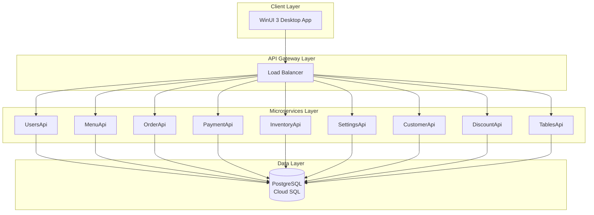
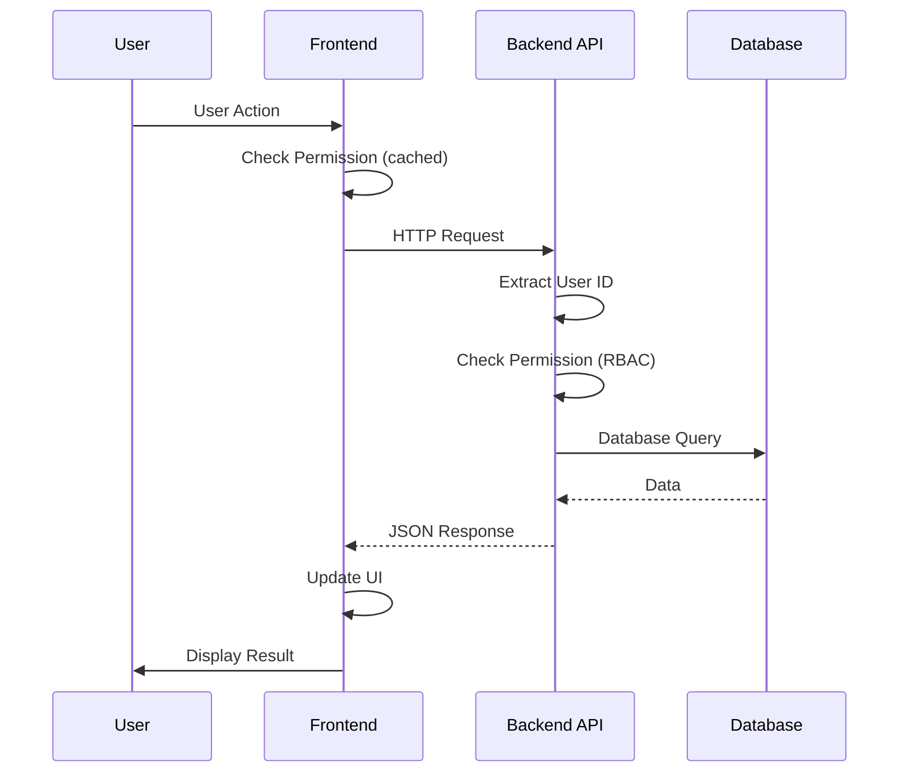
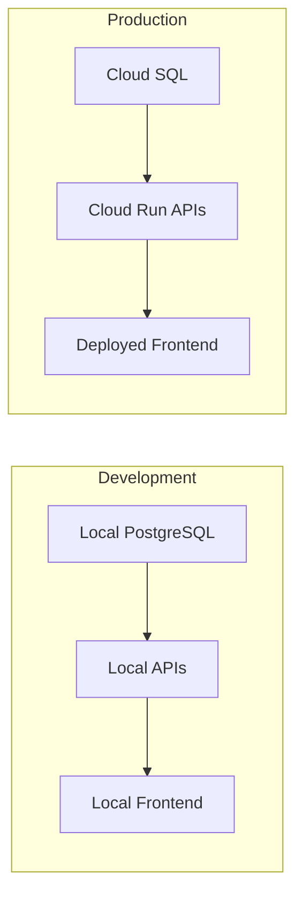

# Architecture Overview

MagiDesk POS follows a microservices architecture with a WinUI 3 desktop frontend.

## High-Level Architecture

## Architecture Principles

### 1. Microservices

- **Independent Services** - Each API is independently deployable
- **Technology Stack** - All use ASP.NET Core 8 (consistent)
- **Database per Service** - Each service has its own schema
- **API Versioning** - v1 (legacy) and v2 (RBAC-enabled)

### 2. Frontend-Backend Separation

- **Desktop Application** - WinUI 3 for rich UI
- **RESTful APIs** - Standard HTTP/JSON communication
- **Stateless** - No server-side session state
- **Caching** - Frontend caches permissions and data

### 3. Security

- **RBAC** - Role-Based Access Control
- **Backend Enforcement** - All permissions checked server-side
- **Frontend Shadow** - UI reflects permissions for UX
- **API Versioning** - v2 endpoints require permissions

## Component Details

### Frontend (WinUI 3)

- **Framework:** WinUI 3 (.NET 8)
- **Pattern:** MVVM (Model-View-ViewModel)
- **Architecture:** Desktop application
- **Communication:** HTTP REST APIs

### Backend (Microservices)

- **Framework:** ASP.NET Core 8
- **Pattern:** RESTful APIs
- **Deployment:** Google Cloud Run
- **Database:** PostgreSQL (shared instance, separate schemas)

### Database

- **Type:** PostgreSQL 17
- **Hosting:** Google Cloud SQL
- **Schemas:** Multiple schemas per service
- **Connection:** Unix socket (Cloud Run) or TCP (local)

## Data Flow

## Deployment Architecture

## Scalability

- **Horizontal Scaling** - Each API scales independently
- **Auto-scaling** - Cloud Run scales based on traffic
- **Database Scaling** - Cloud SQL handles connection pooling
- **Frontend** - Single instance (desktop app)

## Security Layers

1. **Network** - HTTPS only
2. **Authentication** - User login required
3. **Authorization** - RBAC on all endpoints
4. **Data** - Encrypted at rest (Cloud SQL)
5. **Transport** - TLS 1.2+

## Next Steps

- [System Architecture](./system-architecture.md)
- [Frontend Architecture](./frontend-architecture.md)
- [Backend Architecture](./backend-architecture.md)
- [RBAC Architecture](./rbac-architecture.md)
