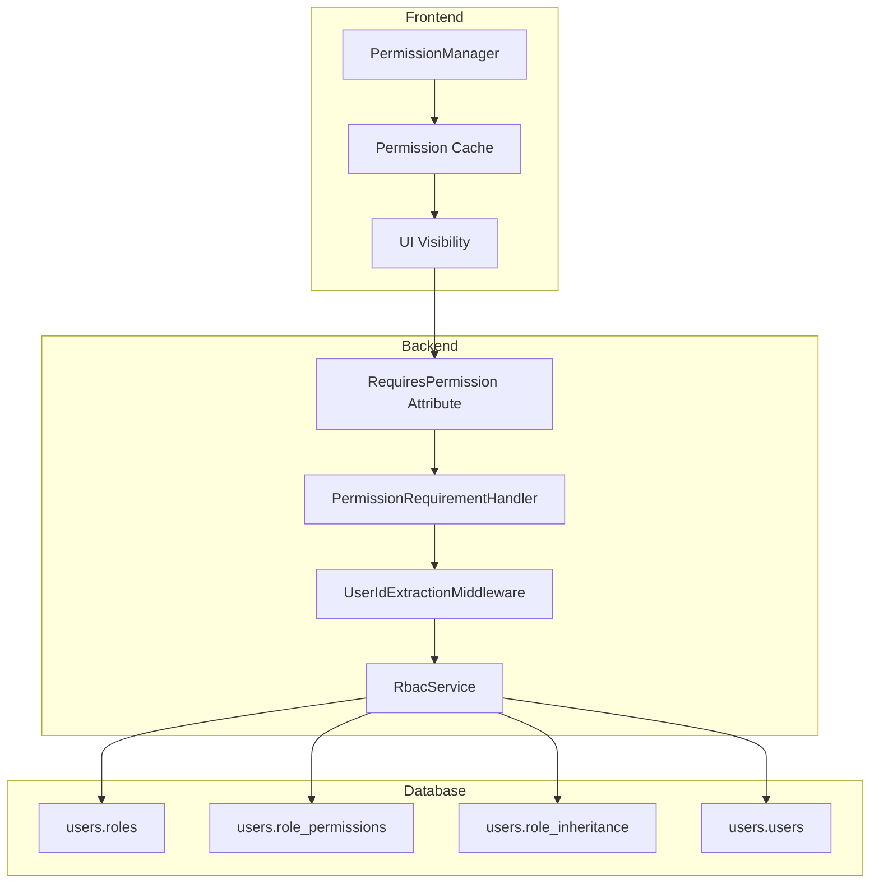
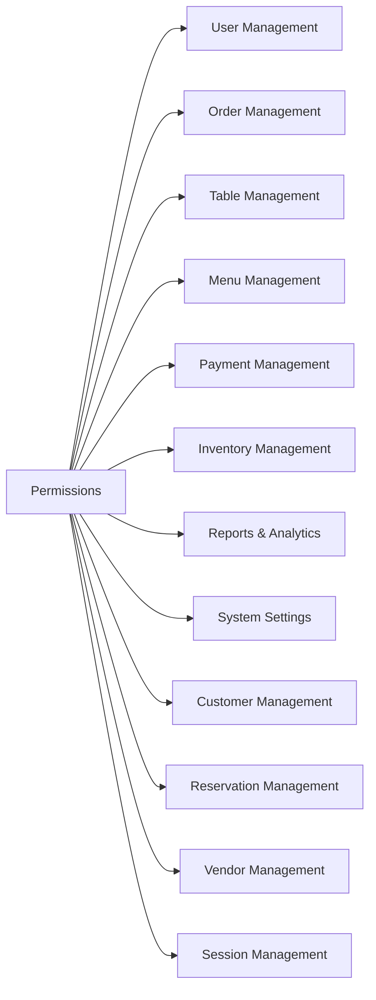
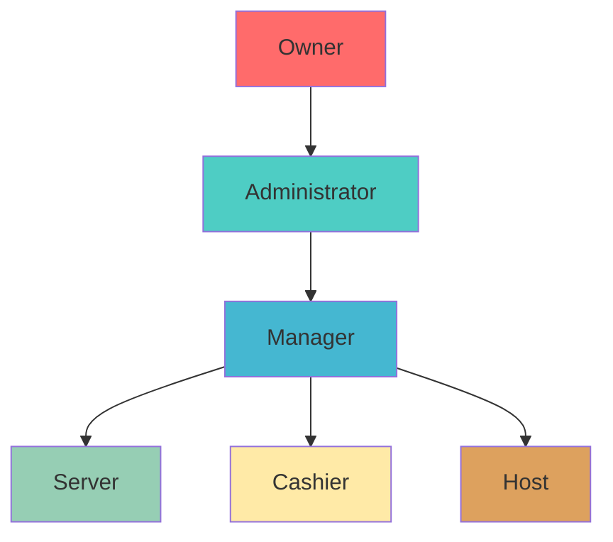
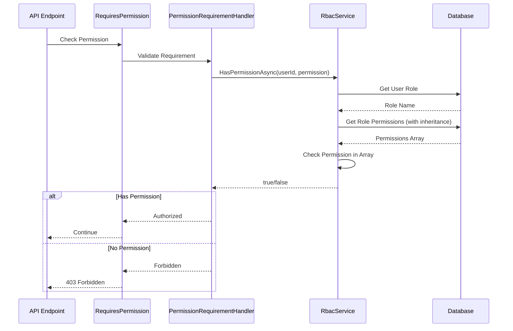
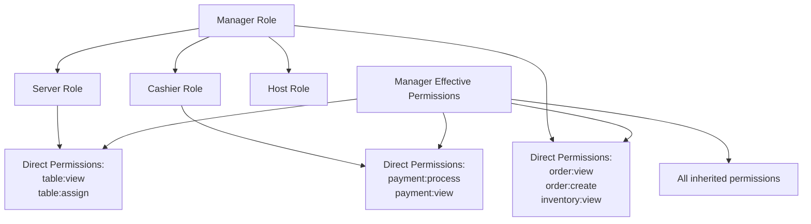

# RBAC Architecture

This document provides a comprehensive overview of the Role-Based Access Control (RBAC) system implemented in MagiDesk POS.

## Overview

The RBAC system provides fine-grained access control across the entire application, with 47 permissions organized into 11 categories, supporting 6 system roles and custom roles with inheritance.

## RBAC Components



## Permission System

### Permission Categories



### Permission List

#### User Management (5 permissions)
- `user:view` - View user information
- `user:create` - Create new users
- `user:update` - Update user information
- `user:delete` - Delete users
- `user:manage_roles` - Assign and manage user roles

#### Order Management (6 permissions)
- `order:view` - View orders
- `order:create` - Create new orders
- `order:update` - Modify existing orders
- `order:delete` - Delete orders
- `order:cancel` - Cancel orders
- `order:complete` - Mark orders as complete

#### Table Management (4 permissions)
- `table:view` - View table status
- `table:manage` - Manage table assignments
- `table:assign` - Assign tables to servers
- `table:clear` - Clear tables

#### Menu Management (5 permissions)
- `menu:view` - View menu items
- `menu:create` - Add new menu items
- `menu:update` - Modify menu items
- `menu:delete` - Remove menu items
- `menu:price_change` - Change menu item prices

#### Payment Management (4 permissions)
- `payment:view` - View payment information
- `payment:process` - Process payments
- `payment:refund` - Process refunds
- `payment:void` - Void transactions

#### Inventory Management (4 permissions)
- `inventory:view` - View inventory levels
- `inventory:update` - Update inventory quantities
- `inventory:adjust` - Adjust inventory for discrepancies
- `inventory:restock` - Process restock orders

#### Reports & Analytics (5 permissions)
- `report:view` - View reports
- `report:sales` - View sales reports
- `report:inventory` - View inventory reports
- `report:user_activity` - View user activity reports
- `report:export` - Export reports

#### System Settings (4 permissions)
- `settings:view` - View system settings
- `settings:update` - Update system settings
- `settings:system` - Modify system configuration
- `settings:receipt` - Configure receipt settings

#### Customer Management (4 permissions)
- `customer:view` - View customer information
- `customer:create` - Add new customers
- `customer:update` - Update customer information
- `customer:delete` - Remove customers

#### Reservation Management (4 permissions)
- `reservation:view` - View reservations
- `reservation:create` - Create reservations
- `reservation:update` - Modify reservations
- `reservation:cancel` - Cancel reservations

#### Vendor Management (5 permissions)
- `vendor:view` - View vendor information
- `vendor:create` - Add new vendors
- `vendor:update` - Update vendor information
- `vendor:delete` - Remove vendors
- `vendor:order` - Place vendor orders

#### Session Management (3 permissions)
- `session:view` - View active sessions
- `session:manage` - Manage sessions
- `session:close` - Close sessions

## System Roles

### Role Hierarchy



### Role Definitions

#### Owner
**Description**: Full system access, cannot be modified  
**Permissions**: All 47 permissions  
**Use Case**: Business owner, system administrator

#### Administrator
**Description**: Full operational access, can manage users  
**Permissions**: All permissions except system-level settings  
**Use Case**: IT administrator, operations manager

#### Manager
**Description**: Day-to-day operations management  
**Permissions**: 
- All view permissions
- Order management
- Payment processing
- Inventory management
- Reports
- Customer management
- Session management

**Use Case**: Shift manager, floor manager

#### Server
**Description**: Table and order management  
**Permissions**:
- Table management
- Order creation and updates
- Menu viewing
- Session management

**Use Case**: Wait staff, table servers

#### Cashier
**Description**: Payment processing  
**Permissions**:
- Payment processing
- Payment viewing
- Order viewing
- Customer viewing

**Use Case**: Cashier, payment processor

#### Host
**Description**: Table assignment and reservations  
**Permissions**:
- Table viewing and assignment
- Reservation management
- Customer viewing

**Use Case**: Host, receptionist

## Permission Resolution Flow



## Role Inheritance

### Inheritance Rules

1. **Direct Permissions**: Permissions directly assigned to role
2. **Inherited Permissions**: Permissions from parent roles
3. **Recursive Inheritance**: Supports multi-level inheritance
4. **Cycle Prevention**: Database constraint prevents circular inheritance

### Inheritance Example



## Implementation Details

### Backend Implementation

#### Permission Requirement Handler

```csharp
public class PermissionRequirementHandler : AuthorizationHandler<PermissionRequirement>
{
    private readonly IRbacService _rbacService;
    
    protected override async Task HandleRequirementAsync(
        AuthorizationHandlerContext context, 
        PermissionRequirement requirement)
    {
        var userId = ExtractUserId(context);
        var hasPermission = await _rbacService.HasPermissionAsync(userId, requirement.Permission);
        
        if (hasPermission)
            context.Succeed(requirement);
        else
            context.Fail();
    }
}
```

#### User ID Extraction Middleware

```csharp
public class UserIdExtractionMiddleware
{
    public async Task InvokeAsync(HttpContext context)
    {
        // Extract from X-User-Id header
        var userId = context.Request.Headers["X-User-Id"].FirstOrDefault();
        
        // Or from query string
        if (string.IsNullOrEmpty(userId))
            userId = context.Request.Query["userId"].FirstOrDefault();
        
        // Store in HttpContext.Items
        context.Items["UserId"] = userId;
        
        await _next(context);
    }
}
```

### Frontend Implementation

#### Permission Manager

```csharp
public class PermissionManager
{
    private string[] _permissions = Array.Empty<string>();
    
    public void LoadPermissions(string[] permissions)
    {
        _permissions = permissions;
    }
    
    public bool HasPermission(string permission)
    {
        return _permissions.Contains(permission);
    }
    
    public bool HasAnyPermission(string[] permissions)
    {
        return permissions.Any(p => _permissions.Contains(p));
    }
}
```

#### UI Visibility Binding

```xml
<Button 
    Visibility="{x:Bind ViewModel.CanCreateOrder, Mode=OneWay}"
    Content="Create Order" />
```

```csharp
public bool CanCreateOrder => 
    _permissionManager.HasPermission(Permissions.ORDER_CREATE);
```

## API Versioning

### v1 (Legacy)
- **Route**: `/api/{controller}` or `/api/v1/{controller}`
- **RBAC**: No permission checks
- **Status**: Backward compatible, maintained for existing clients

### v2 (RBAC-Enabled)
- **Route**: `/api/v2/{controller}`
- **RBAC**: All endpoints require permissions
- **Status**: Recommended for new development

## Permission Assignment

### System Roles
- Permissions assigned during database initialization
- Managed by `DatabaseInitializer` service
- Cannot be modified by users (system roles)

### Custom Roles
- Created via `/api/v2/rbac/roles` endpoint
- Permissions assigned during creation or update
- Can inherit from other roles
- Can be modified by administrators

## Security Considerations

### Backend Enforcement
- **Always Validate**: Backend is the source of truth
- **No Trust**: Never trust frontend permission checks
- **Fail Closed**: Deny access if permission check fails

### Frontend Shadow
- **UX Only**: Frontend checks are for user experience only
- **Hide/Disable**: UI elements hidden/disabled based on permissions
- **Not Security**: Frontend checks do not provide security

### Performance
- **Caching**: Frontend caches permissions after login
- **Efficient Queries**: Database queries optimized with indexes
- **Connection Pooling**: Reuse database connections

## Migration from v1 to v2

### Step 1: Update Frontend
- Use v2 API endpoints
- Include `X-User-Id` header
- Handle 403 Forbidden responses

### Step 2: Assign Roles
- Ensure all users have roles assigned
- Verify role permissions are correct

### Step 3: Test Permissions
- Test each endpoint with different roles
- Verify permission checks work correctly

### Step 4: Deploy
- Deploy v2 endpoints alongside v1
- Monitor for permission errors
- Gradually migrate clients

## Troubleshooting

### Common Issues

**403 Forbidden on All Requests**
- Check `X-User-Id` header is included
- Verify user has a role assigned
- Check role has required permissions

**Permission Not Found**
- Verify permission string matches exactly
- Check permission is in `Permissions.AllPermissions`
- Ensure permission is assigned to role

**Inheritance Not Working**
- Check `role_inheritance` table has correct relationships
- Verify no circular dependencies
- Test permission resolution query

---

**Last Updated**: 2025-01-02  
**RBAC Version**: 1.0.0

