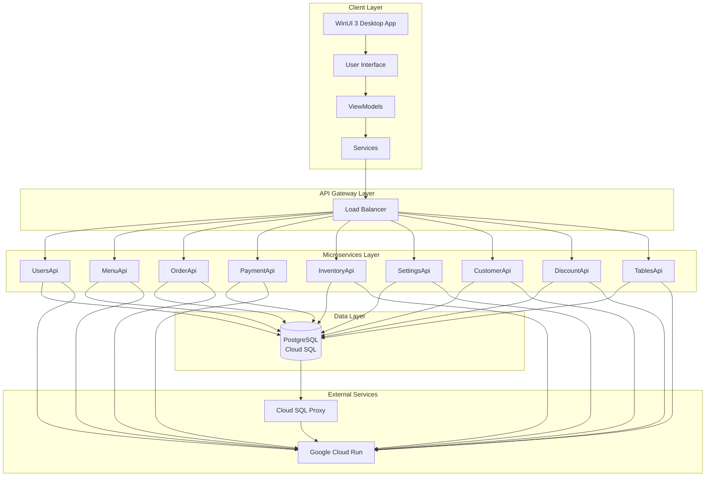
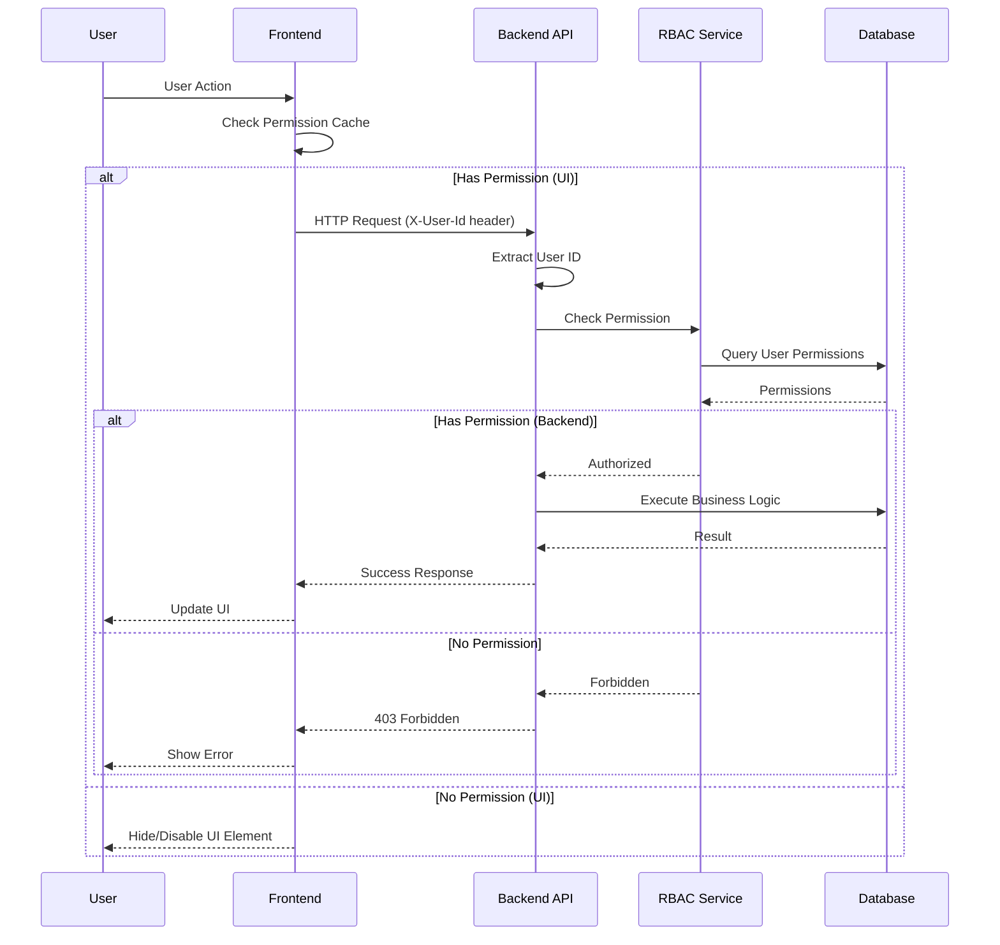
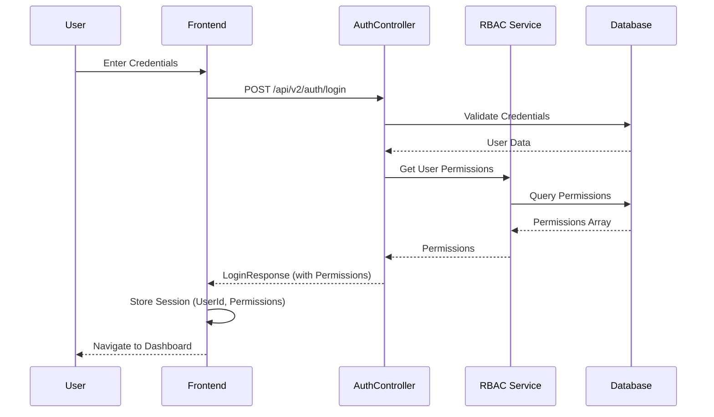
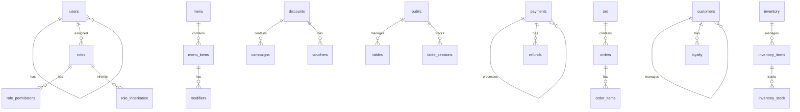
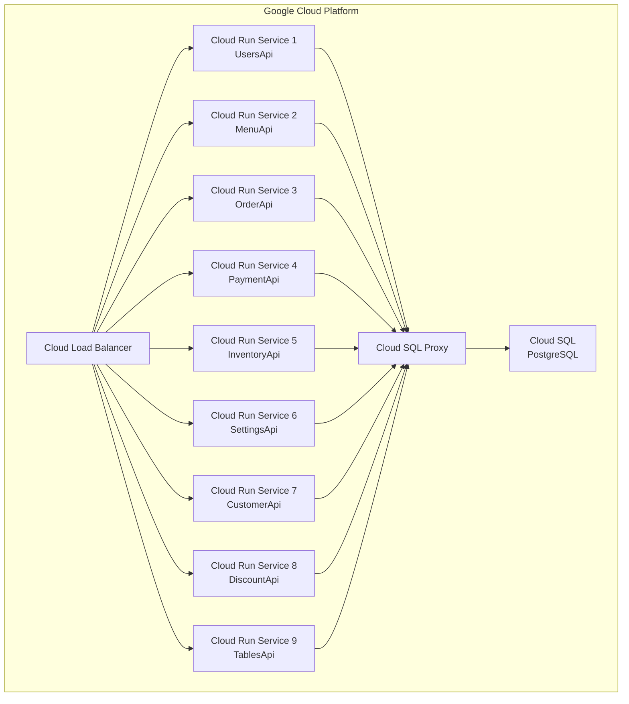
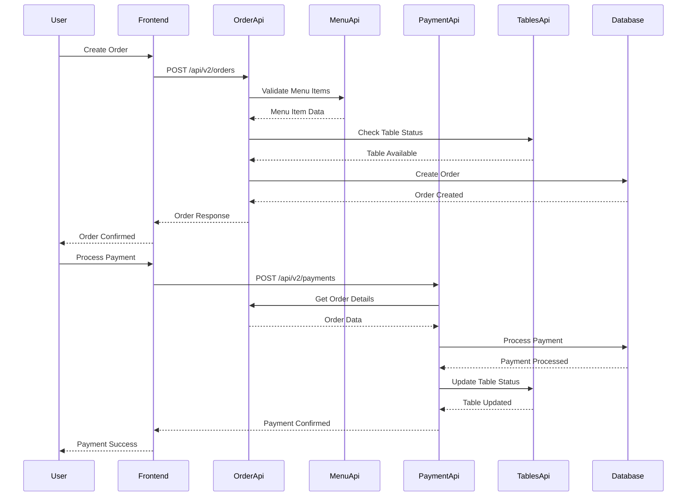

# System Architecture

This document provides a comprehensive overview of the MagiDesk POS system architecture, including component interactions, data flows, and design decisions.

## High-Level Architecture

## Architecture Principles

### 1. Microservices Architecture

**Independent Services**
- Each API is independently deployable
- Services communicate via RESTful HTTP/JSON
- No direct service-to-service dependencies (except UsersApi for RBAC)

**Technology Consistency**
- All services use ASP.NET Core 8
- Consistent patterns across services
- Shared authorization library (`MagiDesk.Shared`)

**Database per Service**
- Each service has its own schema in PostgreSQL
- Services don't access other services' schemas directly
- Data consistency maintained via application logic

### 2. Frontend-Backend Separation

**Desktop Application**
- WinUI 3 for rich, native Windows UI
- MVVM pattern for separation of concerns
- Local state management with caching

**RESTful Communication**
- Standard HTTP/JSON APIs
- Stateless requests
- No server-side session state

**Permission Caching**
- Frontend caches user permissions after login
- UI elements show/hide based on permissions
- Backend always validates permissions (source of truth)

### 3. Security Architecture

**Role-Based Access Control (RBAC)**
- 47 granular permissions
- 6 system roles with predefined permissions
- Custom roles supported
- Role inheritance for permission composition

**Backend Enforcement**
- All v2 endpoints require permissions
- `[RequiresPermission]` attribute on controllers
- `PermissionRequirementHandler` validates access
- `UserIdExtractionMiddleware` extracts user context

**API Versioning**
- v1 endpoints: Legacy, no RBAC (backward compatible)
- v2 endpoints: RBAC-enabled (recommended)
- Gradual migration path

## Component Communication

### Request Flow

### Authentication Flow

## Database Architecture

### Schema Organization

### Schema Details

| Schema | Purpose | Key Tables |
|--------|---------|------------|
| `users` | User management, RBAC | `users`, `roles`, `role_permissions`, `role_inheritance` |
| `menu` | Menu items, modifiers, combos | `menu_items`, `modifiers`, `modifier_options`, `combos` |
| `ord` | Order processing | `orders`, `order_items`, `order_logs` |
| `payments` | Payment processing | `payments`, `refunds`, `payment_logs` |
| `inventory` | Inventory management | `inventory_items`, `inventory_stock`, `inventory_transactions`, `vendors` |
| `settings` | System settings | `app_settings`, `setting_categories` |
| `customers` | Customer management | `customers`, `customer_segments`, `loyalty_programs`, `wallets` |
| `discounts` | Discount management | `campaigns`, `vouchers`, `combo_offers` |
| `public` | Tables and sessions | `tables`, `table_status`, `table_sessions`, `bills` |

## Deployment Architecture

### Cloud Run Deployment

### Deployment Characteristics

**Scalability**
- Each service scales independently
- Auto-scaling based on request volume
- Horizontal scaling (multiple instances)

**Reliability**
- Health check endpoints (`/health`)
- Automatic restarts on failure
- Request timeout handling

**Security**
- Cloud SQL Proxy for secure database connections
- Environment variables for secrets
- IAM-based access control

## Data Flow Patterns

### Order Processing Flow

## Design Decisions

### Why Microservices?

1. **Independent Deployment** - Deploy services without affecting others
2. **Technology Flexibility** - Can use different technologies per service (currently all ASP.NET Core)
3. **Team Autonomy** - Different teams can own different services
4. **Scalability** - Scale services independently based on load

### Why WinUI 3?

1. **Native Performance** - Direct access to Windows APIs
2. **Rich UI** - Modern Fluent Design System
3. **Offline Capability** - Desktop app can work offline
4. **User Experience** - Better UX than web apps for POS systems

### Why PostgreSQL?

1. **ACID Compliance** - Strong consistency guarantees
2. **JSON Support** - Native JSON/JSONB for flexible schemas
3. **Performance** - Excellent for complex queries
4. **Cloud SQL** - Managed service with automatic backups

### Why API Versioning?

1. **Backward Compatibility** - Existing clients continue working
2. **Gradual Migration** - Migrate to v2 at own pace
3. **Feature Flags** - Enable/disable v2 per environment
4. **Easy Rollback** - Revert to v1 if issues arise

## Performance Considerations

### Caching Strategy

- **Frontend**: Permission cache, menu cache, settings cache
- **Backend**: No caching (stateless services)
- **Database**: PostgreSQL query cache

### Connection Pooling

- **Npgsql DataSource**: Connection pooling per service
- **Cloud SQL Proxy**: Connection multiplexing
- **Connection Limits**: Configured per service

### Async/Await

- All I/O operations are async
- No blocking calls in request pipeline
- Parallel processing where possible

## Monitoring and Observability

### Logging

- **Structured Logging**: JSON format logs
- **Log Levels**: Debug, Information, Warning, Error
- **Cloud Logging**: Integrated with Google Cloud Logging

### Health Checks

- **Endpoint**: `/health` on all services
- **Database Check**: Verifies database connectivity
- **Dependency Check**: Verifies external service availability

### Metrics

- Request count, latency, error rate
- Database query performance
- Permission check performance

## Security Architecture

### Authentication

- Currently: `X-User-Id` header (for v2 APIs)
- Future: JWT tokens (planned)

### Authorization

- **Policy-Based**: Each permission is a policy
- **Handler-Based**: `PermissionRequirementHandler` validates
- **Middleware**: `UserIdExtractionMiddleware` extracts context

### Data Protection

- **Encryption in Transit**: HTTPS/TLS
- **Encryption at Rest**: Cloud SQL encryption
- **Secrets Management**: Environment variables

## Future Enhancements

### Planned Improvements

1. **JWT Authentication** - Replace header-based auth
2. **API Gateway** - Centralized routing and rate limiting
3. **Event Sourcing** - For audit trails
4. **CQRS** - Separate read/write models
5. **GraphQL** - Alternative to REST APIs
6. **WebSocket** - Real-time updates

---

**Last Updated**: 2025-01-02  
**Architecture Version**: 1.0.0

