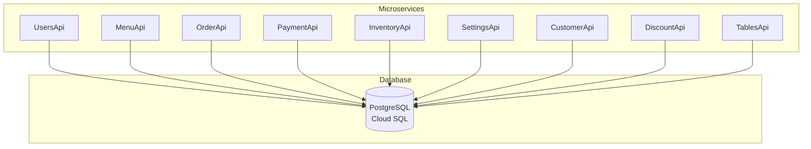

# Backend Overview

MagiDesk POS backend consists of **9 independent microservices**, each handling a specific domain of the POS system.

## Architecture

## Technology Stack

| Component | Technology | Version |
|-----------|-----------|---------|
| **Framework** | ASP.NET Core | 8.0 |
| **Database** | PostgreSQL | 17 |
| **ORM** | Entity Framework Core / Npgsql | Latest |
| **Deployment** | Google Cloud Run | Latest |
| **Container** | Docker | Latest |

## Microservices

### 1. UsersApi
**Purpose:** User management, authentication, RBAC  
**Port:** 5001 (local)  
**Schema:** `users`  
**Key Features:**
- User CRUD operations
- Authentication (login)
- Role-Based Access Control (RBAC)
- Permission management

### 2. MenuApi
**Purpose:** Menu items, modifiers, combos  
**Port:** 5003 (local)  
**Schema:** `menu`  
**Key Features:**
- Menu item management
- Modifiers and options
- Combo offers
- Menu versioning
- Menu analytics

### 3. OrderApi
**Purpose:** Order processing and management  
**Port:** 5004 (local)  
**Schema:** `ord`  
**Key Features:**
- Order creation and management
- Order items
- Order logs
- Kitchen service integration
- Order pricing and validation

### 4. PaymentApi
**Purpose:** Payment processing  
**Port:** 5005 (local)  
**Schema:** `payments`  
**Key Features:**
- Payment processing
- Refunds
- Payment voids
- Payment history
- Split payments

### 5. InventoryApi
**Purpose:** Inventory management  
**Port:** 5006 (local)  
**Schema:** `inventory`  
**Key Features:**
- Inventory items
- Stock management
- Vendor management
- Restock requests
- Inventory transactions
- Cash flow tracking

### 6. SettingsApi
**Purpose:** System settings  
**Port:** 5002 (local)  
**Schema:** `settings`  
**Key Features:**
- Hierarchical settings
- Category-based organization
- Settings versioning
- Environment-specific configs

### 7. CustomerApi
**Purpose:** Customer management and intelligence  
**Port:** 5007 (local)  
**Schema:** `customers`  
**Key Features:**
- Customer CRUD
- Customer segmentation
- Loyalty programs
- Marketing campaigns
- Behavioral triggers
- Wallet management

### 8. DiscountApi
**Purpose:** Discounts and promotions  
**Port:** 5008 (local)  
**Schema:** `discounts`  
**Key Features:**
- Discount campaigns
- Vouchers
- Combo offers
- Customer segments
- Applied discounts tracking

### 9. TablesApi
**Purpose:** Table and session management  
**Port:** 5009 (local)  
**Schema:** `public`  
**Key Features:**
- Table status management
- Session management
- Bill management
- Table assignment

## Common Patterns

### API Versioning

All APIs support versioning:
- **v1** - Legacy endpoints (backward compatible)
- **v2** - RBAC-enabled endpoints (new features)

### RBAC Integration

v2 endpoints require permissions:
- `[RequiresPermission]` attribute on controllers
- Permission checks via `PermissionRequirementHandler`
- User ID extraction via middleware

### Database Connection

All APIs use PostgreSQL:
- **Local:** TCP connection
- **Cloud Run:** Unix socket connection
- Connection string from `appsettings.json`

### Health Checks

All APIs provide:
- `/health` - Health check endpoint
- `/debug/db` - Database connection debug

## Deployment

All APIs are deployed to **Google Cloud Run**:
- Independent deployment per service
- Auto-scaling (0 to 10 instances)
- Cloud SQL integration via Unix socket
- Environment variables for configuration

## API Communication

APIs communicate via:
- **HTTP/REST** - Standard RESTful APIs
- **JSON** - Request/response format
- **HTTPS** - Secure communication

## Next Steps

- [UsersApi](./users-api.md)
- [MenuApi](./menu-api.md)
- [OrderApi](./order-api.md)
- [PaymentApi](./payment-api.md)
- [InventoryApi](./inventory-api.md)
- [SettingsApi](./settings-api.md)
- [CustomerApi](./customer-api.md)
- [DiscountApi](./discount-api.md)
- [TablesApi](./tables-api.md)
