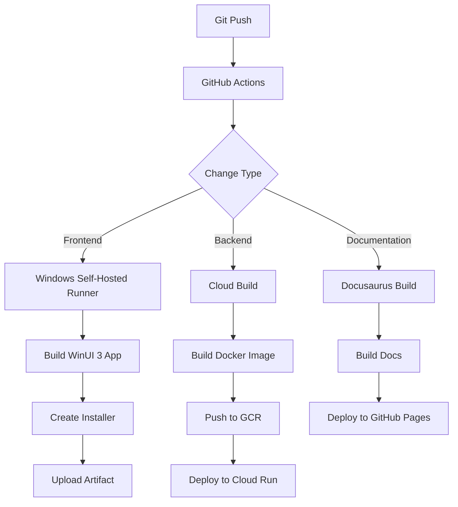

# CI/CD Documentation

This document describes the Continuous Integration and Continuous Deployment (CI/CD) pipelines for MagiDesk POS.

## Overview

MagiDesk POS uses **GitHub Actions** for CI/CD, with a self-hosted Windows runner for building and deploying the WinUI 3 frontend, and automated deployment scripts for backend APIs to Google Cloud Run.

## CI/CD Architecture



## GitHub Actions Workflows

### 1. Documentation Deployment

**File**: `.github/workflows/docs.yml`

**Triggers**:
- Push to any branch with changes in `docs/**`
- Manual workflow dispatch

**Steps**:
1. Checkout code
2. Setup Node.js 18
3. Install dependencies (`npm ci`)
4. Build documentation (`npm run build`)
5. Deploy to GitHub Pages

**Runner**: Self-hosted Windows runner

```yaml
name: Deploy Documentation

on:
  push:
    branches: ['*']
    paths:
      - 'docs/**'
      - '.github/workflows/docs.yml'
  workflow_dispatch:

jobs:
  build:
    runs-on: self-hosted
    steps:
      - uses: actions/checkout@v4
      - uses: actions/setup-node@v4
        with:
          node-version: '18'
      - run: npm ci
        working-directory: docs
      - run: npm run build
        working-directory: docs
      - uses: actions/upload-pages-artifact@v3
        with:
          path: docs/build
```

### 2. Frontend Build (Example)

**File**: `.github/workflows/self-hosted-example.yml`

**Triggers**:
- Push to any branch with changes in `solution/**`
- Manual workflow dispatch

**Steps**:
1. Checkout code
2. Setup .NET 8
3. Restore dependencies
4. Build solution
5. Run tests (optional)

**Runner**: Self-hosted Windows runner

```yaml
name: Build Frontend

on:
  push:
    branches: ['*']
    paths:
      - 'solution/**'
  workflow_dispatch:

jobs:
  build:
    runs-on: self-hosted
    steps:
      - uses: actions/checkout@v4
      - uses: actions/setup-dotnet@v4
        with:
          dotnet-version: '8.0.x'
      - run: dotnet restore solution/MagiDesk.sln
      - run: dotnet build solution/MagiDesk.sln -c Release
```

## Self-Hosted Runner Setup

### Prerequisites

1. **Windows Machine** (Windows 10/11 or Windows Server)
2. **.NET 8 SDK** installed
3. **Node.js 18+** installed (for documentation builds)
4. **Git** installed
5. **Visual Studio 2022** (optional, for XAML debugging)

### Installation Steps

1. **Download Runner**
   ```powershell
   # Create folder
   mkdir C:\actions-runner
   cd C:\actions-runner
   
   # Download runner
   Invoke-WebRequest -Uri https://github.com/actions/runner/releases/download/v2.311.0/actions-runner-win-x64-2.311.0.zip -OutFile actions-runner-win-x64-2.311.0.zip
   
   # Extract
   Expand-Archive -Path actions-runner-win-x64-2.311.0.zip -DestinationPath .
   ```

2. **Configure Runner**
   ```powershell
   .\config.cmd --url https://github.com/your-username/Order-Tracking-By-GPT --token YOUR_TOKEN
   ```

3. **Install as Service**
   ```powershell
   .\svc.cmd install
   .\svc.cmd start
   ```

### Runner Management

**Check Status**:
```powershell
Get-Service actions.runner.*
```

**Restart Runner**:
```powershell
cd C:\actions-runner
.\svc.cmd restart
```

**View Logs**:
```powershell
Get-Content C:\actions-runner\_diag\Runner_*.log -Tail 50
```

## Backend Deployment

### Manual Deployment Scripts

Backend APIs are deployed using PowerShell scripts:

#### UsersApi Deployment
```powershell
.\solution\backend\UsersApi\deploy-users-api.ps1 `
    -ProjectId "bola8pos" `
    -Region "northamerica-south1" `
    -ServiceName "magidesk-users" `
    -CloudSqlInstance "bola8pos:northamerica-south1:pos-app-1"
```

#### MenuApi Deployment
```powershell
.\solution\backend\deploy-menu-cloudrun.ps1 `
    -ProjectId "bola8pos" `
    -Region "northamerica-south1" `
    -ServiceName "magidesk-menu" `
    -CloudSqlInstance "bola8pos:northamerica-south1:pos-app-1"
```

#### Other APIs
Similar scripts exist for:
- `deploy-order-cloudrun.ps1`
- `deploy-payment-cloudrun.ps1`
- `deploy-inventory-cloudrun.ps1`
- `deploy-settings-cloudrun.ps1`
- `deploy-customer-cloudrun.ps1`
- `deploy-tables-cloudrun.ps1`

### Deployment Process

1. **Build Docker Image**
   ```powershell
   docker build -t gcr.io/bola8pos/magidesk-menu:latest .
   ```

2. **Push to Google Container Registry**
   ```powershell
   docker push gcr.io/bola8pos/magidesk-menu:latest
   ```

3. **Deploy to Cloud Run**
   ```powershell
   gcloud run deploy magidesk-menu `
       --image gcr.io/bola8pos/magidesk-menu:latest `
       --region northamerica-south1 `
       --platform managed `
       --allow-unauthenticated `
       --port 8080 `
       --add-cloudsql-instances bola8pos:northamerica-south1:pos-app-1 `
       --set-env-vars "ASPNETCORE_ENVIRONMENT=Production,UsersApi:BaseUrl=https://..."
   ```

## Frontend Deployment

### Build Process

1. **Publish Application**
   ```powershell
   dotnet publish solution/frontend/MagiDesk.Frontend.csproj `
       -c Release `
       -r win-x64 `
       --self-contained `
       -p:PublishSingleFile=true
   ```

2. **Create Installer**
   ```powershell
   .\create-frontend-installer.ps1
   ```

3. **Distribute**
   - Upload installer to distribution server
   - Or use GitHub Releases

### Installer Creation

The installer is created using Inno Setup:

```powershell
# Build installer
.\solution\frontend\install\build-installer.ps1

# Output: MagiDesk-Frontend-Installer.exe
```

## Environment Configuration

### Development
- **Database**: Local PostgreSQL or Cloud SQL with public IP
- **APIs**: Localhost (ports 5001-5009)
- **Frontend**: Local development build

### Staging
- **Database**: Cloud SQL (staging instance)
- **APIs**: Cloud Run (staging services)
- **Frontend**: Test installer

### Production
- **Database**: Cloud SQL (production instance)
- **APIs**: Cloud Run (production services)
- **Frontend**: Production installer

## Deployment Checklist

### Before Deployment

- [ ] All tests passing
- [ ] Code reviewed and approved
- [ ] Database migrations tested
- [ ] Environment variables configured
- [ ] Backup database (production)
- [ ] Notify team of deployment

### During Deployment

- [ ] Deploy backend APIs (one at a time)
- [ ] Verify API health endpoints
- [ ] Test critical endpoints
- [ ] Deploy frontend (if changed)
- [ ] Verify frontend connectivity

### After Deployment

- [ ] Monitor error logs
- [ ] Check performance metrics
- [ ] Verify user functionality
- [ ] Update deployment documentation
- [ ] Notify team of completion

## Rollback Procedures

### Backend Rollback

1. **Identify Previous Version**
   ```powershell
   gcloud run revisions list --service magidesk-menu --region northamerica-south1
   ```

2. **Rollback to Previous Revision**
   ```powershell
   gcloud run services update-traffic magidesk-menu `
       --to-revisions REVISION_NAME=100 `
       --region northamerica-south1
   ```

### Frontend Rollback

1. **Revert to Previous Installer**
   - Download previous installer from releases
   - Distribute to users
   - Or push previous code version

### Database Rollback

1. **Restore from Backup**
   ```sql
   -- Restore from Cloud SQL backup
   -- Or restore from manual backup file
   ```

## Monitoring and Alerts

### Health Checks

All APIs have health check endpoints:
- `/health` - Basic health check
- `/debug/db` - Database connectivity check

### Logging

- **Cloud Logging**: All API logs in Google Cloud Logging
- **Frontend Logs**: Local log files in `%LocalAppData%\MagiDesk\`

### Metrics

- Request count
- Error rate
- Response latency
- Database query performance

## Best Practices

### Versioning
- Use semantic versioning (SemVer)
- Tag releases in Git
- Document changes in CHANGELOG

### Testing
- Run tests before deployment
- Test in staging first
- Verify critical paths

### Communication
- Notify team before deployment
- Document deployment steps
- Update runbooks

### Security
- Use environment variables for secrets
- Rotate credentials regularly
- Audit access logs

## Troubleshooting

### Runner Not Picking Up Jobs

1. Check runner is online in GitHub Settings
2. Verify runner service is running
3. Restart runner service

### Build Failures

1. Check build logs in GitHub Actions
2. Verify dependencies are installed
3. Check for environment-specific issues

### Deployment Failures

1. Check Cloud Run logs
2. Verify environment variables
3. Check database connectivity
4. Review deployment scripts

---

**Last Updated**: 2025-01-02  
**CI/CD Version**: 1.0.0

