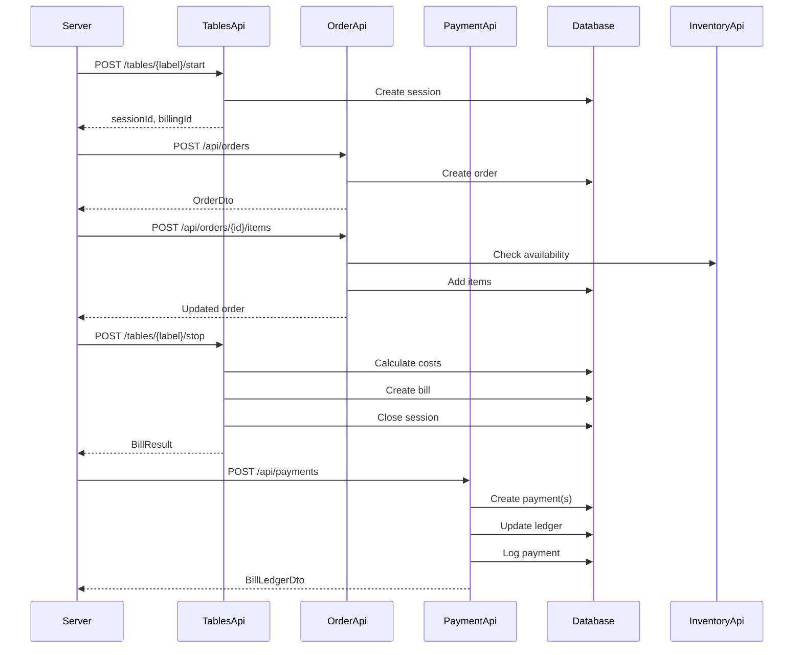

# Payment Processing

Complete documentation of the payment processing system in MagiDesk POS.

## Overview

The payment system handles the complete flow from bill generation to payment settlement, including split payments, discounts, tips, and comprehensive audit trails.

## Payment Flow

### Complete Flow Diagram



## Payment Components

### 1. Bill Generation (TablesApi)

When a table session stops:
- **Time Cost:** `ratePerMinute * durationMinutes`
- **Items Cost:** Sum of all items in session
- **Total:** `timeCost + itemsCost`
- **Status:** `awaiting_payment`

### 2. Payment Registration (PaymentApi)

**Single Payment:**
```json
{
  "sessionId": "uuid",
  "billingId": "uuid",
  "totalDue": 100.00,
  "lines": [
    {
      "amountPaid": 100.00,
      "paymentMethod": "card",
      "tipAmount": 5.00
    }
  ],
  "serverId": "user-id"
}
```

**Split Payment:**
```json
{
  "sessionId": "uuid",
  "billingId": "uuid",
  "totalDue": 100.00,
  "lines": [
    {
      "amountPaid": 60.00,
      "paymentMethod": "card",
      "tipAmount": 3.00
    },
    {
      "amountPaid": 40.00,
      "paymentMethod": "cash",
      "tipAmount": 2.00
    }
  ],
  "serverId": "user-id"
}
```

### 3. Bill Ledger Updates

PaymentApi maintains `bill_ledger`:
- **total_due:** Cached from first payment
- **total_paid:** Sum of all payment amounts
- **total_discount:** Sum of all discounts
- **total_tip:** Sum of all tips
- **status:** Calculated based on paid vs due

## Payment Methods

Supported methods:
- **cash** - Cash payment
- **card** - Credit/Debit card
- **mobile** - Mobile payment (Apple Pay, Google Pay)
- **digital** - Digital wallet
- Custom methods can be added

## Discounts

### Bill-Level Discounts

Apply discount to entire bill:
```http
POST /api/payments/{billingId}/discounts?sessionId={id}&reason={text}&serverId={id}
Body: 10.00
```

### Discount Distribution

- **Proportional:** Distribute across payment methods
- **Single Method:** Apply to specific method only
- **Equal Split:** Split discount equally

## Tips

### Tip Handling

- **Per Payment Method:** Each payment line can have tip
- **Total Tip:** Summed in ledger
- **Tip Distribution:** Configurable per payment

## Payment History

### Payment Logs

All payment operations are logged:
- Payment creation
- Discount application
- Status changes
- Refunds/voids

### Audit Trail

Complete audit trail includes:
- **Action:** Operation type
- **Old Value:** Previous state (JSONB)
- **New Value:** New state (JSONB)
- **Server ID:** Who performed action
- **Timestamp:** When action occurred

## Error Handling

### Validation Errors

- **Amount Mismatch:** Split total ≠ order total
- **Invalid Method:** Unsupported payment method
- **Negative Amounts:** Invalid payment amounts
- **Missing Required Fields:** Required data missing

### Business Logic Errors

- **Bill Not Found:** Invalid billing_id
- **Session Mismatch:** Session doesn't match bill
- **Already Paid:** Bill already settled
- **Insufficient Amount:** Payment less than due

## Integration Points

### With OrderApi

- Orders link to sessions via `session_id`
- Orders link to bills via `billing_id`
- Payment validates against order totals

### With TablesApi

- Bills generated from table sessions
- Session costs included in bills
- Table status updated on payment

### With InventoryApi

- Stock deducted on order confirmation
- Inventory availability checked before order

## Related Documentation

- [PaymentApi Reference](../backend/payment-api.md)
- [Split Payments](./split-payments.md)
- [Order Processing](./orders.md)
- [Table Management](./table-management.md)
