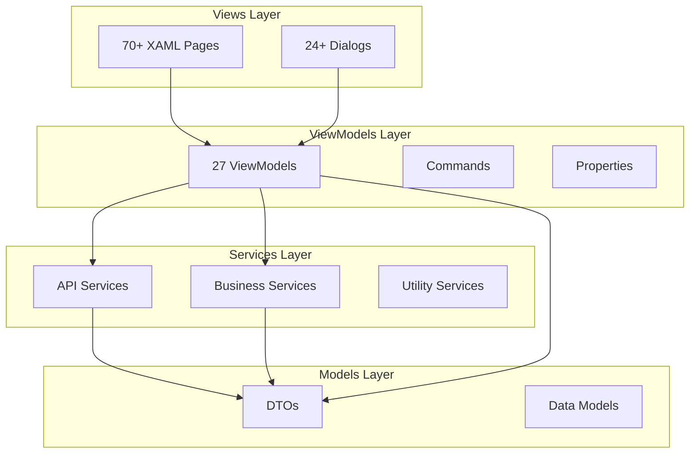

# Frontend Overview

The MagiDesk POS frontend is a Windows desktop application built with **WinUI 3** and **.NET 8**, following the **MVVM (Model-View-ViewModel)** pattern.

## Architecture



## Technology Stack

| Component | Technology | Version |
|-----------|-----------|---------|
| **UI Framework** | WinUI 3 | Latest |
| **.NET Runtime** | .NET 8 | 8.0+ |
| **Pattern** | MVVM | - |
| **Language** | C# | 12.0 |
| **XAML** | WinUI 3 XAML | - |

## Project Structure

```
frontend/
├── Views/              # 70+ XAML pages
├── ViewModels/         # 27 ViewModels
├── Services/            # 51+ Services
├── Converters/          # 15+ Value converters
├── Dialogs/             # 24+ Modal dialogs
├── Models/              # Data models
├── Collections/         # Custom collections
├── Extensions/          # Extension methods
└── Assets/               # Images, icons, etc.
```

## Key Components

### Views (70+ Pages)

**Core Operations:**
- `LoginPage` - Authentication
- `MainPage` - Navigation hub
- `DashboardPage` - System overview
- `TablesPage` - Table management
- `OrdersPage` - Order management
- `BillingPage` - Billing operations
- `PaymentPage` - Payment processing

**Management Pages:**
- `MenuManagementPage` - Menu CRUD
- `InventoryManagementPage` - Inventory operations
- `CustomerManagementPage` - Customer management
- `VendorsManagementPage` - Vendor operations
- `UsersPage` - User management

**Settings Pages:**
- `HierarchicalSettingsPage` - System settings
- `GeneralSettingsPage` - General configuration
- `PosSettingsPage` - POS-specific settings
- `InventorySettingsPage` - Inventory settings
- `PaymentsSettingsPage` - Payment settings
- `ReceiptSettingsPage` - Receipt configuration

### ViewModels (27 ViewModels)

All ViewModels follow the MVVM pattern with:
- **Properties** - Observable properties for data binding
- **Commands** - ICommand implementations for actions
- **Services** - Injected API and business services

**Key ViewModels:**
- `UsersViewModel` - User management
- `OrdersViewModel` - Order operations
- `PaymentViewModel` - Payment processing
- `MenuViewModel` - Menu management
- `InventoryManagementViewModel` - Inventory operations
- `BillingViewModel` - Billing operations
- `DashboardViewModel` - Dashboard data

### Services (51+ Services)

**API Services:**
- `UserApiService` - Users API client
- `MenuApiService` - Menu API client
- `OrderApiService` - Order API client
- `PaymentApiService` - Payment API client
- `InventoryApiService` - Inventory API client
- `SettingsApiService` - Settings API client
- `CustomerApiService` - Customer API client
- `TablesApiService` - Tables API client

**Business Services:**
- `BillingService` - Billing operations
- `ReceiptService` - Receipt generation
- `InventoryService` - Inventory operations
- `VendorService` - Vendor operations
- `DiscountService` - Discount calculations
- `SessionService` - Session management

**Utility Services:**
- `I18nService` - Internationalization
- `ThemeService` - Theme management
- `NotificationService` - Notifications
- `AuditService` - Audit logging
- `HeartbeatService` - Connection monitoring

### Converters (15+ Converters)

Value converters for data binding:
- `BoolToVisibilityConverter` - Boolean to Visibility
- `CurrencyConverter` - Currency formatting
- `DateShortConverter` - Date formatting
- `PaymentConverters` - Payment-specific conversions
- `SessionConverters` - Session data conversions

## MVVM Pattern Implementation

### Model
- DTOs from `MagiDesk.Shared` project
- Data models for local state

### View
- XAML pages with data binding
- Code-behind kept minimal
- UI logic in ViewModels

### ViewModel
- Business logic and state management
- Commands for user actions
- Property change notifications
- Service integration

## Data Binding

The frontend uses extensive data binding:

```xml
<TextBlock Text="{x:Bind ViewModel.UserName, Mode=OneWay}" />
<Button Command="{x:Bind ViewModel.SaveCommand}" />
<ListView ItemsSource="{x:Bind ViewModel.Orders, Mode=OneWay}" />
```

## Navigation

Navigation is handled through:
- `MainPage` with `NavigationView`
- Page navigation via `Frame.Navigate()`
- Navigation guards for permission checks

## Permission System

Frontend implements permission-based UI:
- **PermissionManager** - Caches user permissions
- **Navigation Guards** - Blocks unauthorized navigation
- **Command Enablement** - Disables commands without permissions
- **UI Visibility** - Hides UI elements based on permissions

## Next Steps

- [ViewModels Documentation](./viewmodels/overview.md)
- [Views Documentation](./views/overview.md)
- [Services Documentation](./services/overview.md)
- [Navigation Guide](./navigation.md)
- [Data Binding Guide](./data-binding.md)
