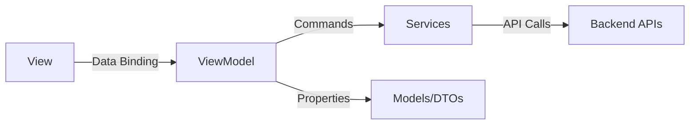

# ViewModels Overview

ViewModels in MagiDesk POS follow the **MVVM (Model-View-ViewModel)** pattern, providing business logic and state management for the WinUI 3 frontend.

## ViewModel Architecture



## ViewModel Pattern

All ViewModels implement:
- **INotifyPropertyChanged** - For property change notifications
- **Commands** - ICommand implementations (RelayCommand/AsyncRelayCommand)
- **Properties** - Observable properties for data binding
- **Services** - Injected API and business services

## ViewModels List (27 Total)

### User Management
- `UsersViewModel` - User CRUD operations

### Order Management
- `OrdersViewModel` - Order operations
- `OrdersManagementViewModel` - Order management
- `OrderDetailViewModel` - Order details

### Payment Management
- `PaymentViewModel` - Payment processing
- `AllPaymentsViewModel` - Payment history

### Billing
- `BillingViewModel` - Billing operations
- `UnsettledBillsViewModel` - Unsettled bills

### Menu Management
- `MenuViewModel` - Menu operations
- `MenuAnalyticsViewModel` - Menu analytics
- `MenuItemDetailsViewModel` - Menu item details

### Inventory Management
- `InventoryManagementViewModel` - Inventory operations
- `InventoryCrudViewModel` - Inventory CRUD
- `InventorySettingsViewModel` - Inventory settings
- `InventoryViewModel` - Inventory overview

### Vendor Management
- `VendorsManagementViewModel` - Vendor operations
- `VendorOrdersViewModel` - Vendor orders

### Settings
- `HierarchicalSettingsViewModel` - Hierarchical settings
- `SettingsViewModel` - General settings
- `ReceiptSettingsViewModel` - Receipt settings

### Other
- `DashboardViewModel` - Dashboard data
- `ModernDashboardViewModel` - Modern dashboard
- `CashFlowViewModel` - Cash flow
- `RestockViewModel` - Restock operations
- `AuditReportsViewModel` - Audit reports
- `ReceiptFormatDesignerViewModel` - Receipt design

## Common Patterns

### Property Implementation

```csharp
private string _userName = string.Empty;
public string UserName
{
    get => _userName;
    set => SetProperty(ref _userName, value);
}
```

### Command Implementation

```csharp
public ICommand SaveCommand { get; }
public ICommand DeleteCommand { get; }

// In constructor
SaveCommand = new RelayCommand(async () => await SaveAsync());
DeleteCommand = new RelayCommand(
    async () => await DeleteAsync(), 
    () => SelectedItem != null
);
```

### Async Operations

```csharp
public async Task LoadDataAsync()
{
    IsLoading = true;
    try
    {
        var data = await _apiService.GetDataAsync();
        Items.Clear();
        foreach (var item in data)
        {
            Items.Add(item);
        }
    }
    finally
    {
        IsLoading = false;
    }
}
```

## ViewModel Lifecycle

1. **Construction** - Services injected, commands initialized
2. **Load** - Data loaded from APIs
3. **User Interaction** - Commands executed
4. **Updates** - Properties updated, UI refreshed
5. **Cleanup** - Resources disposed (if needed)

## Next Steps

- [UsersViewModel](./users-viewmodel.md)
- [OrdersViewModel](./orders-viewmodel.md)
- [PaymentViewModel](./payment-viewmodel.md)
- [MenuViewModel](./menu-viewmodel.md)
- [InventoryViewModel](./inventory-viewmodel.md)
