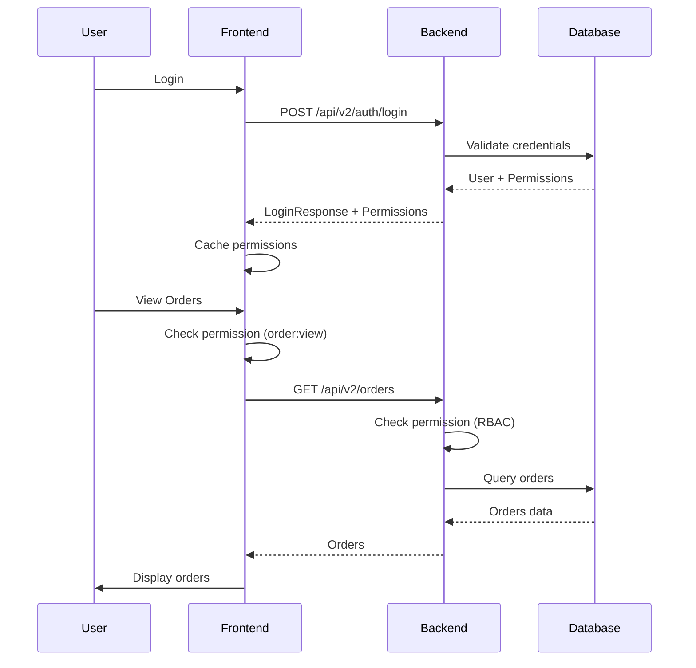

# Overview

MagiDesk POS is a comprehensive Point of Sale system designed for modern businesses. This guide provides an overview of the system architecture, key components, and how they work together.

## What is MagiDesk POS?

MagiDesk POS is a full-featured Point of Sale system built with modern technologies:

- **Desktop Application:** WinUI 3 (.NET 8) for Windows
- **Backend Services:** 9 ASP.NET Core microservices
- **Database:** PostgreSQL (Cloud SQL)
- **Deployment:** Google Cloud Run
- **Security:** Role-Based Access Control (RBAC)

## System Components

### Frontend (WinUI 3 Desktop App)

The frontend is a Windows desktop application built with WinUI 3:

- **27 ViewModels** - Business logic and state management using MVVM pattern
- **70+ Views/Pages** - User interface components
- **51+ Services** - API clients, business services, and utilities
- **15+ Converters** - Value converters for data binding
- **24+ Dialogs** - Modal dialogs and popups

### Backend (Microservices)

The backend consists of 9 independent microservices:

1. **UsersApi** - User management, authentication, RBAC
2. **MenuApi** - Menu items, modifiers, combos, analytics
3. **OrderApi** - Order processing, kitchen service
4. **PaymentApi** - Payment processing, refunds
5. **InventoryApi** - Inventory management, vendors, stock
6. **SettingsApi** - Hierarchical settings management
7. **CustomerApi** - Customer management, loyalty, campaigns
8. **DiscountApi** - Discounts, vouchers, combos
9. **TablesApi** - Table/session management

### Database (PostgreSQL)

PostgreSQL database with multiple schemas:

- **users** - Users, roles, permissions, RBAC
- **inventory** - Vendors, items, stock, transactions
- **ord** - Orders, order items, order logs
- **customers** - Customers, memberships, wallets, loyalty
- **discounts** - Campaigns, vouchers, combos
- **settings** - Hierarchical settings
- **public** - Tables, sessions, bills

## Key Features

### Role-Based Access Control (RBAC)

- **47 Permissions** - Granular permission system
- **6 System Roles** - Owner, Admin, Manager, Server, Cashier, Host
- **Backend Enforcement** - All API endpoints protected
- **Frontend Caching** - Fast permission checks with local cache

### Payment Processing

- Multiple payment methods
- Split payments
- Refunds and voids
- Payment history and audit trail

### Order Management

- Real-time order processing
- Kitchen integration
- Order tracking and logs
- Bill management

### Inventory Management

- Vendor management
- Stock tracking
- Restock requests
- Inventory analytics

### Customer Intelligence

- Customer segmentation
- Loyalty programs
- Marketing campaigns
- Behavioral triggers

### Hierarchical Settings

- Category-based organization
- Environment-specific configurations
- Settings versioning

## Architecture Principles

### Microservices

Each backend API is an independent microservice:

- **Independent Deployment** - Deploy services separately
- **Scalable** - Scale services independently
- **Technology Agnostic** - Each service can use different tech (currently all ASP.NET Core)
- **Fault Isolation** - Failures in one service don't affect others

### MVVM Pattern (Frontend)

The frontend follows the MVVM (Model-View-ViewModel) pattern:

- **Models** - Data structures and DTOs
- **Views** - XAML pages and user interface
- **ViewModels** - Business logic and state management
- **Services** - API clients and business services

### API Versioning

The backend supports API versioning:

- **v1** - Legacy endpoints (backward compatible)
- **v2** - RBAC-enabled endpoints (new features)

## System Flow

## Technology Stack

| Component | Technology | Version |
|-----------|-----------|---------|
| Frontend Framework | WinUI 3 | .NET 8 |
| Backend Framework | ASP.NET Core | 8.0 |
| Database | PostgreSQL | 17 |
| Deployment Platform | Google Cloud Run | Latest |
| Container Runtime | Docker | Latest |

## Next Steps

- [Installation Guide](./installation.md) - Set up your development environment
- [Quick Start](./quick-start.md) - Get up and running quickly
- [Architecture Overview](../architecture/overview.md) - Deep dive into system architecture
