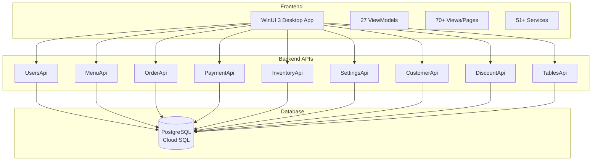

# MagiDesk POS Developer Portal

Welcome to the **MagiDesk POS Developer Portal** - your comprehensive guide to building, deploying, and extending the MagiDesk Point of Sale system.

## What is MagiDesk POS?

MagiDesk POS is a modern, enterprise-grade Point of Sale system built with:

- **Frontend:** WinUI 3 (.NET 8) desktop application
- **Backend:** 9 ASP.NET Core 8 microservices
- **Database:** PostgreSQL (Cloud SQL)
- **Deployment:** Google Cloud Run
- **Architecture:** Microservices with Role-Based Access Control (RBAC)

## Quick Links

### 🚀 Getting Started
- [Overview](./getting-started/overview.md) - System overview and key concepts
- [Installation](./getting-started/installation.md) - Setup instructions
- [Quick Start](./getting-started/quick-start.md) - Get up and running in minutes

### 🏗️ Architecture
- [System Architecture](./architecture/system-architecture.md) - High-level system design
- [Frontend Architecture](./architecture/frontend-architecture.md) - WinUI 3 and MVVM patterns
- [Backend Architecture](./architecture/backend-architecture.md) - Microservices overview
- [RBAC Architecture](./architecture/rbac-architecture.md) - Security and permissions

### 📚 Documentation
- [Frontend Guide](./frontend/overview.md) - WinUI 3 development
- [Backend APIs](./backend/overview.md) - All 9 microservices
- [API Reference](./api/overview.md) - Complete API documentation
- [Database Schema](./database/overview.md) - PostgreSQL schemas

### 🔧 Development
- [Developer Guide](./dev-guide/coding-standards.md) - Coding standards and best practices
- [Configuration](./configuration/appsettings.md) - App settings and environment variables
- [Deployment](./deployment/overview.md) - Deployment guides

### 🛡️ Security
- [RBAC System](./security/rbac.md) - Role-Based Access Control
- [Authentication](./security/authentication.md) - Auth flows and tokens
- [Best Practices](./security/best-practices.md) - Security guidelines

## System Overview

## Key Features

### 🔐 Role-Based Access Control (RBAC)
- 47 granular permissions
- 6 system roles (Owner, Admin, Manager, Server, Cashier, Host)
- Backend-enforced authorization
- Frontend permission caching

### 💳 Payment Processing
- Multiple payment methods
- Split payments
- Refunds and voids
- Payment history and audit

### 📦 Order Management
- Real-time order processing
- Kitchen integration
- Order tracking and logs
- Bill management

### 📊 Inventory Management
- Vendor management
- Stock tracking
- Restock requests
- Inventory analytics

### 👥 Customer Intelligence
- Customer segmentation
- Loyalty programs
- Marketing campaigns
- Behavioral triggers

### ⚙️ Hierarchical Settings
- Category-based settings
- Environment-specific configs
- Settings versioning

## Technology Stack

| Component | Technology |
|-----------|-----------|
| **Frontend Framework** | WinUI 3 (.NET 8) |
| **Backend Framework** | ASP.NET Core 8 |
| **Database** | PostgreSQL 17 |
| **Deployment** | Google Cloud Run |
| **Architecture** | Microservices |
| **Pattern** | MVVM (Frontend) |

## Documentation Structure

This portal is organized into the following sections:

1. **Getting Started** - Installation, setup, and quick start guides
2. **Architecture** - System design and architectural decisions
3. **Frontend** - WinUI 3 development, ViewModels, Views, Services
4. **Backend** - All 9 microservices documented
5. **Database** - Schemas, relationships, migrations
6. **Features** - Feature-specific documentation
7. **API Reference** - Complete API documentation (v1 and v2)
8. **Configuration** - App settings and environment variables
9. **Deployment** - Local, Cloud Run, and production deployment
10. **Security** - RBAC, authentication, best practices
11. **Developer Guide** - Coding standards and guidelines
12. **Troubleshooting** - Common issues and solutions

## Contributing

We welcome contributions! Please see our [Contributing Guide](https://github.com/your-username/Order-Tracking-By-GPT/blob/main/CONTRIBUTING.md) for details.

## Support

- **GitHub Issues:** [Report Issues](https://github.com/your-username/Order-Tracking-By-GPT/issues)
- **Documentation:** This portal
- **Questions:** Open a GitHub Discussion

## License

[Add your license information here]

---

**Last Updated:** 2025-01-27  
**Version:** 1.0.0
