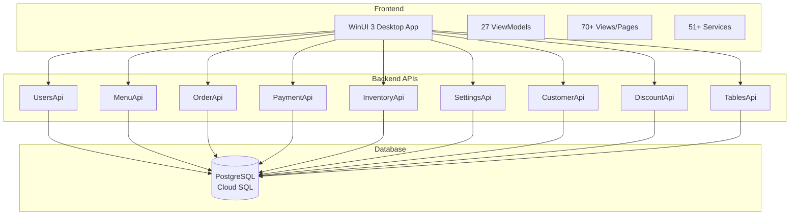

# MagiDesk POS Developer Portal

Welcome to the **MagiDesk POS Developer Portal** - your comprehensive guide to understanding, developing, and deploying the MagiDesk Point of Sale system.

## 🚀 Quick Start

New to MagiDesk POS? Start here:

1. **[Overview](./getting-started/overview)** - Learn what MagiDesk POS is and its key features
2. **[Prerequisites](./getting-started/prerequisites)** - Check system requirements
3. **[Installation](./getting-started/installation)** - Set up your development environment
4. **[Quick Start Guide](./getting-started/quick-start)** - Get up and running in minutes

## 📚 Documentation Structure

### 🏗️ Architecture

- **[System Architecture](./architecture/overview)** - High-level system design
- **[Frontend Architecture](./architecture/frontend-architecture)** - WinUI 3 desktop app structure
- **[Backend Architecture](./architecture/backend-architecture)** - Microservices architecture
- **[Database Architecture](./architecture/database-architecture)** - PostgreSQL schema design
- **[Deployment Architecture](./architecture/deployment-architecture)** - Cloud Run deployment
- **[RBAC Architecture](./architecture/rbac-architecture)** - Role-Based Access Control

### 💻 Frontend Development

- **[Frontend Overview](./frontend/overview)** - WinUI 3 application structure
- **[ViewModels](./frontend/viewmodels/overview)** - MVVM pattern implementation
- **[Views & Pages](./frontend/views/overview)** - UI components and pages
- **[Services](./frontend/services/overview)** - API clients and business services

### 🔧 Backend Development

- **[Backend Overview](./backend/overview)** - Microservices architecture
- **[UsersApi](./backend/users-api)** - User management and RBAC
- **[MenuApi](./backend/menu-api)** - Menu item management
- **[OrderApi](./backend/order-api)** - Order processing
- **[PaymentApi](./backend/payment-api)** - Payment processing
- **[InventoryApi](./backend/inventory-api)** - Inventory management
- **[SettingsApi](./backend/settings-api)** - System settings
- **[CustomerApi](./backend/customer-api)** - Customer management
- **[DiscountApi](./backend/discount-api)** - Discount management
- **[TablesApi](./backend/tables-api)** - Table/session management

### 📡 API Reference

- **[API Overview](./api/overview)** - API versioning and conventions
- **[Authentication](./api/authentication)** - Authentication flows
- **[API v1](./api/v1/overview)** - Legacy endpoints (backward compatible)
- **[API v2](./api/v2/overview)** - RBAC-enabled endpoints

### 🗄️ Database

- **[Database Overview](./database/overview)** - PostgreSQL structure
- **[Schemas](./database/schemas)** - Schema definitions
- **[Relationships](./database/relationships)** - Entity relationships
- **[Migrations](./database/migrations)** - Database migration guide

### 🔐 Security

- **[Security Overview](./security/overview)** - Security architecture
- **[RBAC](./security/rbac)** - Role-Based Access Control
- **[Authentication](./security/authentication)** - Auth flows
- **[Best Practices](./security/best-practices)** - Security guidelines

### 🚢 Deployment

- **[Deployment Overview](./deployment/overview)** - Deployment strategies
- **[Local Development](./deployment/local-development)** - Local setup
- **[Cloud Run](./deployment/cloud-run)** - Google Cloud Run deployment
- **[Production](./deployment/production)** - Production deployment

### 🛠️ Developer Guide

- **[Coding Standards](./dev-guide/coding-standards)** - Code style and conventions
- **[WinUI 3 Guidelines](./dev-guide/winui3-guidelines)** - WinUI 3 best practices
- **[API Development](./dev-guide/api-development)** - API development guide
- **[Testing](./dev-guide/testing)** - Testing strategies

### 🐛 Troubleshooting

- **[Common Issues](./troubleshooting/common-issues)** - Frequently encountered problems
- **[Debugging](./troubleshooting/debugging)** - Debugging techniques
- **[Logs](./troubleshooting/logs)** - Log locations and analysis

## 🎯 Key Features

### 🔐 Role-Based Access Control (RBAC)

- **47 granular permissions** across 11 categories
- **6 system roles** (Owner, Admin, Manager, Server, Cashier, Host)
- **Backend-enforced** authorization
- **Frontend permission caching** for UX

### 💳 Payment Processing

- Multiple payment methods
- Split payments
- Refunds and voids
- Payment history and audit

### 📦 Order Management

- Real-time order processing
- Kitchen integration
- Order tracking and logs
- Bill management

### 📊 Inventory Management

- Vendor management
- Stock tracking
- Restock requests
- Inventory analytics

### 👥 Customer Intelligence

- Customer segmentation
- Loyalty programs
- Marketing campaigns
- Behavioral triggers

### ⚙️ Hierarchical Settings

- Category-based settings
- Environment-specific configs
- Settings versioning

## 🏛️ Technology Stack

| Component | Technology | Version |
|-----------|-----------|---------|
| **Frontend Framework** | WinUI 3 | Latest |
| **.NET Runtime** | .NET 8 | 8.0+ |
| **Backend Framework** | ASP.NET Core | 8.0 |
| **Database** | PostgreSQL | 17 |
| **Deployment** | Google Cloud Run | Latest |
| **Architecture** | Microservices | - |
| **Pattern** | MVVM (Frontend) | - |

## 📊 System Overview

## 🤝 Contributing

We welcome contributions! Please read our [Contribution Guide](./dev-guide/coding-standards) before submitting pull requests.

## 📝 License

This project is licensed under the terms specified in the [LICENSE](../LICENSE) file.

## 📞 Support

- **Documentation Issues**: Open an issue on GitHub
- **Feature Requests**: Use GitHub Discussions
- **Bug Reports**: Use GitHub Issues

---

**Last Updated**: 2025-01-02  
**Documentation Version**: 1.0.0
