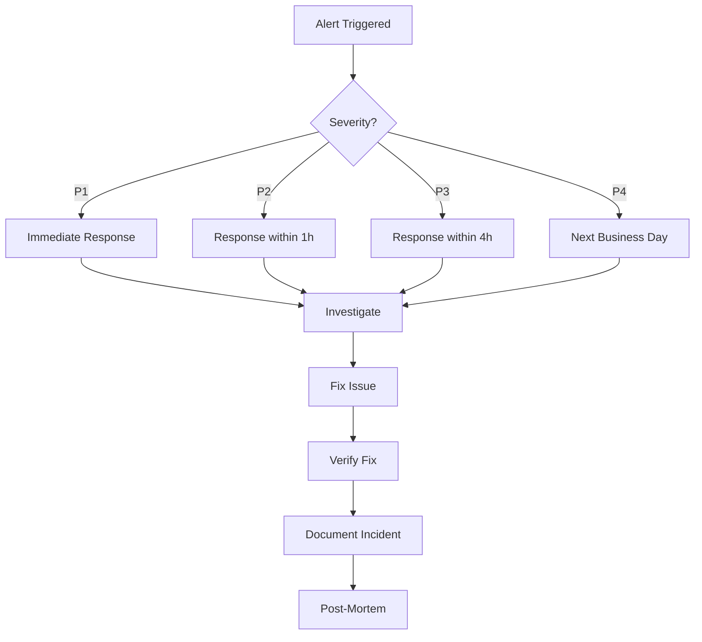

# Alerting

## Overview

MagiDesk POS uses Google Cloud Monitoring for alerting. Alerts are configured to notify the operations team of critical issues.

## Alert Categories

### Critical (P1)

Immediate response required:

- **Service Down**: Any API service is unreachable
- **Database Failure**: Database connection failures
- **Payment Processing Failure**: Payment API errors > 10%
- **Data Corruption**: Data integrity issues detected

### High (P2)

Response within 1 hour:

- **High Error Rate**: Error rate > 10% for 5 minutes
- **Slow Performance**: p95 response time > 2 seconds
- **High Resource Usage**: CPU/Memory > 90%
- **Authentication Failures**: Spike in failed logins

### Medium (P3)

Response within 4 hours:

- **Elevated Error Rate**: Error rate > 5% for 15 minutes
- **Degraded Performance**: p95 response time > 1 second
- **Low Stock Alerts**: Multiple items below reorder threshold
- **Backup Failures**: Automated backup failures

### Low (P4)

Informational:

- **Configuration Changes**: Settings modified
- **Deployment Events**: New deployments
- **Capacity Warnings**: Approaching resource limits

## Alert Configuration

### Google Cloud Monitoring Alerts

**Alert Policy Example:**

```yaml
displayName: "High Error Rate - UsersApi"
conditions:
  - displayName: "Error rate > 10%"
    conditionThreshold:
      filter: 'resource.type="cloud_run_revision" AND resource.labels.service_name="magidesk-users"'
      comparison: COMPARISON_GT
      thresholdValue: 0.1
      duration: 300s
notificationChannels:
  - email: ops-team@example.com
  - slack: #alerts
```

### Alert Channels

| Channel | Use Case | Response Time |
|---------|----------|---------------|
| **Email** | Non-critical alerts | 4 hours |
| **Slack** | Team notifications | 1 hour |
| **PagerDuty** | Critical alerts | Immediate |
| **SMS** | Critical outages | Immediate |

## Alert Response Procedures

### Service Down Alert

1. **Verify**: Check health endpoints
2. **Check Logs**: Review recent error logs
3. **Restart Service**: If needed (see [Service Management](./service-management.md))
4. **Investigate**: Root cause analysis
5. **Document**: Update incident log

### High Error Rate Alert

1. **Identify**: Which endpoints are failing
2. **Check Dependencies**: Database, external services
3. **Scale**: Increase service instances if needed
4. **Rollback**: Consider rolling back recent changes
5. **Fix**: Address root cause

### Database Failure Alert

1. **Verify**: Check database connectivity
2. **Check Cloud SQL**: Review Cloud SQL status
3. **Connection Pool**: Check connection pool usage
4. **Failover**: If configured, verify failover
5. **Escalate**: Contact database administrator if needed

## Alert Tuning

### Reducing False Positives

1. **Adjust Thresholds**: Based on historical data
2. **Add Conditions**: Require sustained conditions
3. **Filter Noise**: Exclude known maintenance windows
4. **Review Regularly**: Weekly alert review

### Missing Alerts

1. **Verify Configuration**: Alert policies active
2. **Check Channels**: Notification channels working
3. **Review Thresholds**: May be too high
4. **Add Missing Alerts**: Identify gaps

## Incident Response

### Incident Severity Levels

| Level | Description | Response Time | Example |
|-------|-------------|---------------|---------|
| **P1 - Critical** | Service down, data loss | Immediate | Service unavailable |
| **P2 - High** | Major feature broken | 1 hour | Payment processing down |
| **P3 - Medium** | Minor feature broken | 4 hours | Report generation slow |
| **P4 - Low** | Cosmetic issues | Next business day | UI typo |

### Incident Response Workflow



## Alert Maintenance

### Weekly Review

- Review all alerts from the past week
- Identify false positives
- Tune thresholds
- Update runbooks

### Monthly Review

- Review alert effectiveness
- Identify missing alerts
- Update incident response procedures
- Team training on new alerts
