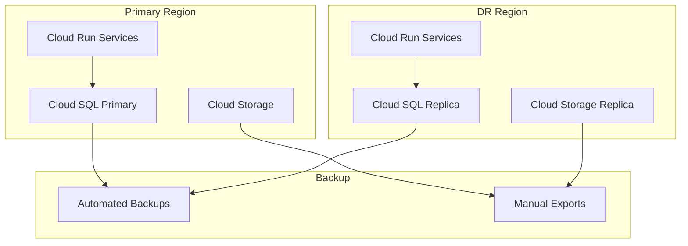

# Disaster Recovery

## Overview

This document outlines disaster recovery (DR) procedures for MagiDesk POS system, including failover procedures, data recovery, and service restoration.

## DR Objectives

| Metric | Target | Current |
|--------|--------|---------|
| **RTO (Recovery Time Objective)** | 4 hours | 2-4 hours |
| **RPO (Recovery Point Objective)** | 1 hour | 1 hour (automated backups) |
| **Availability Target** | 99.9% | 99.95% (Cloud Run SLA) |

## Disaster Scenarios

### Scenario 1: Database Failure

**Impact**: All services affected  
**Severity**: Critical

**Recovery Steps:**
1. Assess database status
2. Attempt automatic failover (if configured)
3. Restore from latest backup
4. Verify data integrity
5. Restart services

**Estimated Recovery Time**: 2-4 hours

### Scenario 2: Regional Outage

**Impact**: All services in region unavailable  
**Severity**: Critical

**Recovery Steps:**
1. Activate DR region (if configured)
2. Update DNS/routing
3. Verify service health
4. Monitor for issues

**Estimated Recovery Time**: 1-2 hours (if DR region configured)

### Scenario 3: Service Failure

**Impact**: Single service unavailable  
**Severity**: High

**Recovery Steps:**
1. Check service health
2. Review logs for errors
3. Restart service
4. Verify functionality
5. Investigate root cause

**Estimated Recovery Time**: 15-30 minutes

### Scenario 4: Data Corruption

**Impact**: Data integrity compromised  
**Severity**: Critical

**Recovery Steps:**
1. Identify affected data
2. Stop affected services
3. Restore from backup
4. Verify data integrity
5. Resume services

**Estimated Recovery Time**: 2-4 hours

## DR Architecture



## Failover Procedures

### Automatic Failover

Cloud SQL provides automatic failover for:
- High Availability (HA) instances
- Read replicas (for read operations)

### Manual Failover

#### Database Failover

```powershell
# Promote read replica to primary
gcloud sql instances promote-replica REPLICA_INSTANCE_NAME
```

#### Service Failover

1. Update service configuration to point to DR region
2. Deploy services to DR region
3. Update DNS/routing
4. Verify service health

## Recovery Procedures

### Full System Recovery

1. **Assess Situation**
   - Identify affected components
   - Determine recovery point
   - Estimate recovery time

2. **Prepare Recovery Environment**
   - Provision resources if needed
   - Prepare backup restoration
   - Notify stakeholders

3. **Restore Database**
   - Restore from backup (see [Backup & Restore](./backup-restore.md))
   - Verify data integrity
   - Test database connectivity

4. **Restore Services**
   - Deploy services
   - Configure environment variables
   - Verify service health

5. **Verify System**
   - Run health checks
   - Test critical workflows
   - Monitor for issues

6. **Resume Operations**
   - Notify users
   - Monitor system closely
   - Document incident

### Partial Recovery

For partial failures:

1. Identify affected services
2. Isolate affected components
3. Restore only affected services
4. Verify functionality
5. Resume operations

## DR Testing

### Test Schedule

- **Quarterly**: Full DR test
- **Monthly**: Component-level tests
- **Weekly**: Backup verification

### Test Procedures

1. **Plan Test**: Define test scope and objectives
2. **Execute Test**: Simulate disaster scenario
3. **Measure Results**: Document recovery time and issues
4. **Improve Procedures**: Update based on test results

### Test Scenarios

- Database failure
- Service failure
- Regional outage
- Data corruption
- Network failure

## Communication Plan

### During Disaster

1. **Immediate**: Notify operations team
2. **15 minutes**: Status update to stakeholders
3. **Hourly**: Progress updates
4. **Resolution**: Post-incident report

### Communication Channels

- **Slack**: #incidents channel
- **Email**: ops-team@example.com
- **Status Page**: (if available)
- **Phone**: Emergency contact list

## Post-Incident

### Incident Review

1. **Timeline**: Document incident timeline
2. **Root Cause**: Identify root cause
3. **Impact**: Assess business impact
4. **Lessons Learned**: Document improvements
5. **Action Items**: Create improvement tasks

### Improvement Plan

Based on incident review:

1. Update DR procedures
2. Improve monitoring/alerting
3. Enhance backup procedures
4. Update documentation
5. Team training

## DR Checklist

### Pre-Incident

- [ ] Backups configured and tested
- [ ] DR procedures documented
- [ ] Team trained on procedures
- [ ] Monitoring and alerting configured
- [ ] Contact list up to date

### During Incident

- [ ] Incident declared
- [ ] Team notified
- [ ] Assessment completed
- [ ] Recovery plan executed
- [ ] Status updates sent

### Post-Incident

- [ ] Services restored
- [ ] Data verified
- [ ] Incident documented
- [ ] Post-mortem completed
- [ ] Improvements planned

## Best Practices

1. **Regular Testing**: Test DR procedures regularly
2. **Documentation**: Keep procedures up to date
3. **Automation**: Automate recovery where possible
4. **Monitoring**: Comprehensive monitoring and alerting
5. **Training**: Regular team training
6. **Communication**: Clear communication plan
7. **Continuous Improvement**: Learn from each incident
