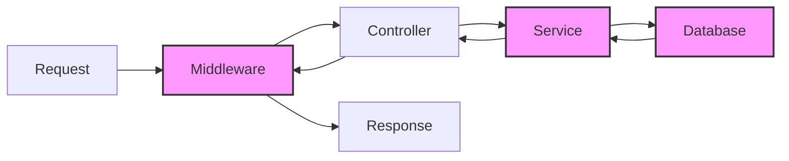

# Monitoring

## Overview

MagiDesk POS is monitored through Google Cloud Monitoring (formerly Stackdriver) for production services and local monitoring tools for development.

## Key Metrics

### Service Metrics

| Metric | Description | Threshold | Alert |
|--------|-------------|-----------|-------|
| **Request Rate** | Requests per second | > 1000 req/s | High traffic |
| **Error Rate** | Percentage of failed requests | > 5% | High error rate |
| **Response Time** | Average response time (p50, p95, p99) | p95 > 1s | Slow responses |
| **CPU Usage** | CPU utilization | > 80% | High CPU |
| **Memory Usage** | Memory utilization | > 90% | High memory |
| **Database Connections** | Active database connections | > 80% of max | Connection pool exhaustion |

### Business Metrics

| Metric | Description | Source |
|--------|-------------|--------|
| **Active Users** | Users logged in | UsersApi |
| **Orders Per Hour** | Order processing rate | OrderApi |
| **Payment Success Rate** | Successful payments / total | PaymentApi |
| **Inventory Alerts** | Low stock items | InventoryApi |

## Monitoring Tools

### Google Cloud Monitoring

**Dashboard URL**: [Cloud Monitoring Console](https://console.cloud.google.com/monitoring)

**Key Dashboards:**
- Service Health Dashboard
- API Performance Dashboard
- Database Performance Dashboard
- Business Metrics Dashboard

### Health Check Endpoints

All APIs expose health endpoints:

```bash
# Basic health check
GET /health

# Readiness probe
GET /health/ready

# Liveness probe
GET /health/live
```

**Response Format:**
```json
{
  "status": "healthy",
  "timestamp": "2025-01-27T10:30:00Z",
  "service": "UsersApi",
  "version": "2.0.0",
  "uptime": "2d 5h 30m"
}
```

## Custom Metrics

### Application Metrics

Services expose custom metrics via:

1. **Request Metrics**: Automatically tracked by Cloud Run
2. **Business Metrics**: Custom logging for analysis
3. **Performance Metrics**: Response times, throughput

### Example: Custom Business Metric

```csharp
// Log custom metric
_logger.LogInformation("OrderCreated", new {
    OrderId = orderId,
    TotalAmount = totalAmount,
    PaymentMethod = paymentMethod,
    Duration = duration
});
```

## Alerting

See [Alerting Guide](./alerting.md) for detailed alert configuration.

### Critical Alerts

- Service down (health check fails)
- Error rate > 10%
- Database connection failures
- Payment processing failures

## Performance Monitoring

### Response Time Tracking

Monitor p50, p95, and p99 response times:



### Database Query Performance

Monitor slow queries:

```sql
-- Find slow queries
SELECT query, mean_exec_time, calls
FROM pg_stat_statements
WHERE mean_exec_time > 1000
ORDER BY mean_exec_time DESC
LIMIT 10;
```

## Monitoring Best Practices

1. **Set Appropriate Thresholds**: Based on SLA requirements
2. **Monitor Trends**: Not just absolute values
3. **Correlate Metrics**: Combine service and business metrics
4. **Regular Reviews**: Weekly metric reviews
5. **Document Anomalies**: Record and investigate unusual patterns

## Troubleshooting

### Metrics Not Appearing

1. Verify Cloud Monitoring API is enabled
2. Check service account permissions
3. Verify metric export configuration
4. Check log exports

### High False Positives

1. Adjust alert thresholds
2. Add alert conditions (e.g., sustained over time)
3. Review alert logic
