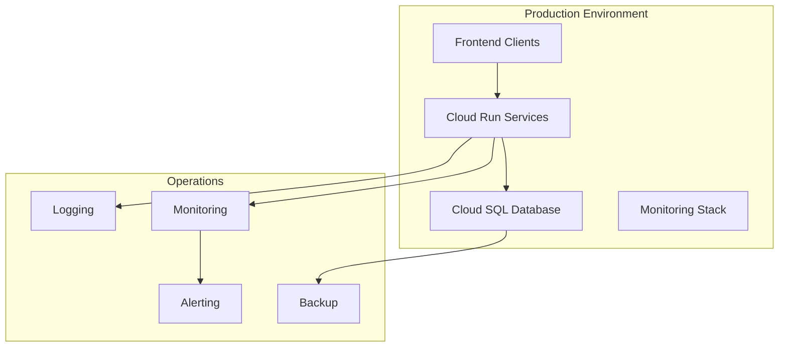

# Operations & Support Overview

This section provides comprehensive operational documentation for running, monitoring, and maintaining the MagiDesk POS system in production.

## Table of Contents

- [Logging](./logging.md) - Logging configuration and log analysis
- [Monitoring](./monitoring.md) - System monitoring and metrics
- [Alerting](./alerting.md) - Alert configuration and incident response
- [Troubleshooting](./troubleshooting.md) - Common issues and solutions
- [Service Management](./service-management.md) - Starting, stopping, and restarting services
- [Backup & Restore](./backup-restore.md) - Database backup and restore procedures
- [Disaster Recovery](./disaster-recovery.md) - DR procedures and failover
- [Performance Tuning](./performance-tuning.md) - Optimization and tuning guidelines

## Operational Architecture

## Key Operational Principles

1. **High Availability**: All services are deployed on Google Cloud Run with automatic scaling
2. **Observability**: Comprehensive logging, monitoring, and alerting
3. **Disaster Recovery**: Automated backups and documented recovery procedures
4. **Security**: RBAC enforcement, secure communication, and audit logging
5. **Performance**: Monitoring and optimization for optimal user experience

## Service Health Checks

All APIs expose health check endpoints:

- **Health Check**: `GET /health` - Basic service health
- **Readiness**: `GET /health/ready` - Service ready to accept traffic
- **Liveness**: `GET /health/live` - Service is alive

## Support Contacts

- **Development Team**: [GitHub Issues](https://github.com/zedfauji/pos-app/issues)
- **Emergency**: Contact system administrator
- **Documentation**: This developer portal

## Quick Reference

| Task | Command/Link |
|------|-------------|
| View logs | [Logging Guide](./logging.md) |
| Check service health | `GET /health` on any API |
| Restart service | [Service Management](./service-management.md) |
| Backup database | [Backup & Restore](./backup-restore.md) |
| View metrics | [Monitoring](./monitoring.md) |
