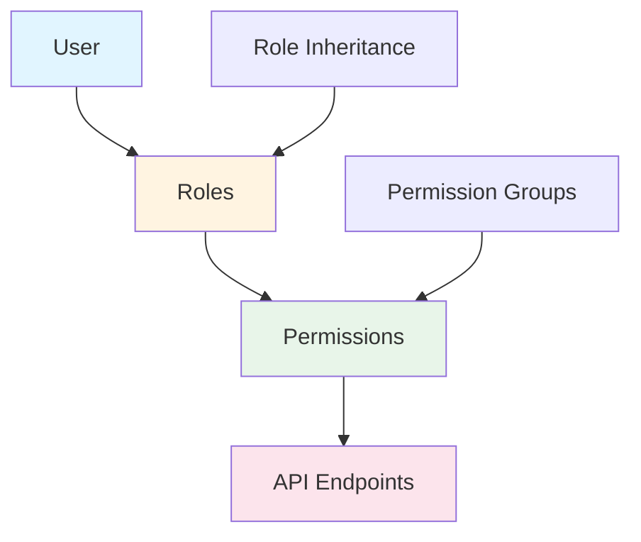
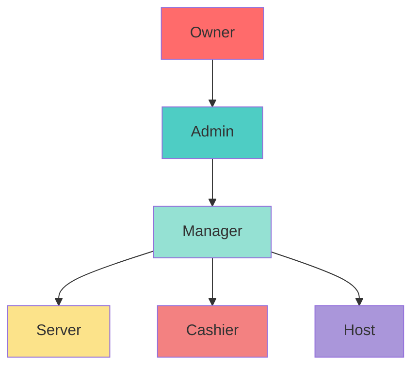

# Role-Based Access Control (RBAC)

## Overview

MagiDesk POS implements a comprehensive Role-Based Access Control (RBAC) system with 47 granular permissions across 11 categories and 6 system roles.

## Architecture



## System Roles

| Role | Description | Use Case |
|------|-------------|----------|
| **Owner** | Full system access | Business owner |
| **Admin** | Administrative access | System administrator |
| **Manager** | Management operations | Store manager |
| **Server** | Order and table management | Wait staff |
| **Cashier** | Payment processing | Cashier |
| **Host** | Table management only | Host/hostess |

## Permission Categories

### 1. User Management (`user:*`)

- `user:view` - View users
- `user:create` - Create users
- `user:update` - Update users
- `user:delete` - Delete users
- `user:manage_roles` - Manage roles and permissions

### 2. Menu Management (`menu:*`)

- `menu:view` - View menu items
- `menu:create` - Create menu items
- `menu:update` - Update menu items
- `menu:delete` - Delete menu items
- `menu:manage_modifiers` - Manage modifiers
- `menu:manage_combos` - Manage combo offers

### 3. Order Management (`order:*`)

- `order:view` - View orders
- `order:create` - Create orders
- `order:update` - Update orders
- `order:delete` - Delete orders
- `order:manage_items` - Manage order items
- `order:view_logs` - View order logs

### 4. Payment Management (`payment:*`)

- `payment:view` - View payments
- `payment:process` - Process payments
- `payment:refund` - Process refunds
- `payment:void` - Void payments
- `payment:view_history` - View payment history

### 5. Inventory Management (`inventory:*`)

- `inventory:view` - View inventory
- `inventory:update` - Update inventory
- `inventory:manage_vendors` - Manage vendors
- `inventory:manage_stock` - Manage stock levels
- `inventory:view_reports` - View inventory reports

### 6. Settings Management (`settings:*`)

- `settings:view` - View settings
- `settings:update` - Update settings
- `settings:manage_hierarchy` - Manage hierarchical settings

### 7. Customer Management (`customer:*`)

- `customer:view` - View customers
- `customer:create` - Create customers
- `customer:update` - Update customers
- `customer:manage_loyalty` - Manage loyalty programs
- `customer:manage_campaigns` - Manage marketing campaigns

### 8. Discount Management (`discount:*`)

- `discount:view` - View discounts
- `discount:create` - Create discounts
- `discount:update` - Update discounts
- `discount:delete` - Delete discounts

### 9. Table Management (`table:*`)

- `table:view` - View tables
- `table:manage` - Manage table status
- `table:manage_sessions` - Manage table sessions

### 10. Reports (`reports:*`)

- `reports:view` - View reports
- `reports:export` - Export reports
- `reports:analytics` - Access analytics

### 11. System (`system:*`)

- `system:admin` - System administration
- `system:config` - System configuration
- `system:backup` - Backup operations

## Role Hierarchy



## Permission Assignment

### Default Role Permissions

**Owner:**
- All permissions

**Admin:**
- All permissions except `system:admin`

**Manager:**
- `order:*`, `payment:view`, `inventory:view`, `customer:*`, `reports:*`

**Server:**
- `order:create`, `order:update`, `order:view`, `table:*`, `menu:view`

**Cashier:**
- `payment:*`, `order:view`, `customer:view`

**Host:**
- `table:*`, `menu:view`

## API Integration

### V2 Endpoints (RBAC-Enabled)

All v2 endpoints require permissions:

```csharp
[HttpGet]
[RequiresPermission(Permissions.USER_VIEW)]
public async Task<IActionResult> GetUsers(...)
{
    // Endpoint implementation
}
```

### Permission Checking

Backend checks permissions via `IRbacService`:

```csharp
var hasPermission = await _rbacService.HasPermissionAsync(
    userId, 
    Permissions.USER_VIEW
);
```

## Frontend Integration

### Permission Manager

Frontend uses `PermissionManager` to check permissions:

```csharp
if (PermissionManager.HasPermission("user:view"))
{
    // Show UI element
}
```

### UI Element Visibility

```xml
<Button Visibility="{x:Bind ViewModel.CanCreateUser, Mode=OneWay}">
    Create User
</Button>
```

## Best Practices

1. **Principle of Least Privilege**: Grant minimum required permissions
2. **Regular Audits**: Review permissions regularly
3. **Role-Based Access**: Use roles, not individual permissions
4. **Documentation**: Document permission requirements
5. **Testing**: Test permission enforcement

## Troubleshooting

### Permission Denied Errors

1. **Check User Role**: Verify user has correct role
2. **Check Permissions**: Verify role has required permissions
3. **Check API Version**: Ensure using v2 endpoints
4. **Check Headers**: Verify `X-User-Id` header is present

### Missing Permissions

1. **Review Role**: Check role permission assignments
2. **Update Role**: Add missing permissions to role
3. **Verify**: Test permission after update
