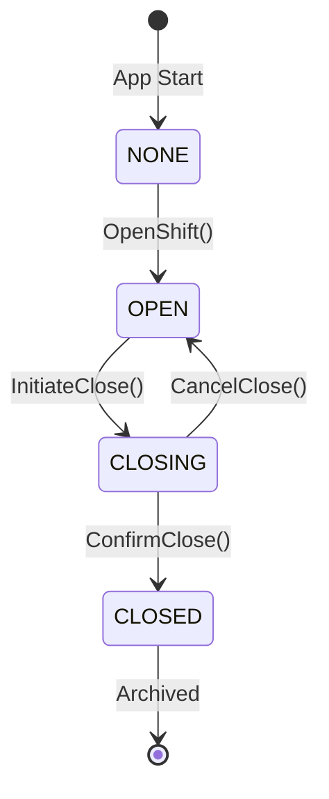
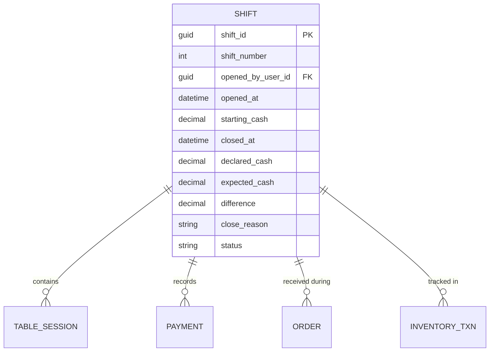
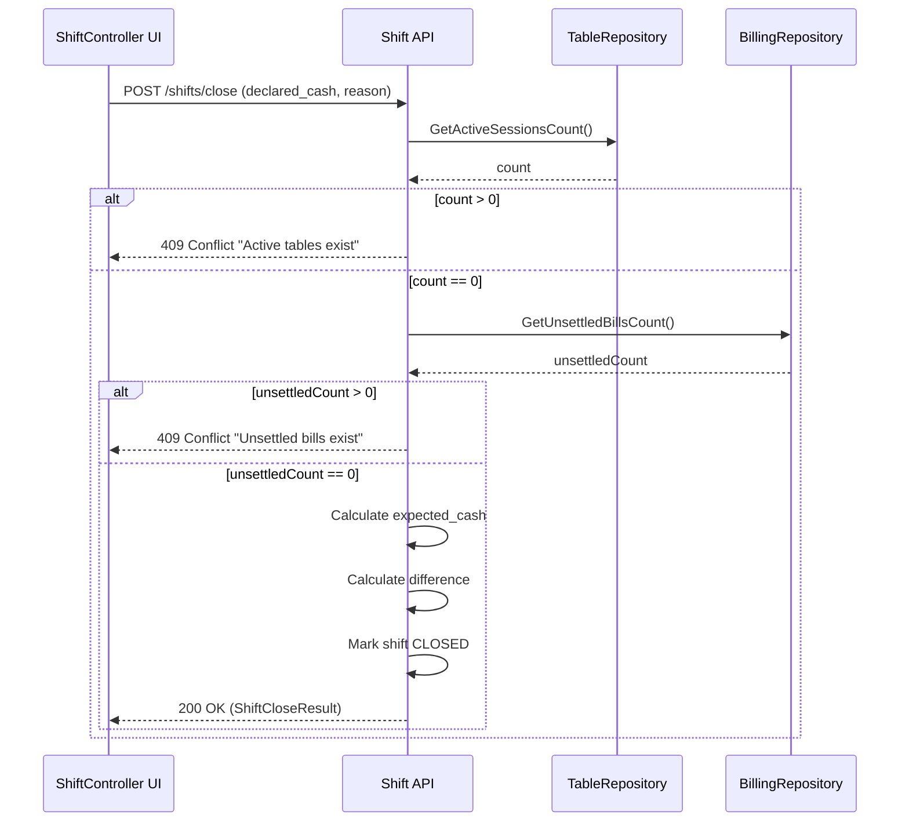

# Shift Controller - Domain Invariants

> **Principle:** "Money accountability starts here."

## 🔒 Non-Negotiable System Rules

### Rule 1: No Shift = No Operations

| Blocked Operation | Reason |
|-------------------|--------|
| Start table session | No audit trail for revenue |
| Send orders | Cannot tie revenue to shift |
| Accept payments | Cannot reconcile cash |
| Inventory transactions | Cannot track shrinkage |
| Move to UNSETTLED | No shift to settle against |

### Rule 2: Shift Cannot Close With Open Liabilities

| Blocking Condition | Why |
|--------------------|-----|
| UNSETTLED sessions exist | Uncollected revenue |
| Tables are OPEN (active) | Incomplete transactions |
| Payments incomplete | Cash not reconciled |

### Rule 3: Closed Shifts Are IMMUTABLE

- ❌ No edits
- ❌ No recalculation  
- ❌ No deletion
- ✅ Read-only historical record

---

## Shift States



| State | Description | Allowed Operations |
|-------|-------------|-------------------|
| `NONE` | No shift exists today | Open new shift only |
| `OPEN` | Active shift in progress | All business operations |
| `CLOSING` | Close initiated, awaiting cash declaration | View only, declare cash |
| `CLOSED` | Shift finalized, immutable | Read-only, print Z-report |

---

## Entity Relationships



---

## Blocking Rules Matrix

| Operation | Requires Open Shift | Requires No UNSETTLED | Requires No Active Tables |
|-----------|:-------------------:|:--------------------:|:------------------------:|
| Start Session | ✅ | - | - |
| Send Order | ✅ | - | - |
| Accept Payment | ✅ | - | - |
| End Session (→ UNSETTLED) | ✅ | - | - |
| Settle Bill (→ SETTLED) | ✅ | - | - |
| Close Shift | ✅ | ✅ | ✅ |
| View History | - | - | - |
| Print Z-Report | - | - | - |

---

## Shift-to-Operations Gate

```
┌─────────────────────────────────────────────────────────────┐
│                    SHIFT GATE (Backend)                       │
├─────────────────────────────────────────────────────────────┤
│                                                               │
│   Every API that modifies financial state MUST:               │
│                                                               │
│   1. Check ShiftService.GetCurrentOpenShift()                │
│   2. If null → Return 423 Locked ("No shift open")           │
│   3. If valid → Proceed with operation                        │
│   4. Tag operation with shift_id                              │
│                                                               │
└─────────────────────────────────────────────────────────────┘
```

---

## Close Shift Validation Sequence



---

## Key Invariants Summary

1. **Shift ID propagation**: Every financial entity (session, order, payment) MUST reference the active shift_id
2. **No orphan transactions**: Operations without a shift_id are REJECTED
3. **Atomic close**: Shift closes in a single transaction with all validations
4. **Cash accountability**: `expected_cash = starting_cash + cash_sales - cash_outs`
5. **Immutable history**: After close, only SELECT operations allowed
