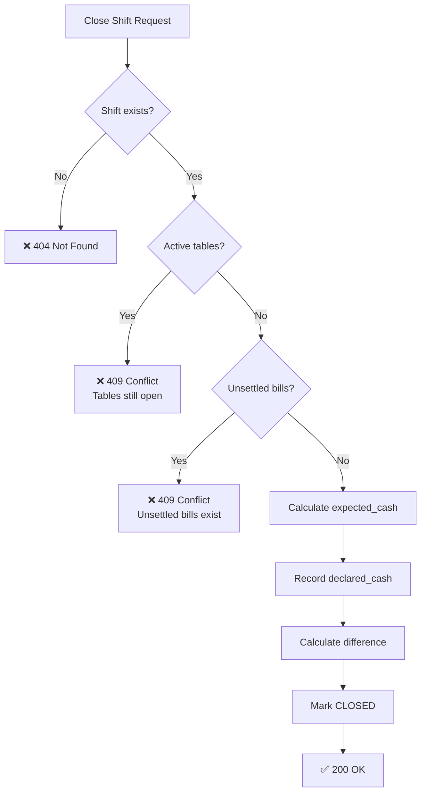

# Shift Controller - Backend Enforcement Plan

> **Backend is the ONLY authority.** UI is a display layer that reflects backend state.

---

## 🔐 API Gating Architecture

### ShiftGuardMiddleware

All financial APIs pass through a middleware that validates shift status:

```csharp
public class ShiftGuardMiddleware
{
    private static readonly HashSet<string> GatedPaths = new()
    {
        "/tables/*/start",
        "/tables/*/stop", 
        "/tables/*/end",
        "/orders",
        "/payments",
        "/inventory/transactions"
    };

    public async Task InvokeAsync(HttpContext context, IShiftService shiftService)
    {
        if (RequiresOpenShift(context.Request.Path))
        {
            var currentShift = await shiftService.GetCurrentOpenShiftAsync();
            if (currentShift == null)
            {
                context.Response.StatusCode = 423; // Locked
                await context.Response.WriteAsJsonAsync(new { 
                    error = "NO_SHIFT_OPEN",
                    message = "Cannot perform this operation without an open shift."
                });
                return;
            }
            
            // Inject shift_id into request context for downstream use
            context.Items["CurrentShiftId"] = currentShift.ShiftId;
        }
        
        await _next(context);
    }
}
```

---

## Close Shift Validation Chain



### Blocking Queries

```sql
-- Active sessions check
SELECT COUNT(*) FROM table_sessions 
WHERE status = 'active' AND shift_id = @currentShiftId;

-- Unsettled bills check
SELECT COUNT(*) FROM bills 
WHERE (status = 'unsettled' OR is_settled = false) 
  AND shift_id = @currentShiftId;
```

---

## Shift ID Propagation

Every financial entity MUST have a `shift_id` column:

| Entity | Column | Constraint |
|--------|--------|------------|
| `table_sessions` | `shift_id` | NOT NULL FK |
| `orders` | `shift_id` | NOT NULL FK |
| `order_items` | (via order) | Inherited |
| `bills` | `shift_id` | NOT NULL FK |
| `payments` | `shift_id` | NOT NULL FK |
| `inventory_txns` | `shift_id` | NOT NULL FK |

### Migration Required

```sql
ALTER TABLE table_sessions ADD COLUMN shift_id UUID REFERENCES shifts(shift_id);
ALTER TABLE orders ADD COLUMN shift_id UUID REFERENCES shifts(shift_id);
ALTER TABLE bills ADD COLUMN shift_id UUID REFERENCES shifts(shift_id);
ALTER TABLE payments ADD COLUMN shift_id UUID REFERENCES shifts(shift_id);
```

---

## Idempotency Handling

### Open Shift

```csharp
public async Task<Shift> OpenShiftAsync(OpenShiftRequest request)
{
    // Check if shift already open today
    var existing = await GetCurrentOpenShiftAsync();
    if (existing != null)
    {
        if (request.IdempotencyKey == existing.IdempotencyKey)
            return existing; // Idempotent return
        else
            throw new ConflictException("A shift is already open");
    }
    
    // Create new shift
    var shift = new Shift { ... };
    await _repo.InsertAsync(shift);
    return shift;
}
```

### Close Shift

```csharp
public async Task<ShiftCloseResult> CloseShiftAsync(CloseShiftRequest request)
{
    var shift = await GetCurrentOpenShiftAsync();
    if (shift == null)
        throw new NotFoundException("No open shift");
    
    if (shift.Status == "closed")
    {
        // Already closed - idempotent check
        if (shift.IdempotencyKey == request.IdempotencyKey)
            return BuildCloseResult(shift);
        else
            throw new ConflictException("Shift already closed");
    }
    
    // Validation chain...
    // Close atomically...
}
```

---

## Expected Cash Calculation

```csharp
public async Task<decimal> CalculateExpectedCashAsync(Guid shiftId)
{
    var startingCash = await GetStartingCashAsync(shiftId);
    var cashSales = await GetCashSalesAsync(shiftId);
    var cashOuts = await GetCashOutsAsync(shiftId);
    var tipsCash = await GetCashTipsAsync(shiftId);
    
    return startingCash + cashSales + tipsCash - cashOuts;
}
```

### SQL for Cash Sales

```sql
SELECT COALESCE(SUM(p.amount_paid), 0) as cash_sales
FROM payments p
JOIN bills b ON p.bill_id = b.bill_id
WHERE b.shift_id = @shiftId
  AND p.payment_method = 'cash'
  AND p.is_voided = false;
```

---

## HTTP Response Codes

| Scenario | Status | Body |
|----------|--------|------|
| No shift open (gated operation) | `423 Locked` | `{ error: "NO_SHIFT_OPEN" }` |
| Shift already open (open attempt) | `409 Conflict` | `{ error: "SHIFT_ALREADY_OPEN" }` |
| Active tables exist (close attempt) | `409 Conflict` | `{ error: "ACTIVE_TABLES_EXIST", count: N }` |
| Unsettled bills exist (close attempt) | `409 Conflict` | `{ error: "UNSETTLED_BILLS_EXIST", count: N }` |
| Shift not found | `404 Not Found` | `{ error: "SHIFT_NOT_FOUND" }` |
| Success | `200 OK` | Result payload |

---

## Atomic Close Transaction

```sql
BEGIN TRANSACTION;

-- Final validation (with lock)
SELECT * FROM shifts WHERE shift_id = @shiftId FOR UPDATE;

-- Check blocking conditions
IF EXISTS (SELECT 1 FROM table_sessions WHERE shift_id = @shiftId AND status = 'active')
    ROLLBACK; RETURN;

IF EXISTS (SELECT 1 FROM bills WHERE shift_id = @shiftId AND status = 'unsettled')
    ROLLBACK; RETURN;

-- Calculate and close
UPDATE shifts SET
    status = 'closed',
    closed_at = NOW(),
    closed_by_user_id = @userId,
    declared_cash = @declaredCash,
    expected_cash = @calculatedExpected,
    difference = @declaredCash - @calculatedExpected,
    close_reason = @reason
WHERE shift_id = @shiftId;

COMMIT;
```

---

## Service Layer Design

```
IShiftService
├── GetCurrentOpenShiftAsync()     → Shift?
├── OpenShiftAsync(request)        → Shift
├── GetShiftBlockersAsync(id)      → ShiftBlockers
├── CloseShiftAsync(request)       → ShiftCloseResult
├── GetShiftReportAsync(id)        → ShiftReport
└── GetShiftHistoryAsync(filter)   → List<ShiftSummary>

IShiftRepository
├── GetOpenShiftAsync()            → Shift?
├── InsertShiftAsync(shift)        → void
├── UpdateShiftAsync(shift)        → void
├── GetShiftByIdAsync(id)          → Shift?
└── GetShiftsPaginatedAsync(...)   → PagedList<Shift>
```
