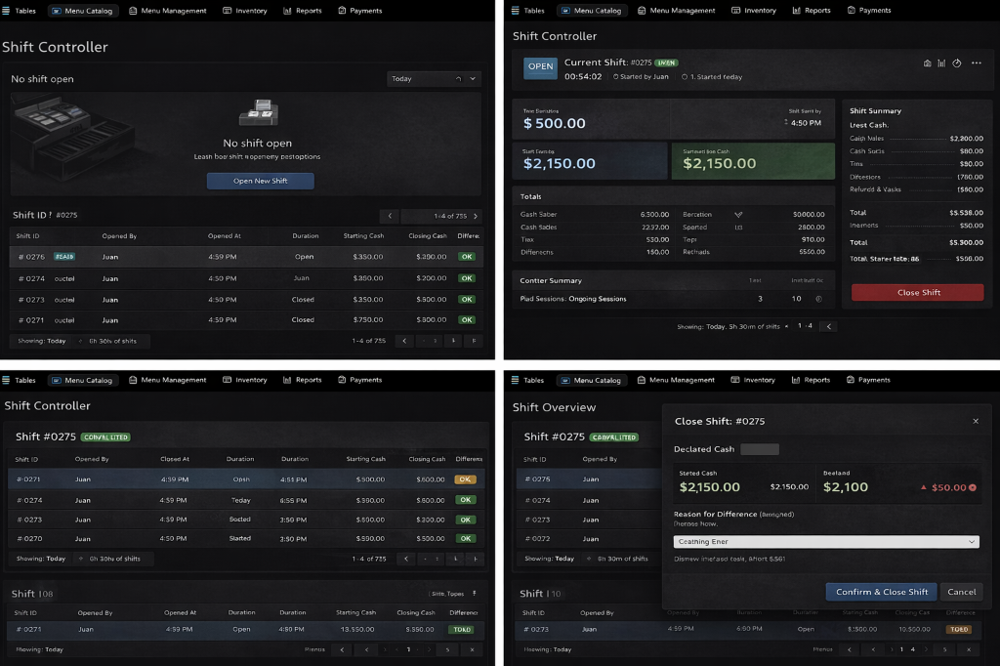

# Shift Controller - UI Architecture

> UI displays backend state. UI never calculates money. UI disables clearly when blocked.

---

## Visual Reference



The UI MUST match this reference:
- Dark professional POS theme
- Clear empty-state when no shift open
- Prominent "Open New Shift" CTA
- Real-time shift KPIs when open
- Read-only historical shift list
- Explicit Close Shift flow with declared vs expected cash

---

## Page Structure

```
ShiftControllerPage
├── Header (Shift status bar)
├── Content Area
│   ├── [No Shift Open] → EmptyState + OpenShiftButton
│   ├── [Shift Open] → LiveShiftDashboard
│   └── [Closing] → CloseShiftDialog
└── History Section (always visible)
```

---

## ViewModels

### 1. ShiftControllerViewModel (Main)

```csharp
public partial class ShiftControllerViewModel : ObservableObject
{
    // State
    [ObservableProperty] private bool isLoading;
    [ObservableProperty] private bool isShiftOpen;
    [ObservableProperty] private ShiftDto? currentShift;
    [ObservableProperty] private string shiftStatus; // "OPEN", "CLOSED", "NONE"
    [ObservableProperty] private string errorMessage;
    
    // Stats (backend-driven)
    [ObservableProperty] private decimal totalSales;
    [ObservableProperty] private decimal cashSales;
    [ObservableProperty] private decimal cardSales;
    [ObservableProperty] private decimal expectedCash;
    [ObservableProperty] private int activeTables;
    [ObservableProperty] private int paidSessions;
    
    // History  
    [ObservableProperty] private ObservableCollection<ShiftHistoryItem> shiftHistory;
    
    // Commands
    [RelayCommand] Task LoadAsync();
    [RelayCommand] Task OpenShiftAsync();
    [RelayCommand] Task InitiateCloseAsync();
    [RelayCommand] Task RefreshStatsAsync();
}
```

### 2. OpenShiftViewModel

```csharp
public partial class OpenShiftViewModel : ObservableObject
{
    [ObservableProperty] private decimal startingCash;
    [ObservableProperty] private string note;
    [ObservableProperty] private bool isProcessing;
    [ObservableProperty] private string errorMessage;
    
    [RelayCommand] Task ConfirmOpenAsync();
    [RelayCommand] void Cancel();
}
```

### 3. CloseShiftViewModel

```csharp
public partial class CloseShiftViewModel : ObservableObject
{
    // Display (read-only from backend)
    [ObservableProperty] private int shiftNumber;
    [ObservableProperty] private decimal expectedCash;
    [ObservableProperty] private decimal startingCash;
    
    // Input
    [ObservableProperty] private decimal declaredCash;
    [ObservableProperty] private string reasonForDifference;
    [ObservableProperty] private string categoryForDifference;
    
    // Computed
    public decimal Difference => DeclaredCash - ExpectedCash;
    public bool HasDifference => Difference != 0;
    public bool IsShort => Difference < 0;
    public bool IsOver => Difference > 0;
    
    // Blockers
    [ObservableProperty] private ObservableCollection<ShiftBlocker> blockers;
    [ObservableProperty] private bool hasBlockers;
    
    // State
    [ObservableProperty] private bool isProcessing;
    [ObservableProperty] private string errorMessage;
    
    [RelayCommand] Task LoadBlockersAsync();
    [RelayCommand] Task ConfirmCloseAsync();
    [RelayCommand] void Cancel();
}
```

### 4. ShiftHistoryViewModel

```csharp
public partial class ShiftHistoryViewModel : ObservableObject
{
    [ObservableProperty] private ObservableCollection<ShiftHistorySummary> shifts;
    [ObservableProperty] private int currentPage;
    [ObservableProperty] private int totalPages;
    [ObservableProperty] private bool isLoading;
    
    // Filters
    [ObservableProperty] private DateTime? fromDate;
    [ObservableProperty] private DateTime? toDate;
    
    [RelayCommand] Task LoadPageAsync(int page);
    [RelayCommand] Task NextPageAsync();
    [RelayCommand] Task PreviousPageAsync();
    [RelayCommand] Task ViewDetailsAsync(ShiftHistorySummary shift);
    [RelayCommand] Task PrintZReportAsync(Guid shiftId);
}
```

---

## UI States

### State 1: No Shift Open

```
┌─────────────────────────────────────────────┐
│  ┌─────────────────────────────────────┐    │
│  │           [Cassette Icon]            │    │
│  │       "No shift open"                │    │
│  │  Learn how shift expedency restops   │    │
│  │                                      │    │
│  │     ┌──────────────────────────┐     │    │
│  │     │   Open New Shift         │     │    │
│  │     └──────────────────────────┘     │    │
│  └─────────────────────────────────────┘    │
│                                             │
│  ┌── Shift History ─────────────────────┐   │
│  │  #0276 | Juan | 4:59 PM | Open | ... │   │
│  │  #0275 | Juan | 4:50 PM | Juan | OK  │   │
│  └──────────────────────────────────────┘   │
└─────────────────────────────────────────────┘
```

### State 2: Shift Open (Dashboard)

```
┌───────────────────────────────────────────────────────────────┐
│ OPEN  Current Shift: #0275 [LIVE]                             │
│       00:54:02  ○ Started by Juan  ○ 1. Started today         │
├───────────────────────────────────────────────────────────────┤
│                                                               │
│  ┌─────────────────────┐   ┌─────────────────────┐           │
│  │ Time Earnings       │   │ Current Pos Cash    │           │
│  │    $500.00          │   │    $2,150.00        │           │
│  └─────────────────────┘   └─────────────────────┘           │
│                                                               │
│  ┌─────────────────────┐   ┌─────────────────────┐           │
│  │ Shift Earnings      │   │ Current for Cash    │           │
│  │   $2,150.00         │   │   $2,150.00         │           │
│  └─────────────────────┘   └─────────────────────┘           │
│                                                               │
│  Totals                         Shift Summary                 │
│  ─────────────────────          ─────────────────             │
│  Cash Sales     6,300.00       Cash Sales    $2,300.00       │
│  Card Sales     2,237.00       Cash Starts   $80.00          │
│  Tips           530.00         ...                            │
│                                                               │
│  Counter Summary                    ┌─────────────────────┐   │
│  Paid Sessions: 10  Ongoing: 3      │   Close Shift       │   │
│                                     └─────────────────────┘   │
└───────────────────────────────────────────────────────────────┘
```

### State 3: Close Shift Dialog

```
┌───────────────────────────────────────────┐
│  Close Shift: #0275                    X  │
├───────────────────────────────────────────┤
│                                           │
│  Declared Cash: [________]                │
│                                           │
│  ┌─────────────────────────────────────┐  │
│  │ Started Cash         Expected Cash  │  │
│  │  $2,150.00  $2,150.00   $2,100      │  │
│  │                       +$50.00 ●     │  │
│  └─────────────────────────────────────┘  │
│                                           │
│  Reason for Difference (required):        │
│  [____________________________________]   │
│                                           │
│  Category:                                │
│  [Counting Error                    ▼]    │
│                                           │
│  ⚠ Dismiss interface fault/Short 5.50    │
│                                           │
│  ┌──────────────────┐  ┌──────────────┐   │
│  │ Confirm & Close  │  │   Cancel     │   │
│  └──────────────────┘  └──────────────┘   │
└───────────────────────────────────────────┘
```

---

## UI Blocking Rules

| Condition | UI Behavior |
|-----------|-------------|
| No shift open | All operation buttons disabled, "No shift" banner |
| Shift open | All operations enabled |
| Close requested + blockers | Show blocker list, disable confirm |
| Close confirmed | Processing spinner, disable all inputs |
| Cash mismatch | Require reason, show difference prominently |

---

## Navigation Integration

```csharp
// ShellViewModel additions
public void NavigateToShiftController() => NavigateTo<ShiftControllerViewModel>();

// Gating other pages
public async Task NavigateToTables()
{
    var status = await _shiftApi.ValidateAsync();
    if (!status.CanOperate)
    {
        await ShowToast("No shift open. Open a shift first.");
        NavigateToShiftController();
        return;
    }
    NavigateTo<TableViewModel>();
}
```

---

## Real-time Updates (Optional Enhancement)

```csharp
// Poll every 30 seconds when shift is open
private DispatcherTimer _statsTimer;

public void StartStatsPolling()
{
    _statsTimer = new DispatcherTimer { Interval = TimeSpan.FromSeconds(30) };
    _statsTimer.Tick += async (s, e) => await RefreshStatsAsync();
    _statsTimer.Start();
}
```
