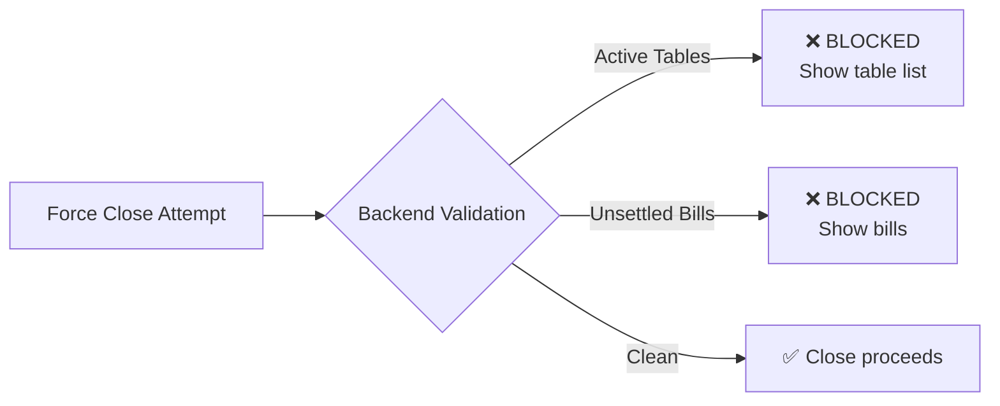

# Shift Controller - Risk & Fraud Prevention

> Trust is verified, not assumed. Every exception is logged.

---

## Risk Scenarios & Mitigations

### 1. Cash Mismatch at Close

**Risk:** Declared cash ≠ expected cash (theft, error, or legitimate variance)

**Mitigation:**
| Control | Implementation |
|---------|----------------|
| Mandatory reason field | Cannot submit close without explanation |
| Category selection | Pre-defined reasons (counting_error, theft, float_adjustment, customer_refund_cash) |
| Large variance alert | Differences > 2% flagged for manager review |
| Photo capture (future) | Optional photo of cash drawer |
| Audit log | All differences stored permanently |

**Detection Query:**
```sql
SELECT shift_id, declared_cash, expected_cash, difference, 
       ABS(difference / NULLIF(expected_cash, 0)) * 100 as variance_pct
FROM shifts 
WHERE difference != 0 
ORDER BY variance_pct DESC;
```

---

### 2. Forced Close Attempts

**Risk:** Staff tries to close shift with open tables/unsettled bills

**Mitigation:**
- Backend REJECTS with specific blockers
- UI shows exact blocking items (table labels, bill amounts)
- NO backdoor. Close is impossible until cleared.



---

### 3. Power Loss / Crash Mid-Shift

**Risk:** System crashes, shift state unknown

**Mitigation:**
| Recovery Step | Implementation |
|---------------|----------------|
| Shift persisted in DB | State survives crashes |
| Auto-recovery on startup | UI checks `/shifts/current` |
| Transaction logs | All operations have timestamps |
| No in-memory-only state | Everything is persisted |

**Startup Check:**
```csharp
// On app startup
var currentShift = await _shiftApi.GetCurrentAsync();
if (currentShift.IsOpen)
{
    ShowBanner($"Resuming shift #{currentShift.ShiftNumber}");
    NavigateToShiftDashboard();
}
else
{
    ShowBanner("No active shift");
    NavigateToShiftController();
}
```

---

### 4. Printer Failure During Z-Report

**Risk:** Shift closed but Z-report not printed

**Mitigation:**
| Control | Implementation |
|---------|----------------|
| Print is NOT required for close | Close succeeds even if print fails |
| Retry button | Re-print Z-report anytime from history |
| PDF backup | Generate PDF and email option |
| Error notification | Clear message with retry option |

---

### 5. Staff Error: Wrong Starting Cash

**Risk:** Operator enters wrong starting cash

**Mitigation:**
| Control | Implementation |
|---------|----------------|
| Confirmation dialog | "Starting cash: $X. Confirm?" |
| Manager approval (optional) | Require manager PIN for amounts > $1000 |
| Cannot edit after 5 minutes | Immutable after grace period |
| Audit trail | Original + any correction logged |

---

### 6. Unauthorized Shift Operations

**Risk:** Non-manager tries to open/close shift

**Mitigation:**
| Control | Implementation |
|---------|----------------|
| Role-based access | Only Manager/Admin can open/close |
| API authorization | Check JWT claims before processing |
| UI disables buttons | Non-managers see read-only view |

```csharp
[HttpPost("open")]
[Authorize(Roles = "Manager,Administrator")]
public async Task<IActionResult> OpenShift(...)
```

---

### 7. Session Stuck in UNSETTLED Forever

**Risk:** Bill never collected, shift can never close

**Mitigation:**
| Control | Implementation |
|---------|----------------|
| Aging alerts | Bills unsettled > 2 hours flagged |
| Manager write-off | Authority to write off with reason |
| Daily report | List of ancient unsettled bills |
| Auto-escalation | Notify owner if > 24 hours |

**Write-off Endpoint (Manager only):**
```
POST /bills/{id}/write-off
{
  "reason": "Customer left without paying",
  "managerPin": "****"
}
```

---

### 8. Duplicate Shift Open

**Risk:** Race condition opens two shifts

**Mitigation:**
| Control | Implementation |
|---------|----------------|
| Unique constraint | Only one OPEN shift per business |
| Idempotency key | Same request = same result |
| Atomic check + insert | Single transaction |

```sql
-- Atomic open with lock
BEGIN;
SELECT * FROM shifts WHERE status = 'open' FOR UPDATE;
-- If exists: ROLLBACK + return existing
-- If not: INSERT new shift
COMMIT;
```

---

## Audit Trail Requirements

All shift operations logged with:

| Field | Example |
|-------|---------|
| `event_type` | `SHIFT_OPEN`, `SHIFT_CLOSE`, `CLOSE_BLOCKED` |
| `timestamp` | `2025-12-22T16:00:00Z` |
| `user_id` | `uuid` |
| `user_name` | `Juan` |
| `shift_id` | `uuid` |
| `details_json` | `{ "declared": 2100, "expected": 2150 }` |
| `ip_address` | `192.168.1.100` |

---

## Fraud Detection Dashboard (Future)

KPIs to monitor:
- Variance rate by user
- Frequency of blockers at close time
- Average unsettled bill age
- Write-off patterns
- Shift duration anomalies
