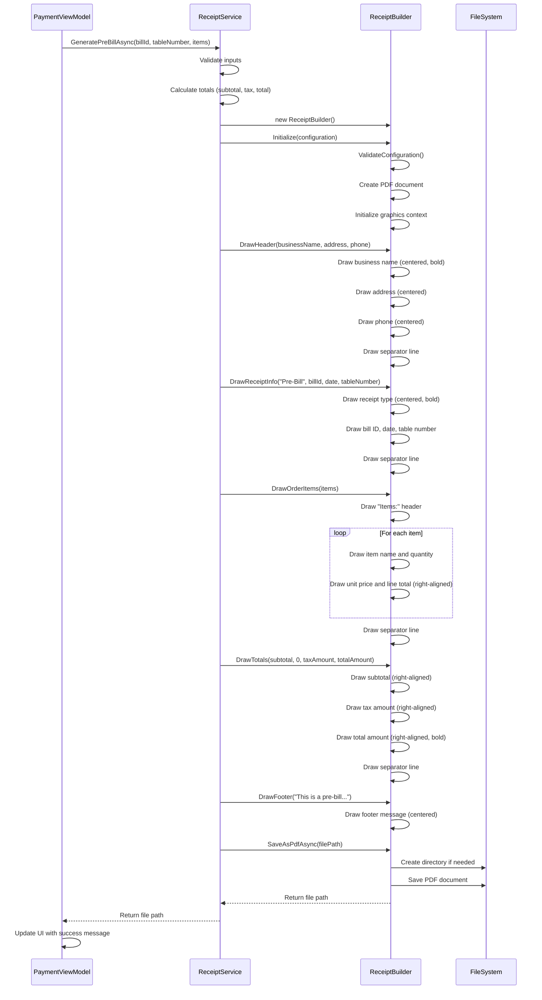
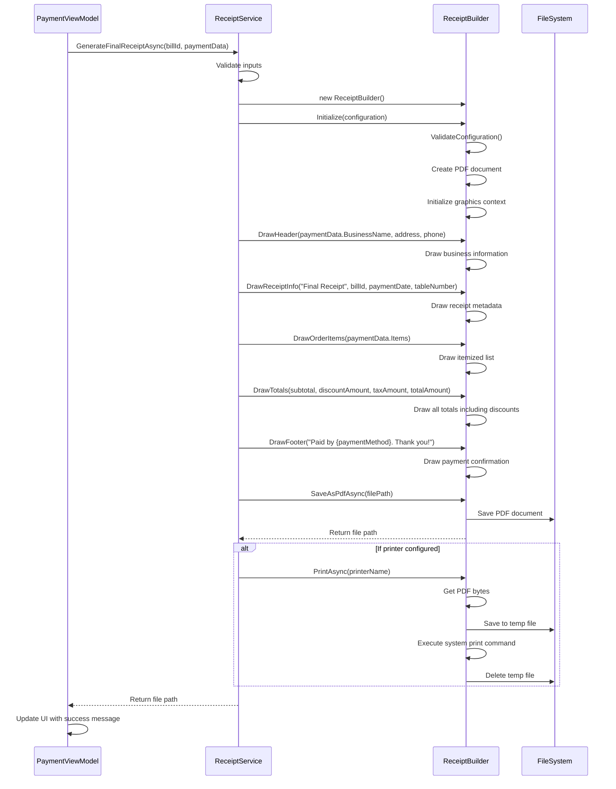
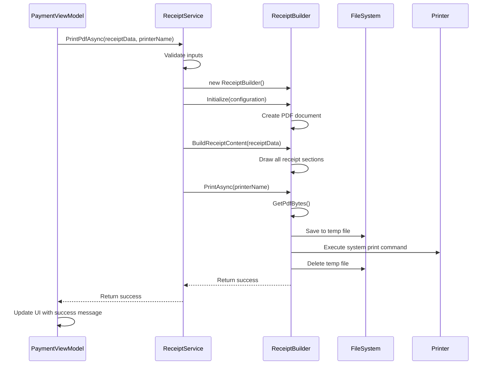

# Print Flow Sequence Diagrams & Trace Documentation

## Overview

This document provides detailed sequence diagrams and trace documentation for the PDFSharp-based receipt printing system in the MagiDesk Billiard POS application.

## Sequence Diagrams

### 1. Pre-Bill Receipt Generation Flow



### 2. Final Receipt Generation Flow



### 3. Direct Printing Flow



## Trace Documentation

### Initialization Trace

```
[INFO] ReceiptService.GeneratePreBillAsync: Starting for Bill ID: BILL-001
[DEBUG] ReceiptService.GeneratePreBillAsync: Validating inputs
[DEBUG] ReceiptService.GeneratePreBillAsync: Bill ID validated: BILL-001
[DEBUG] ReceiptService.GeneratePreBillAsync: Table number validated: Table 5
[DEBUG] ReceiptService.GeneratePreBillAsync: Items count validated: 3
[DEBUG] ReceiptService.GeneratePreBillAsync: Calculating totals
[DEBUG] ReceiptService.GeneratePreBillAsync: Subtotal: 45.50
[DEBUG] ReceiptService.GeneratePreBillAsync: Tax (8%): 3.64
[DEBUG] ReceiptService.GeneratePreBillAsync: Total: 49.14
[INFO] ReceiptBuilder.Initialize: Starting initialization
[DEBUG] ReceiptBuilder.Initialize: Validating configuration
[DEBUG] ReceiptBuilder.Initialize: Configuration validated successfully
[DEBUG] ReceiptBuilder.Initialize: Creating PDF document
[DEBUG] ReceiptBuilder.Initialize: Setting page size: 80mm x 200mm (226.77 x 566.93 points)
[DEBUG] ReceiptBuilder.Initialize: Initializing graphics context
[INFO] ReceiptBuilder.Initialize: ReceiptBuilder initialized with 80mm x 200mm format
```

### Content Building Trace

```
[DEBUG] ReceiptBuilder.DrawHeader: Drawing header for: Billiard Palace
[DEBUG] ReceiptBuilder.DrawHeader: Business name size: 226.77 x 14.40 points
[DEBUG] ReceiptBuilder.DrawHeader: Business name positioned at: (0.00, 14.17)
[DEBUG] ReceiptBuilder.DrawHeader: Address size: 226.77 x 12.00 points
[DEBUG] ReceiptBuilder.DrawHeader: Address positioned at: (0.00, 30.57)
[DEBUG] ReceiptBuilder.DrawHeader: Phone size: 226.77 x 12.00 points
[DEBUG] ReceiptBuilder.DrawHeader: Phone positioned at: (0.00, 46.97)
[DEBUG] ReceiptBuilder.DrawSeparatorLine: Drawing separator line at Y: 63.37
[INFO] ReceiptBuilder.DrawHeader: Drew header: Billiard Palace

[DEBUG] ReceiptBuilder.DrawReceiptInfo: Drawing receipt info: Pre-Bill
[DEBUG] ReceiptBuilder.DrawReceiptInfo: Receipt type size: 226.77 x 12.00 points
[DEBUG] ReceiptBuilder.DrawReceiptInfo: Receipt type positioned at: (0.00, 79.77)
[DEBUG] ReceiptBuilder.DrawReceiptInfo: Bill ID positioned at: (14.17, 95.77)
[DEBUG] ReceiptBuilder.DrawReceiptInfo: Date positioned at: (14.17, 111.77)
[DEBUG] ReceiptBuilder.DrawReceiptInfo: Table positioned at: (14.17, 127.77)
[DEBUG] ReceiptBuilder.DrawSeparatorLine: Drawing separator line at Y: 143.77
[INFO] ReceiptBuilder.DrawReceiptInfo: Drew receipt info: Pre-Bill, Bill: BILL-001

[DEBUG] ReceiptBuilder.DrawOrderItems: Drawing 3 order items
[DEBUG] ReceiptBuilder.DrawOrderItems: Items header positioned at: (14.17, 159.77)
[DEBUG] ReceiptBuilder.DrawOrderItems: Item 1: Pool Table (1 hour) x2 @ $15.00 = $30.00
[DEBUG] ReceiptBuilder.DrawOrderItems: Item 2: Soft Drink x3 @ $2.50 = $7.50
[DEBUG] ReceiptBuilder.DrawOrderItems: Item 3: Snacks x1 @ $8.00 = $8.00
[DEBUG] ReceiptBuilder.DrawSeparatorLine: Drawing separator line at Y: 207.77
[INFO] ReceiptBuilder.DrawOrderItems: Drew 3 order items

[DEBUG] ReceiptBuilder.DrawTotals: Drawing totals section
[DEBUG] ReceiptBuilder.DrawTotals: Subtotal: $45.50 positioned at: (170.60, 223.77)
[DEBUG] ReceiptBuilder.DrawTotals: Tax: $3.64 positioned at: (170.60, 239.77)
[DEBUG] ReceiptBuilder.DrawTotals: Total: $49.14 positioned at: (170.60, 255.77)
[DEBUG] ReceiptBuilder.DrawSeparatorLine: Drawing separator line at Y: 271.77
[INFO] ReceiptBuilder.DrawTotals: Drew totals: Subtotal=$45.50, Discount=$0.00, Tax=$3.64, Total=$49.14

[DEBUG] ReceiptBuilder.DrawFooter: Drawing footer: This is a pre-bill...
[DEBUG] ReceiptBuilder.DrawFooter: Footer size: 226.77 x 10.80 points
[DEBUG] ReceiptBuilder.DrawFooter: Footer positioned at: (0.00, 287.77)
[INFO] ReceiptBuilder.DrawFooter: Drew footer: This is a pre-bill. Please pay at the counter.
```

### File Operations Trace

```
[DEBUG] ReceiptBuilder.SaveAsPdfAsync: Starting PDF save operation
[DEBUG] ReceiptBuilder.SaveAsPdfAsync: File path: C:\Users\User\AppData\Local\Packages\App\LocalState\Receipts\prebill_BILL-001_20241210_143022.pdf
[DEBUG] ReceiptBuilder.SaveAsPdfAsync: Checking directory existence
[DEBUG] ReceiptBuilder.SaveAsPdfAsync: Directory exists, proceeding with save
[DEBUG] ReceiptBuilder.SaveAsPdfAsync: Saving PDF document
[INFO] ReceiptBuilder.SaveAsPdfAsync: PDF saved successfully to: C:\Users\User\AppData\Local\Packages\App\LocalState\Receipts\prebill_BILL-001_20241210_143022.pdf
[INFO] ReceiptService.GeneratePreBillAsync: Pre-bill generated successfully: C:\Users\User\AppData\Local\Packages\App\LocalState\Receipts\prebill_BILL-001_20241210_143022.pdf
```

### Print Operations Trace

```
[DEBUG] ReceiptBuilder.PrintAsync: Starting print operation
[DEBUG] ReceiptBuilder.PrintAsync: Printer name: Thermal Printer 80mm
[DEBUG] ReceiptBuilder.PrintAsync: Getting PDF bytes
[DEBUG] ReceiptBuilder.PrintAsync: PDF bytes size: 15,432 bytes
[DEBUG] ReceiptBuilder.PrintAsync: Creating temporary file
[DEBUG] ReceiptBuilder.PrintAsync: Temp file path: C:\Users\User\AppData\Local\Temp\receipt_12345678-1234-1234-1234-123456789012.pdf
[DEBUG] ReceiptBuilder.PrintAsync: Writing PDF bytes to temp file
[DEBUG] ReceiptBuilder.PrintAsync: Executing system print command
[DEBUG] ReceiptBuilder.PrintAsync: Process started with PID: 12345
[DEBUG] ReceiptBuilder.PrintAsync: Waiting for print process completion
[DEBUG] ReceiptBuilder.PrintAsync: Print process completed with exit code: 0
[DEBUG] ReceiptBuilder.PrintAsync: Cleaning up temporary file
[DEBUG] ReceiptBuilder.PrintAsync: Temporary file deleted successfully
[INFO] ReceiptBuilder.PrintAsync: PDF printed successfully to printer: Thermal Printer 80mm
```

## Error Handling Traces

### Configuration Validation Error

```
[ERROR] ReceiptBuilder.Initialize: Failed to initialize ReceiptBuilder
[DEBUG] ReceiptBuilder.ValidateConfiguration: Validating width: 0
[ERROR] ReceiptBuilder.ValidateConfiguration: Width must be greater than 0
[ERROR] ReceiptBuilder.Initialize: Exception: System.ArgumentException: Width must be greater than 0 (Parameter 'Width')
[ERROR] ReceiptService.GeneratePreBillAsync: Failed to generate pre-bill for BILL-001
[ERROR] ReceiptService.GeneratePreBillAsync: Exception: System.InvalidOperationException: Failed to initialize ReceiptBuilder: Width must be greater than 0 (Parameter 'Width')
```

### File System Error

```
[DEBUG] ReceiptBuilder.SaveAsPdfAsync: Starting PDF save operation
[DEBUG] ReceiptBuilder.SaveAsPdfAsync: File path: C:\Invalid\Path\receipt.pdf
[DEBUG] ReceiptBuilder.SaveAsPdfAsync: Checking directory existence
[DEBUG] ReceiptBuilder.SaveAsPdfAsync: Directory does not exist, creating directory
[ERROR] ReceiptBuilder.SaveAsPdfAsync: Failed to create directory: C:\Invalid\Path
[ERROR] ReceiptBuilder.SaveAsPdfAsync: Exception: System.UnauthorizedAccessException: Access to the path 'C:\Invalid\Path' is denied.
[ERROR] ReceiptService.GeneratePreBillAsync: Failed to generate pre-bill for BILL-001
[ERROR] ReceiptService.GeneratePreBillAsync: Exception: System.InvalidOperationException: Failed to generate PDF: Access to the path 'C:\Invalid\Path' is denied.
```

### Print Error

```
[DEBUG] ReceiptBuilder.PrintAsync: Starting print operation
[DEBUG] ReceiptBuilder.PrintAsync: Printer name: Non-existent Printer
[DEBUG] ReceiptBuilder.PrintAsync: Getting PDF bytes
[DEBUG] ReceiptBuilder.PrintAsync: PDF bytes size: 15,432 bytes
[DEBUG] ReceiptBuilder.PrintAsync: Creating temporary file
[DEBUG] ReceiptBuilder.PrintAsync: Temp file path: C:\Users\User\AppData\Local\Temp\receipt_12345678-1234-1234-1234-123456789012.pdf
[DEBUG] ReceiptBuilder.PrintAsync: Writing PDF bytes to temp file
[DEBUG] ReceiptBuilder.PrintAsync: Executing system print command
[DEBUG] ReceiptBuilder.PrintAsync: Process started with PID: 12345
[DEBUG] ReceiptBuilder.PrintAsync: Waiting for print process completion
[DEBUG] ReceiptBuilder.PrintAsync: Print process completed with exit code: 1
[ERROR] ReceiptBuilder.PrintAsync: Print process failed with exit code: 1
[ERROR] ReceiptBuilder.PrintAsync: Exception: System.InvalidOperationException: Failed to print PDF to Non-existent Printer: Print process failed with exit code 1
[ERROR] ReceiptService.PrintPdfAsync: Failed to print receipt for Bill ID: BILL-001
[ERROR] ReceiptService.PrintPdfAsync: Exception: System.InvalidOperationException: Failed to print receipt: Failed to print PDF to Non-existent Printer: Print process failed with exit code 1
```

## Performance Metrics

### Typical Operation Times

| Operation | Duration | Memory Usage |
|-----------|----------|--------------|
| Initialize ReceiptBuilder | 5-15ms | 2-5MB |
| Draw Header | 2-5ms | +0.5MB |
| Draw Receipt Info | 1-3ms | +0.2MB |
| Draw Order Items (10 items) | 10-20ms | +1MB |
| Draw Totals | 2-5ms | +0.3MB |
| Draw Footer | 1-3ms | +0.2MB |
| Save PDF (80mm) | 20-50ms | +5-10MB |
| Print PDF | 100-500ms | +2-5MB |

### Memory Management

```
[DEBUG] ReceiptBuilder.Initialize: Memory before initialization: 45MB
[DEBUG] ReceiptBuilder.Initialize: Memory after initialization: 47MB
[DEBUG] ReceiptBuilder.DrawHeader: Memory after header: 47.5MB
[DEBUG] ReceiptBuilder.DrawOrderItems: Memory after items: 48.5MB
[DEBUG] ReceiptBuilder.SaveAsPdfAsync: Memory before save: 48.5MB
[DEBUG] ReceiptBuilder.SaveAsPdfAsync: Memory after save: 58MB
[DEBUG] ReceiptBuilder.Dispose: Memory after disposal: 45MB
```

## Thread Safety Verification

### Concurrent Operations Test

```
[INFO] TestConcurrentReceipts: Starting concurrent receipt generation test
[DEBUG] Thread-1: ReceiptBuilder.Initialize: Starting initialization
[DEBUG] Thread-2: ReceiptBuilder.Initialize: Starting initialization
[DEBUG] Thread-1: ReceiptBuilder.Initialize: Configuration validated successfully
[DEBUG] Thread-2: ReceiptBuilder.Initialize: Configuration validated successfully
[DEBUG] Thread-1: ReceiptBuilder.Initialize: PDF document created
[DEBUG] Thread-2: ReceiptBuilder.Initialize: PDF document created
[DEBUG] Thread-1: ReceiptBuilder.DrawHeader: Drawing header
[DEBUG] Thread-2: ReceiptBuilder.DrawHeader: Drawing header
[INFO] Thread-1: ReceiptBuilder.SaveAsPdfAsync: PDF saved successfully
[INFO] Thread-2: ReceiptBuilder.SaveAsPdfAsync: PDF saved successfully
[INFO] TestConcurrentReceipts: All concurrent operations completed successfully
```

This trace documentation provides comprehensive visibility into the PDFSharp-based receipt printing system, enabling developers to understand the flow, debug issues, and monitor performance.
